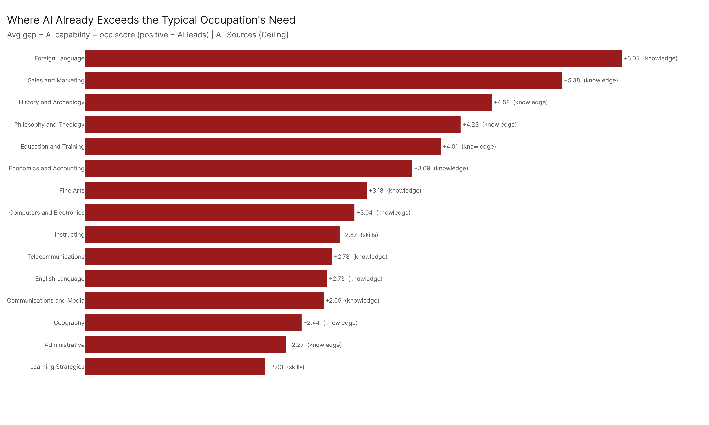

# Worker Resilience: Where You Still Lead, and Where AI Already Does

*What every worker should know about the gap between human capability and AI capability — element by element.*

*Config: all_ceiling | Method: freq | Auto-aug ON | National | S + A + K, importance >= 3*

---

## 1. Framework

Not every part of your job faces the same AI pressure. Some things you do, AI cannot match. Other things, AI already does better than most workers need.

For each element (a specific skill, ability, or knowledge domain) required by an occupation, we compute a **gap**:

> **Gap = AI capability score (95th percentile across occupations) minus the occupation's own requirement (importance x level, filtered to importance >= 3)**

- **Negative gap (human advantage):** The job demands more than AI can deliver. Your training, experience, and physical presence matter here. Investing in these areas protects your value.
- **Positive gap (AI advantage):** AI already exceeds what the job requires. Rather than competing, workers benefit most by learning to use AI for these tasks — freeing time and attention for where they still lead.

This analysis covers **Skills, Abilities, and Knowledge** across all occupations in the dataset.

---

## 2. Where Humans Still Lead

The top human advantages are overwhelmingly physical and perceptual abilities. Every element in the top 10 involves the body: fast limb movement, spatial awareness, strength, balance, flexibility, or fine motor control.

| Rank | Element | Type | Mean Gap |
|------|---------|------|----------|
| 1 | Speed of Limb Movement | Abilities | -7.49 |
| 2 | Sound Localization | Abilities | -7.33 |
| 3 | Dynamic Flexibility | Abilities | -6.47 |
| 4 | Reaction Time | Abilities | -6.43 |
| 5 | Response Orientation | Abilities | -6.18 |
| 6 | Static Strength | Abilities | -6.19 |
| 7 | Multilimb Coordination | Abilities | -6.18 |
| 8 | Extent Flexibility | Abilities | -6.13 |
| 9 | Depth Perception | Abilities | -5.95 |
| 10 | Control Precision | Abilities | -5.76 |

**What this means for you.** If your job requires you to physically be there — reacting to unpredictable environments, handling materials, coordinating your body in real time, perceiving depth and sound in a workspace — AI is not close to replacing what you do. These are not just "manual labor" skills; they include the spatial reasoning of a surgeon, the reaction time of an emergency responder, and the fine motor precision of a dental hygienist. Physical presence and perceptual judgment remain a durable human edge.

Even the one knowledge domain that appears deep in the human-advantage list, Building and Construction (mean gap -5.52), is tightly linked to hands-on, site-specific expertise — the kind of knowledge that depends on being in a place, not just reading about it.

---

## 3. Where AI Already Leads

AI's strongest advantages are concentrated in **knowledge domains** — the recall, synthesis, and explanation of factual information.

| Rank | Element | Type | Mean Gap |
|------|---------|------|----------|
| 1 | Foreign Language | Knowledge | +6.05 |
| 2 | Sales and Marketing | Knowledge | +5.38 |
| 3 | History and Archeology | Knowledge | +4.58 |
| 4 | Philosophy and Theology | Knowledge | +4.23 |
| 5 | Education and Training | Knowledge | +4.01 |
| 6 | Economics and Accounting | Knowledge | +3.69 |
| 7 | Fine Arts | Knowledge | +3.18 |
| 8 | Computers and Electronics | Knowledge | +3.04 |
| 9 | Instructing | Skills | +2.87 |
| 10 | Telecommunications | Knowledge | +2.78 |

**What this means for you.** If a significant part of your job is looking things up, recalling facts, drafting explanations, or teaching standardized material, AI can already handle much of that workload. This is not a threat if you respond correctly: **use AI as a tool for these tasks** rather than spending your time competing with it. A financial analyst who uses AI for economic data retrieval can spend more time on judgment calls. A teacher who uses AI for content generation can spend more time on the interpersonal, motivational work that AI cannot replicate.

The single non-knowledge element in the AI-advantage top 10 is **Instructing** — the skill of teaching others. AI's advantage here reflects its ability to deliver structured explanations at scale, not its ability to mentor, motivate, or read a room. The human side of instruction remains yours.

---

## 4. Variation Across Occupations

The gap pattern is not uniform. Some occupations are heavily insulated by physical requirements; others are heavily exposed on the knowledge side.

Among 26 matched occupations of interest (3 unmatched due to title differences: Physicians All Other, Financial Analysts, Data Scientists):

- **Registered Nurses** show deep human advantages in Psychology (-12.17), Problem Sensitivity (-8.74), and Customer and Personal Service (-7.28) — the interpersonal and diagnostic core of nursing is well-protected. But AI already exceeds their needs in Biology (+10.53) and Education and Training (+9.55), suggesting nurses can offload study and reference tasks to AI.
- **Software Developers** retain human advantage in Computers and Electronics (-10.83) and systems-level thinking, but AI exceeds their needs in English Language (+6.42), Writing (+3.34), and Speaking (+3.07) — documentation and communication tasks are ripe for AI assistance.
- **General and Operations Managers** hold strong advantages in Coordination (-5.66), Monitoring (-4.82), and personnel management — the organizational and interpersonal work that defines their role. AI leads in Economics and Accounting (+5.56) and Instructing (+4.95).

The pattern holds: human advantages cluster in judgment, coordination, and interpersonal skills. AI advantages cluster in knowledge recall and structured communication.

---

## 5. Cross-Config Stability

The physical-vs-knowledge divide is consistent across all five AEI configurations tested. While the magnitude of individual gaps shifts (ceiling configs produce larger gaps than conversation-based configs), the same elements appear in the human-advantage and AI-advantage lists regardless of which config is used. This means the findings above are not an artifact of one particular AI capability estimate — they reflect a structural pattern.

---

## 6. Key Takeaways

1. **Your body is your moat.** Every top human-advantage element is a physical or perceptual ability. If your job requires real-time physical presence and sensory judgment, your position is more durable than aggregate "AI exposure" scores might suggest. Invest in the physical and perceptual skills your role demands.

2. **Knowledge recall is AI's home turf.** Nine of the top 10 AI-advantage elements are knowledge domains. If you spend significant time looking up information, drafting factual summaries, or explaining established content, learn to delegate those tasks to AI. The time you save belongs to the parts of your job where you still lead.

3. **The human edge in "knowledge jobs" is judgment, not facts.** Even in heavily knowledge-dependent occupations like nursing or management, the human-advantage elements are interpersonal (Social Perceptiveness, Coordination, Personnel Management) and diagnostic (Problem Sensitivity, Inductive Reasoning). Doubling down on these skills — through mentoring, cross-functional experience, and deliberate practice — is the highest-return investment a knowledge worker can make.

4. **Use the heatmap to find your own pattern.** The gap is not the same for every occupation. Look at where your specific role falls. Identify your top human-advantage elements and invest there. Identify your top AI-advantage elements and start using AI tools for those tasks today.

---

## Config

Primary: `All 2026-02-18` (all_ceiling). Cross-config uses all five configs. Method: freq, auto-aug ON, national. S + A + K, importance >= 3. Gap = AI capability (95th pct) minus occupation score (importance x level).

## Files

| File | Description |
|------|-------------|
| `results/element_gaps_summary.csv` | Mean gap per element across all occupations |
| `results/human_advantage_elements.csv` | Top elements by human advantage (gap < 0) |
| `results/ai_advantage_elements.csv` | Top elements AI already covers (gap > 0) |
| `results/occ_element_gaps.csv` | Per-occ x element detail |
| `results/occs_of_interest_gaps.csv` | Top 5 human + top 5 AI elements for 29 named occs |
| `results/occ_gaps_all_configs.csv` | Per-occ gap summary across all five configs |
