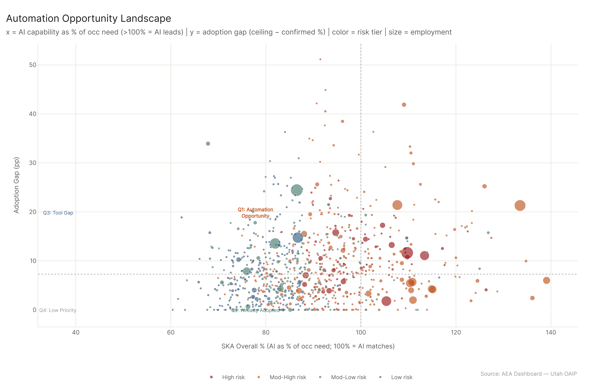
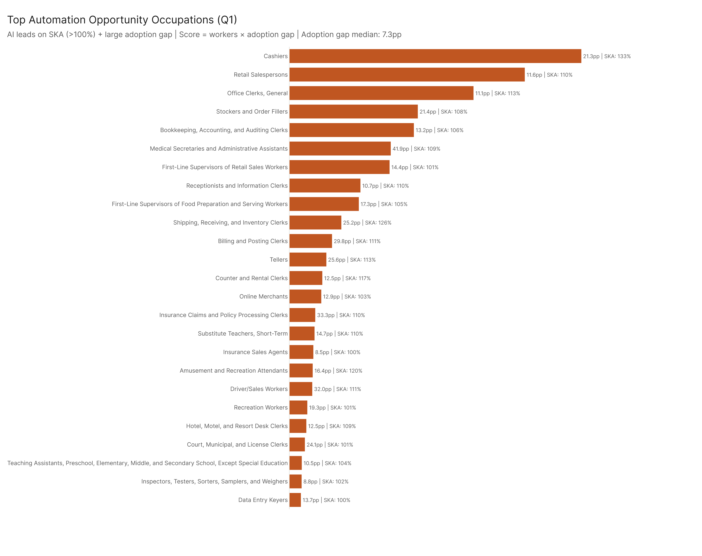
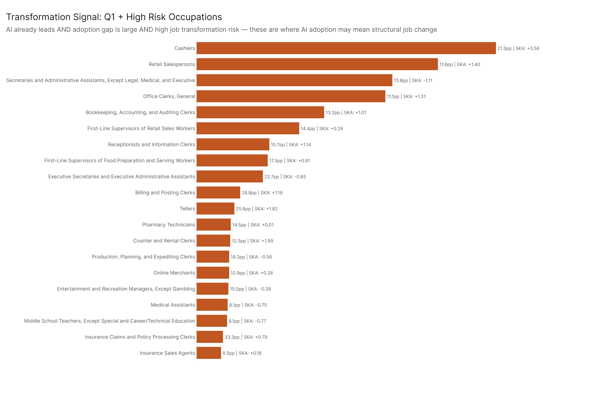
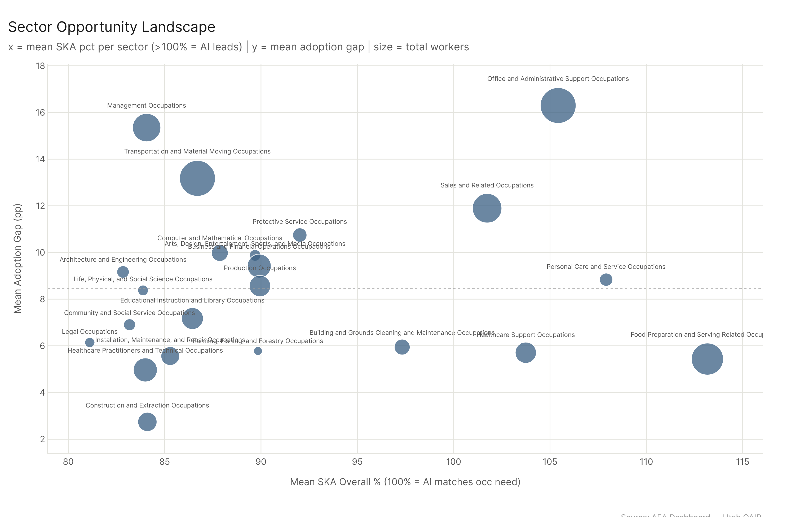
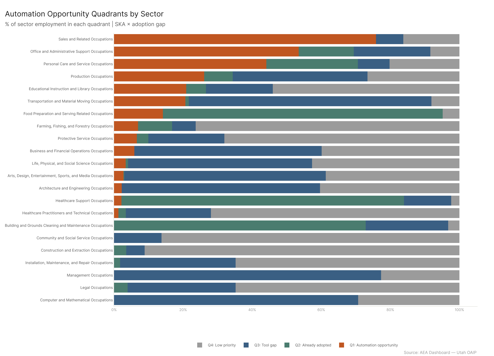

# Automation Opportunity: Where AI Leads and the Gap Is Largest

*Config: all_confirmed (SKA + adoption gap baseline) | Ceiling: all_ceiling | Method: freq | Auto-aug ON | National*

---

248 occupations (out of 893 analyzed) fall into Q1: AI capability already exceeds typical occupational skill need (SKA gap > median) AND the adoption gap is large (ceiling minus confirmed > median 7.3pp). These are the highest-value automation targets available with today's tools. 102 of those 248 also carry a high risk tier from the job risk scoring analysis, meaning they're not just automation opportunities — they're occupations where the combination of AI capability, deployment gap, and structural vulnerability signals likely job transformation rather than just augmentation. The rest (146 occupations in Q1 without high risk) are more straightforwardly opportunity: AI can reach them, the tools aren't deployed, and transformation pressure is lower.

---

## The Quadrant Framework

Every occupation lands in one of four quadrants defined by two medians: the median SKA overall_gap (-1.12, meaning most occupations still have a human advantage) and the median adoption gap (7.3pp).

**Q1 — Automation opportunity (248 occupations):** AI capability exceeds what the occupation needs (SKA gap above median) AND confirmed adoption is well below ceiling (big gap). This is where the economic opportunity is most legible: the tools work, and they're not being used.

**Q2 — Already adopted (198 occupations):** AI leads on SKA, but the adoption gap is small. These occupations have largely converged on their AI-accessible ceiling already.

**Q3 — Tool gap (198 occupations):** Humans still have the skills advantage (negative SKA gap) but there's a meaningful adoption gap. The ceiling suggests AI could do more, but workers in these roles have distinct capabilities that AI tools haven't fully matched.

**Q4 — Low priority (249 occupations):** Small adoption gap AND humans lead. Limited AI capability and limited gap — these occupations are relatively insulated from either AI displacement or augmentation at current capability levels.

The near-even split across quadrants (roughly 25% each) means the landscape isn't dominated by any single pattern. About half of all occupations (Q1 + Q2) are in territory where AI leads on skills; about half of all occupations (Q1 + Q3) have meaningful deployment gaps remaining.

---

## The Q1 Occupations

The scatter places each occupation in SKA-gap × adoption-gap space, colored by risk tier. Q1 is the upper-right quadrant. High-risk occupations appear in red; they cluster in Q1 and Q2 more than Q3 and Q4, which makes intuitive sense — occupations with high AI capability AND structural vulnerability (low job zone, poor outlook, software-heavy) are both more AI-capable and more at risk.

The top Q1 occupations by opportunity score (workers × adoption gap):

| Rank | Occupation | SKA Gap | Adoption Gap | Employment | Risk Tier |
|------|-----------|---------|--------------|-----------|-----------|
| 1 | Cashiers | +3.56 | +21.3pp | 3.1M | High |
| 2 | Retail Salespersons | +1.40 | +11.6pp | 3.8M | High |
| 3 | Secretaries and Admin Assistants | -1.11 | +15.8pp | 1.7M | High |
| 4 | Office Clerks, General | +1.31 | +11.1pp | 2.5M | High |
| 5 | Stockers and Order Fillers | +3.27 | +21.4pp | 2.8M | Moderate |
| 6 | Bookkeeping, Accounting, and Auditing Clerks | +1.01 | +13.2pp | 1.5M | High |
| 7 | Medical Secretaries and Admin Assistants | +1.02 | +41.9pp | 831K | Moderate |
| 8 | First-Line Supervisors of Retail Sales Workers | +0.26 | +14.4pp | 1.1M | High |
| 9 | Software Quality Assurance Analysts | -0.87 | +25.6pp | 726K | Moderate |
| 10 | Receptionists and Information Clerks | +1.14 | +10.7pp | 965K | High |

The **Medical Secretaries** entry stands out: a 41.9pp adoption gap is the largest of any occupation in Q1. Confirmed exposure is 31.4%, ceiling is 73.3%. AI tools have demonstrably shown they can do nearly three-quarters of the task load for this role, but the deployment hasn't happened. The SKA gap is positive (+1.02), meaning AI already leads on the typical skill profile. This isn't a case where the tools are just good enough — they're considerably ahead of where deployment is.

**Secretaries and Admin Assistants** (row 3) is an interesting edge case: SKA gap is -1.11 (slightly below the median, meaning humans technically still lead by this measure) but the adoption gap is 15.8pp and the risk tier is high. It's right on the Q1/Q3 boundary. The tool-literacy framing applies here as much as the automation framing.

---

## The Transformation Signal

When Q1 occupations also carry a high risk tier, the picture changes from "economic opportunity" to "structural change signal." 102 of the 248 Q1 occupations meet this threshold.

These occupations have AI capability exceeding human occupational need, a meaningful deployment gap, and structural vulnerability markers (low job zone, below-average outlook, or high software content). The combination doesn't guarantee job loss — it doesn't even predict it directly. But it's the set of occupations where the three pressure points converge: AI can do the work, it isn't being deployed yet, and when it is, the workers in those roles are less insulated from the displacement effects.

Top transformation signal occupations:
- **Cashiers**: SKA +3.56, 21pp gap, high risk. The AI capability is there, the gap is real, and the structural position of cashiers (low job zone, mixed outlook) makes them particularly exposed when deployment happens.
- **Billing and Posting Clerks**: SKA +1.18, 29.8pp gap, high risk. A 30pp gap means nearly a third of their AI-accessible task ceiling hasn't been reached by confirmed usage. Their outlook and job zone are both in the at-risk range.
- **Executive Secretaries and Executive Administrative Assistants**: SKA -0.85 (just below median), 22.7pp gap, high risk. This is a well-paid role that has already seen significant displacement pressure. The adoption gap says there's more coming.

What Q1 + high-risk does NOT mean: that these jobs are going away imminently, or that AI deployment will automatically cause displacement. Deployment decisions are made by organizations, not by capability alone. But the combination is a meaningful early indicator.

---

## Sector-Level Opportunity

At the sector level, the scatter shows Office/Admin and Management as the clearest opportunity sectors: both have above-median adoption gaps AND above-neutral SKA gaps (AI leads at the sector level). Transportation/Moving has a high adoption gap but slightly negative SKA (humans still have an edge in aggregate). Computer occupations have a below-neutral SKA (humans lead significantly) but a 10pp adoption gap — suggesting that even in tech, deployment hasn't caught up to capability.

The sectors with the worst combination — high adoption gap AND strong AI SKA advantage — are the ones where economic opportunity and transformation pressure overlap most directly. Office/Admin (mean SKA +0.65, mean adoption gap 16.3pp) and Management (mean SKA -2.24 but with high adoption gap 15.4pp) are the clearest candidates.

Management's negative mean SKA gap (-2.24) is worth noting: despite the large adoption gap, humans still maintain an aggregate skills advantage in management roles. This suggests the ceiling gap in Management is more about task-level AI capability (AI can do specific tasks) than wholesale AI advantage across the skill profile. The distinction matters for how the gap closes: it's likely to close through task-level augmentation rather than replacement of the full job.

---

## The Quadrant Distribution by Sector

A few sector-level patterns:

**Sales**: The highest Q1 concentration — about 40% of sales employment is in Q1. Large deployment gap, positive mean SKA. Sales AI tools are mature and work; deployment is lagging.

**Office/Admin**: Heavy Q1 and Q2 concentration. Most of the adoption gap here is being closed, but the Q1 residual is still substantial.

**Healthcare Practitioners**: Heavy Q3 and Q4. AI tools exist but human clinical judgment provides a clear advantage. The ceiling is lower and the adoption gap is smaller. This is not a sector where automation pressure is high at current AI capability.

**Construction and Extraction**: Predominantly Q4. Physical, site-specific work with limited AI capability. The smallest adoption gap of any major sector (2.7pp mean).

---

## SKA, Adoption Gap, and What This Analysis Can't Tell You

The SKA gap is computed using O*NET skills/abilities/knowledge importance scores crossed with occupation-level AI exposure. A positive gap means AI capability (proxied through pct_tasks_affected × element importance) exceeds what the occupation typically needs. A negative gap means humans still lead.

A few limitations to name:

The SKA formula treats all elements as comparable in scale, which they aren't — some elements (like critical thinking) are systematically more important across jobs than others. The gap scores are relative, not absolute.

The adoption gap is measured at the national level and doesn't capture within-occupation variance. A 25pp gap for Medical Secretaries means on average there's a 25pp difference between confirmed and ceiling — but some organizations are already at the ceiling while others are far below confirmed. The "gap" is a distributional fact about current deployment, not a statement about any individual workplace.

The transformation signal (Q1 + high risk) is correlational. High-risk tiers were scored on 7 flags including exposure trend, outlook, and job zone. The combination with Q1 is an interpretive overlay, not a causal model of job change.

---

## Config

| Setting | Value |
|---------|-------|
| SKA baseline | `all_confirmed` — `AEI Both + Micro 2026-02-12` |
| Ceiling | `all_ceiling` — `All 2026-02-18` |
| SKA formula | Per-occ × element (importance >= 3): ai_capability at 95th pctile |
| Risk tiers | From `job_exposure/job_risk_scoring/results/risk_scores_primary.csv` |
| Method | `freq`, Auto-aug ON, National |

## Files

| File | Contents |
|------|----------|
| `results/opportunity_scores.csv` | All 893 occupations: SKA gap, adoption gap, quadrant, risk tier |
| `results/q1_occupations.csv` | 248 Q1 occupations ranked by opportunity score |
| `results/q1_transformation_signal.csv` | 102 Q1 + high-risk occupations |
| `results/q3_tool_gap.csv` | 198 Q3 (human leads, adoption gap) occupations |
| `results/sector_opportunity.csv` | Major-category: mean SKA gap, mean adoption gap, total workers |
| `results/quadrant_summary.csv` | Employment by quadrant and major category |
