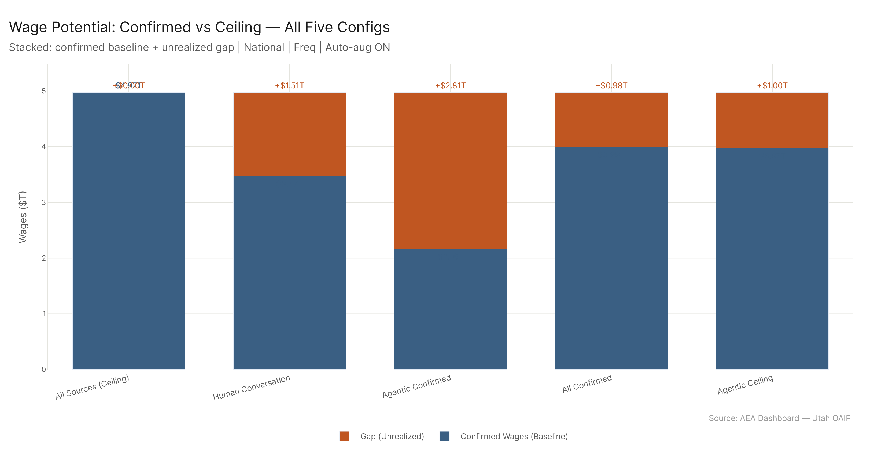
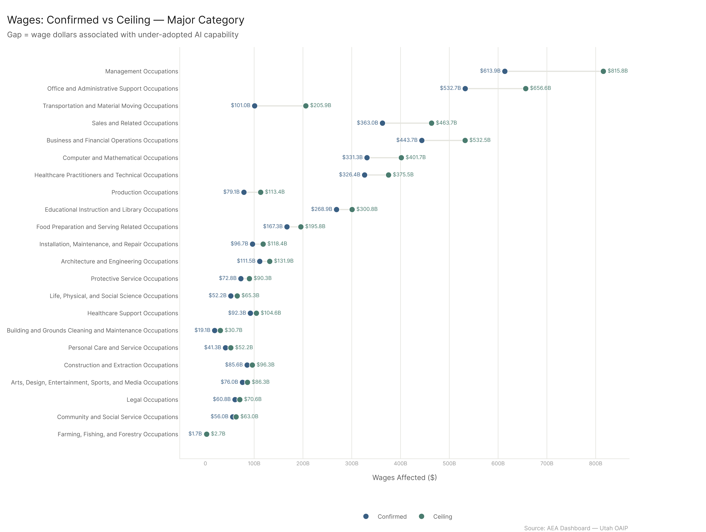
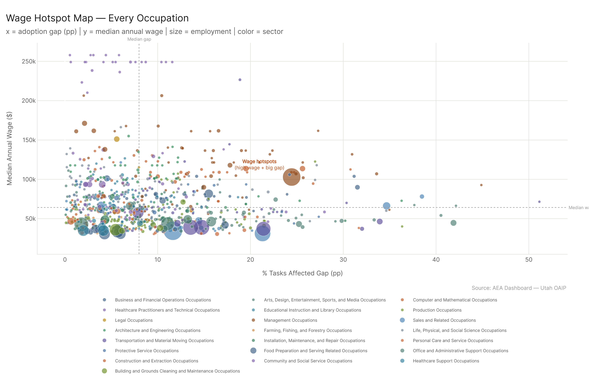
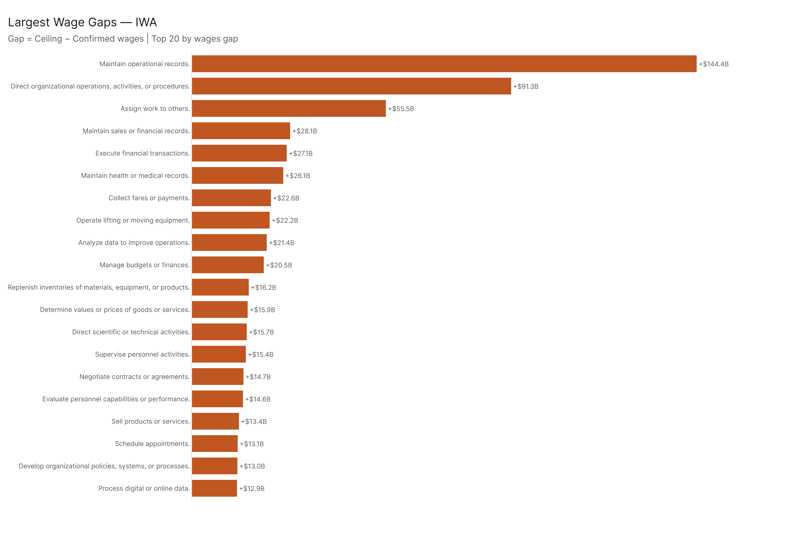
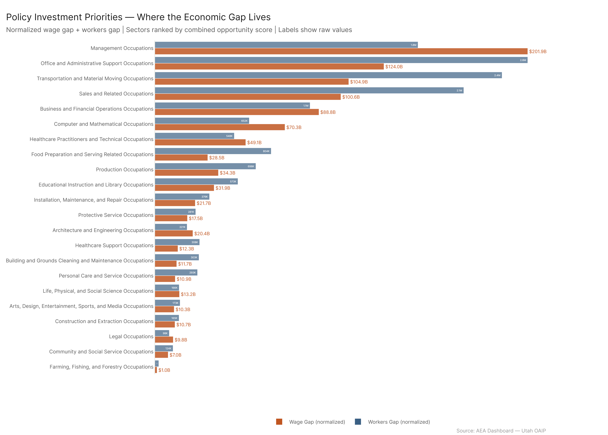
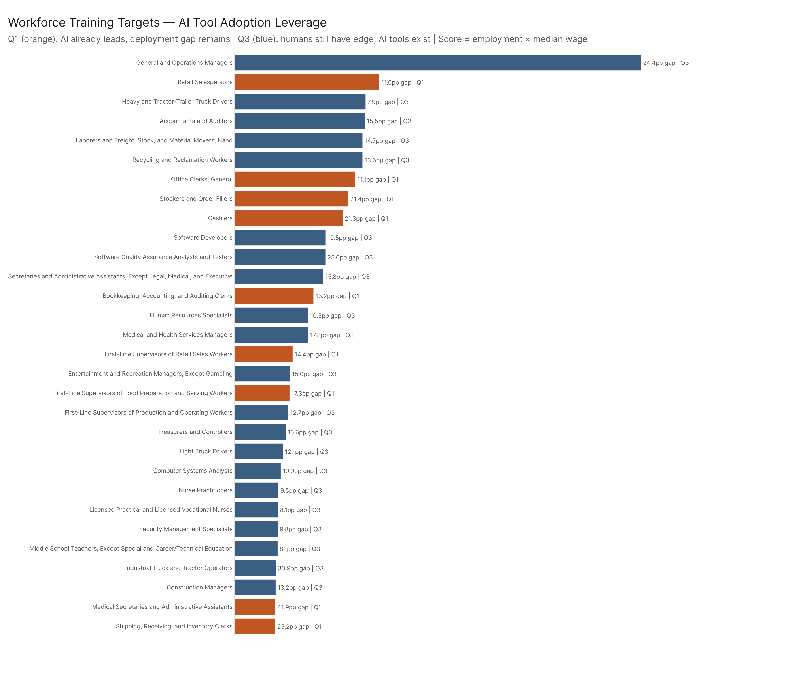
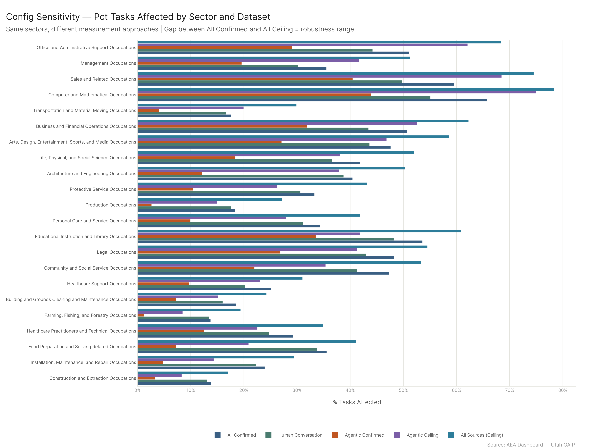
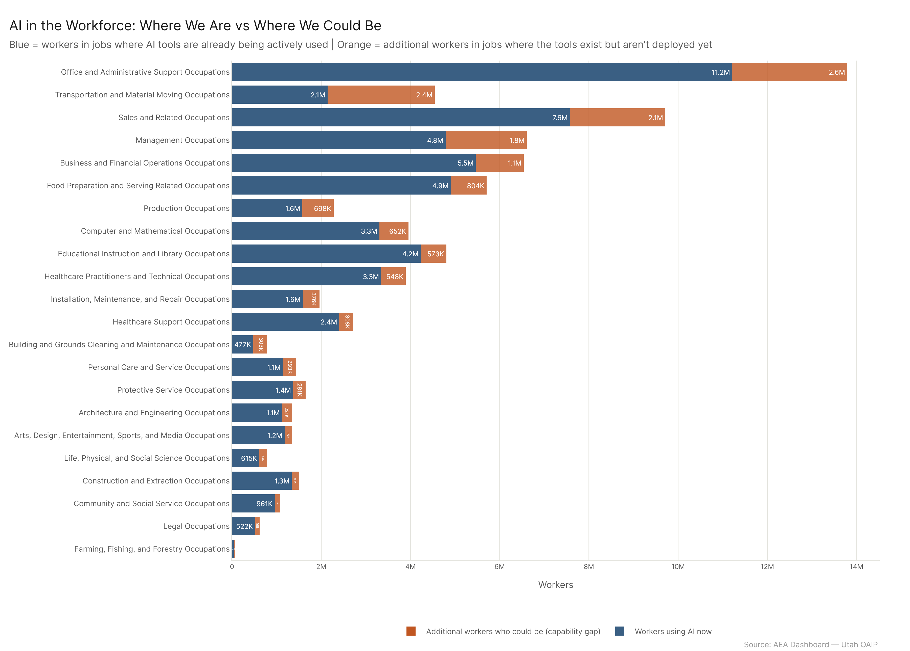

*Primary config: all_confirmed (AEI Both + Micro 2026-02-12) | Ceiling: all_ceiling (All 2026-02-18) | Method: freq | Auto-aug ON | National*

The adoption gap between confirmed AI usage and demonstrated capability is $980 billion in annual wages and 15.8 million additional workers. That number is not hypothetical future capability — it's the difference between what confirmed deployments currently reach and what tools that already exist have been shown to handle. The gap lives in specific places: Office and Administrative Support (2.6M workers), Transportation (2.4M), Sales (2.1M), and Management (1.8M) carry the largest absolute shortfalls. At the activity level, documenting and recording work alone accounts for 4.4M workers in the gap. 248 occupations are in Q1 — AI already leads on skills AND the adoption gap is large — and 102 of those also carry structural risk signals that make them candidates for significant job transformation rather than just augmentation. The gap is closing, confirmed usage grew 21.8M workers over 16 months, but the ceiling moved too.

---

## 1. Adoption Gap: Where Confirmed Usage Falls Short of the Ceiling

*Full detail: [adoption_gap_report.md](adoption_gap/adoption_gap_report.md)*

The ceiling puts 77.1M workers in AI's current reach. Confirmed is 61.3M. The 15.8M-worker gap is distributed unevenly, and the distribution is informative.

At the major category level, **Office and Administrative Support** leads by raw worker gap (2.6M, from 51% to 68% confirmed-to-ceiling) and **Transportation and Material Moving** leads by percentage-point gap (12.3pp, confirmed 17.6% to ceiling 29.9%). Transportation's gap is particularly notable because the sector's confirmed exposure is already low — there's a long way to go both in absolute and relative terms. Sales (15pp gap, 2.1M workers), Management (15.7pp, 1.8M workers), and Business/Financial (11.5pp, 1.1M workers) round out the top five.

At the occupation level, **General and Operations Managers** leads by worker gap (876K, from 28% to 52%) — a management role where decision-support and coordination tools demonstrably work but aren't broadly deployed. **Medical Secretaries and Administrative Assistants** has the largest percentage-point gap of any major occupation (41.9pp, from 31% to 73%), meaning that most of what AI can demonstrably do for that role isn't being done. **Stockers and Order Fillers** (21.4pp gap, 2.8M workers) and **Cashiers** (21.3pp, 3.1M workers) are large-workforce entries where the ceiling is substantially above current deployment.

At the work activity level, **Documenting/Recording Information** (GWA: 37% → 67%, +4.4M workers) is the single largest gap in both absolute and relative terms. This is arguably the clearest example of demonstrated capability not translating into deployment — recording and documentation tools are mature, they work, and they're widely used in some contexts (high-end professional settings, larger organizations) but not in the bulk of jobs where the task is performed. **Maintain operational records** (IWA: +2.6M workers, +52pp) and **Maintain sales or financial records** (+707K, +47pp) are the IWA-level entries behind that headline.

The trend confirms that the gap is being addressed but not at ceiling pace: confirmed grew from 39.5M to 61.3M workers (September 2024 → February 2026), adding 21.8M in 16 months. The ceiling also grew as MCP and API capabilities expanded. The gap is moving, but it hasn't closed.

---

## 2. Wage Potential: The Dollar Value of the Gap

*Full detail: [wage_potential_report.md](wage_potential/wage_potential_report.md)*

$980 billion per year in wages are associated with AI capabilities that exist and work but aren't deployed. That's the difference between $3.99T (confirmed) and $4.97T (ceiling). The framing: for every $4 that AI tools currently reach in wages, there's another dollar sitting in demonstrated-but-not-deployed capability.

The distribution of the wage gap is concentrated at the top of the wage distribution. **Management** carries the largest sector wage gap because management occupations are high-wage AND have a 15.7pp adoption gap — the per-worker economic value is higher than lower-wage sectors with comparable gaps. The headline number: **General and Operations Managers** alone accounts for $90.2 billion in the gap, from a single occupation category.

The hotspot analysis (59 occupations in the top quartile on both median wage and adoption gap) identifies the specific roles where closing the gap produces the most per-worker economic value. Software QA Analysts ($114K median, 25.6pp gap), Software Developers ($114K, 19.5pp), Medical and Health Services Managers ($118K, 17.8pp), and supply chain / financial management roles dominate this list.

At the work activity level, **Maintain operational records** (IWA) carries $144B in the wage gap — a single activity type with more economic value in its adoption gap than many entire industry sectors. **Direct organizational operations** adds $91B, and **Assign work to others** adds $55B.

---

## 3. Automation Opportunity: Where SKA, Adoption Gap, and Risk Converge

*Full detail: [automation_opportunity_report.md](automation_opportunity/automation_opportunity_report.md)*

96 occupations fall in Q1: AI capability (by the SKA overall_pct measure) already exceeds the occupation's skill/knowledge requirement (>100%) AND the adoption gap is large. The quadrant now splits on the natural 100% threshold — not the median — making Q1 "AI literally covers more than the job needs" rather than just "above average." This is the set of occupations where the economic opportunity is most legible — tools exist, the capability exceeds the requirement, the gap is deployment.

33 of those 96 also carry a high risk tier from the updated job_risk_scoring (eight-flag model, max 10, four tiers). These are the transformation signal occupations — where capability exceeds requirement, deployment gap is large, and structural vulnerability converges.

The remaining 63 Q1 occupations (without high risk tier) are more purely opportunity-framed. For these occupations, the story is augmentation and productivity, not displacement pressure.

The quadrant distribution by sector shows that Sales and Office/Admin have the highest Q1 concentration (roughly 40% of employment in those sectors falls in Q1). Healthcare Practitioners and Construction skew heavily toward Q3 and Q4 — limited AI capability and human advantage intact.

---

## 4. Audience Framing

*Full detail: [audience_framing_report.md](audience_framing/audience_framing_report.md)*

The gap analysis translates differently depending on what you're trying to decide.

**Policy** focus is on where to direct AI adoption programs. The combined wage-gap + workers-gap picture points clearly at Office/Admin, Management, and Sales as priority sectors. The $980B opportunity isn't self-actualizing — it requires organizational change, tool adoption, and in some cases, workforce support programs for the workers in the 102 transformation-signal occupations.

**Workforce practitioners and educators** should distinguish Q1 from Q3. Q1 (AI leads, big gap) is where workers will encounter AI tools whether they're ready or not — these are the tool-literacy priorities. Q3 (humans still lead, some gap) is where the tools exist and workers who use them well will be more effective than those who don't.

**Researchers** should note that the gap magnitude is config-sensitive at the sector level (Transportation and Education in particular vary by config) but the ranking is robust. The transformation signal combining SKA, adoption gap, and risk tier is an observational overlay, not a causal model.

**For a general audience:** the orange bars are the capability gap — tools that exist, work, and aren't being deployed. Whether that gap closes through augmentation (same job, different tools) or displacement (different job, or no job) depends on decisions being made right now, not on the technology itself.

---

## Cross-Cutting Findings

**The gap is structural, not marginal.** 15.8M workers and $980B in wages represent roughly 10% of the total U.S. labor market by workers and 25% of the confirmed wage base. This isn't a rounding error — it's a substantial portion of economic activity sitting in demonstrable-but-not-deployed capability.

**Documentation and record-keeping is the single most under-deployed category.** "Documenting/Recording Information" (GWA) has the largest worker gap (4.4M), the IWA "Maintain operational records" has the largest wage gap ($144B), and "Record operational or production data" (DWA) has the most extreme gap percentage (+52pp). This activity type cuts across nearly every sector and every job level, which is why the numbers compound so heavily.

**High-wage and high-gap occupations are not the same set.** The wage hotspot analysis finds 59 occupations in the top quartile on both dimensions, but the list looks very different from the worker-count leaders. Software developers and health services managers appear in hotspots but not in raw worker-gap rankings; stockers and cashiers appear in worker-gap leaders but not in hotspots. Policy and workforce interventions that conflate these two populations will miss half the picture in each direction.

**The transformation signal (Q1 + high risk) is concentrated in low-to-mid job zones.** The 33 transformation-signal occupations (under the updated 8-flag model with the natural 100% SKA threshold) are predominantly in job zones 1–3. This means they're accessible jobs — relatively lower barriers to entry, often less formal training required — that are simultaneously most exposed to AI capability and least insulated from its effects. The tighter Q1 definition (pct > 100%, not just above median) and the more conservative high-risk tier (115 vs. 195 occupations) make this a more selective set.

**The gap is not closing at ceiling pace, but confirmed growth is real.** 21.8M additional workers entered confirmed AI usage in 16 months (Sep 2024 → Feb 2026), a nearly 55% increase. The gap persists because the ceiling also grew. The technology and the adoption are both moving — adoption just isn't keeping up.

---

## Key Takeaways

1. **$980B in wages is associated with demonstrated-but-undeployed AI capability.** The ceiling is $4.97T; confirmed is $3.99T. The gap is an organizational adoption problem, not a technology problem.

2. **15.8M workers represent the adoption gap.** From 61.3M (confirmed) to 77.1M (ceiling) — a gap roughly the size of the entire Healthcare Practitioners workforce.

3. **Documentation and record-keeping alone accounts for 4.4M workers in the gap.** "Documenting/Recording Information" (GWA) has the largest worker gap of any activity type. The tools exist; deployment hasn't reached the majority of jobs where this task exists.

4. **96 occupations are in Q1: AI exceeds the job's skill requirement (>100% overall_pct) AND adoption is lagging.** The tighter Q1 definition (natural 100% threshold vs. old median split) identifies the most clear-cut automation opportunities. 33 of them also carry high structural risk signals — making them transformation candidates, not just augmentation candidates.

5. **The wage hotspot set (59 occupations) is distinct from the worker-count leaders.** High-wage + big-gap occupations (software QA, health services managers, supply chain managers) need different interventions than high-worker + big-gap occupations (cashiers, stockers, sales workers).

6. **Confirmed usage grew 21.8M workers (+55%) in 16 months.** The adoption curve is steep. The gap isn't static — it's being closed — but not at ceiling pace.

7. **The framing matters for each audience.** The same $980B gap is an investment opportunity for policy, a tool-literacy priority for workforce development, a measurement challenge for researchers, and a statement about which jobs are changing for everyone else.

---

## Sub-Report Index

| Sub-Analysis | Report | What It Answers |
|---|---|---|
| Adoption Gap | [adoption_gap_report.md](adoption_gap/adoption_gap_report.md) | Where is confirmed usage furthest below the ceiling, across occupations and work activities? |
| Wage Potential | [wage_potential_report.md](wage_potential/wage_potential_report.md) | Which occupations and sectors have the highest economic value locked in the gap? |
| Automation Opportunity | [automation_opportunity_report.md](automation_opportunity/automation_opportunity_report.md) | Where does AI lead on SKA AND the adoption gap is large? Where is the transformation signal? |
| Audience Framing | [audience_framing_report.md](audience_framing/audience_framing_report.md) | How do these findings translate for policy, workforce, researchers, and laypeople? |

---

## Config Reference

| Config Key | Dataset | Role |
|---|---|---|
| `all_confirmed` | `AEI Both + Micro 2026-02-12` | **PRIMARY** — confirmed usage baseline |
| `all_ceiling` | `All 2026-02-18` | Capability ceiling (all sources) |
| `human_conversation` | `AEI Conv + Micro 2026-02-12` | Human conversational baseline (lower bound) |
| `agentic_confirmed` | `AEI API 2026-02-12` | Agentic tool-use only |
| `agentic_ceiling` | `MCP + API 2026-02-18` | Agentic ceiling (upper bound for tool-use) |
