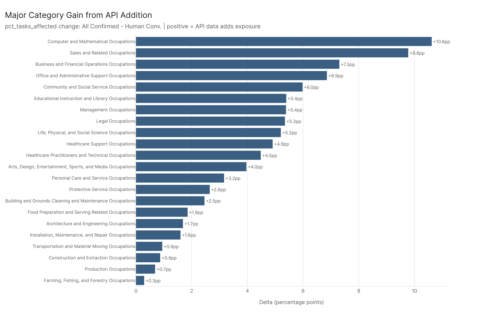
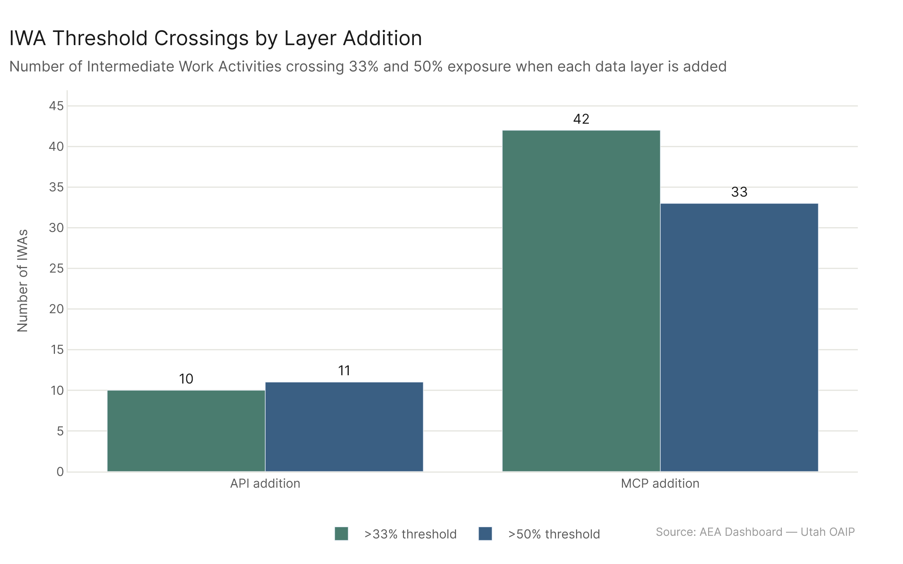

*Primary config: Human Conv. (AEI Conv + Micro 2026-02-12) | All Confirmed (AEI Both + Micro 2026-02-12) | All Ceiling (All 2026-02-18) | Method: freq | Auto-aug ON | National*

**TLDR:** Adding each new data layer changes the picture meaningfully. The AEI API layer (Human Conv. -> All Confirmed) is more surgical: it pushes 64 occupations into the high tier (>=60%) and concentrates gains in Computer/Mathematical, Sales, and Business/Financial. The MCP layer (All Confirmed -> All Ceiling) is more sweeping: 104 new high-tier entrants, with Office/Admin, Management, and Sales all jumping 15+ percentage points. At the work-activity level, MCP causes 42 IWAs to cross the 33% threshold — four times more than the API addition. Each layer reveals a structurally different part of AI's footprint.

## Tier Structure at Baseline

Starting from Human Conv., the distribution is skewed toward mid-range exposure: 280 Low, 342 Restructuring, 220 Moderate, 81 High. This is already a substantial footprint, but it understates the picture because it only captures confirmed conversational usage.

## API Addition: Confirming Known Exposure

When AEI API data is added (Human Conv. -> All Confirmed), the tier shift is conservative. 62 occupations move from Restructuring to Moderate, and 63 move from Moderate to High. Critically, no occupation drops — adding API data only increases scores. The tier shift matrix shows mostly diagonal (stability) with moderate upward mobility in the middle tiers. The occupations entering the High tier are concentrated in tech-adjacent and analytical roles: Computer/Mathematical Occupations gain 10.6pp at the major level, Sales 9.8pp, Business/Financial 7.3pp. Some sectors barely move: Construction, Food Prep, and Personal Care gain less than 1pp from the API addition.

The API addition's footprint is selective — it upgrades occupations where agentic AI has been demonstrably deployed. 64 new High-tier entrants is meaningful, but the overall structure is preserved.

## MCP Addition: Expanding the Frontier

The MCP layer is more transformative. From All Confirmed to All Ceiling, 104 occupations enter the High tier — 60% more than the API step added. The tier matrix shows substantial upward mobility: 105 occupations move from Low to Restructuring, 114 from Restructuring to Moderate, 87 from Moderate to High. The sectors gaining most are those involving coordination, scheduling, and data management: Office/Admin Support jumps 17.3pp, Management 15.7pp, Sales 15.0pp, Computer/Math 12.7pp, Transportation 12.3pp.

The negative cases are real: sectors that don't benefit from MCP's tool-calling capabilities — Educational Instruction (-11.7pp from all_confirmed to all_ceiling vs. the conv baseline comparison), Community/Social Services (-11.9pp), Food Prep (-14.7pp). These aren't losses in an absolute sense; they represent a redistribution of relative attention as other sectors surge.

## Work Activity Threshold Crossings

At the IWA level, the contrast is sharp. The API addition causes 10 IWAs to cross the 33% threshold and 11 to cross 50%. The MCP addition causes 42 to cross 33% and 33 to cross 50%. MCP is touching fundamentally different work patterns — scheduling, record maintenance, data processing, environmental monitoring — that weren't flagged by the conversation-only data.

## Tier Shift Summary

**API effect (Human Conv. -> All Confirmed):**
- Low stable: 259; Low -> Restructuring: 21
- Restructuring -> Moderate: 62; Restructuring -> High: 1  
- Moderate -> High: 63; High stable: 81
- Net new High-tier occupations: 64

**MCP effect (All Confirmed -> All Ceiling):**
- Low -> Restructuring: 105; Low -> Moderate: 13; Low -> High: 1
- Restructuring -> Moderate: 114; Restructuring -> High: 16
- Moderate -> High: 87; High stable: 145
- Net new High-tier occupations: 104

## Key Figures

## Key Takeaways

1. **MCP is the more transformative data layer** — 104 new High-tier occupations vs. 64 from API, and 4x more IWA threshold crossings.
2. **API addition is selective** — it confirms and upgrades tech-adjacent roles, but barely moves physical and service sectors.
3. **MCP expands the footprint into operations** — Office/Admin, Management, Transportation, and Sales all benefit disproportionately from MCP's tool-calling signal.
4. **No occupations lose exposure when layers are added** — the transitions are strictly upward (or stable), meaning new data only reveals more, never less.
5. **IWA threshold crossings are the leading indicator** — 42 IWAs crossing 33% under MCP suggests a coming wave of work-pattern disruption in scheduling, records management, and data operations.
