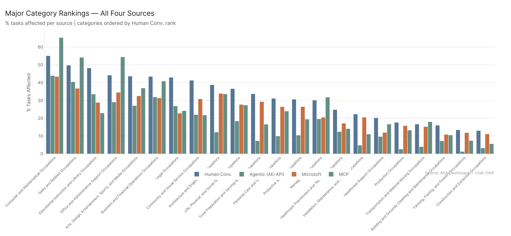
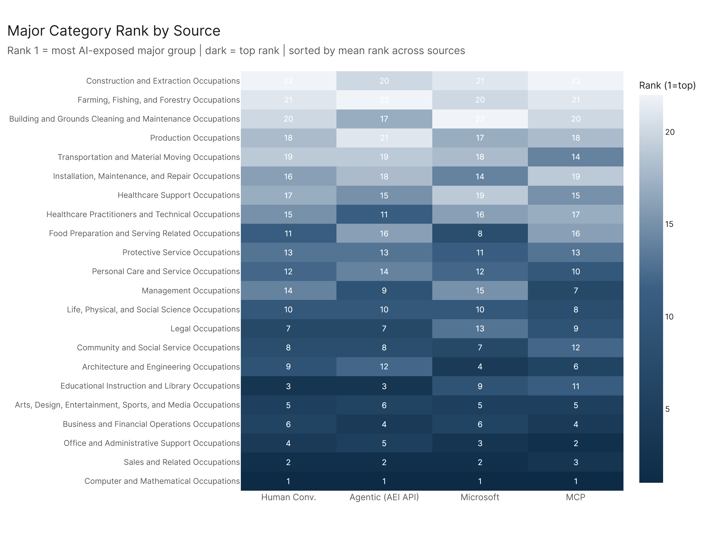
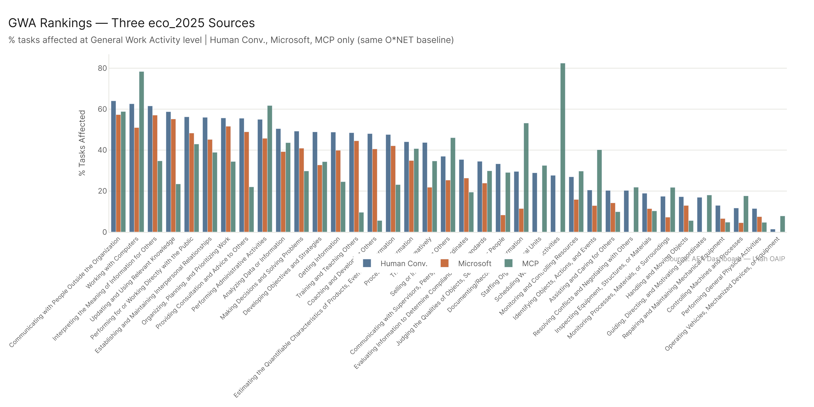

# Ranking Agreement: Where Do the Four Sources Agree?

*Config: Four sources — AEI Conv + Micro 2026-02-12 (Human Conv.) | AEI API 2026-02-12 (Agentic) | Microsoft | MCP Cumul. v4 | Method: freq | Auto-aug ON | National*

---

Four independent AI scoring sources — human conversational usage, agentic API usage, Microsoft Copilot, and MCP tool-use — agree strongly on which major occupation groups are most AI-exposed (mean Spearman rho = 0.875), but that consensus collapses almost entirely by the time you reach individual occupations (rho = 0.676, and 91% of occupations have zero cross-source consensus in the top 30). Six major categories are genuine bedrock findings, supported by all four sources. The rest of the occupational hierarchy is where each source's distinct measurement philosophy produces divergent pictures.

---

## The Pairwise Correlation Structure

The four sources form a clear hierarchy of similarity. Human Conv. and Microsoft track each other most closely — rho 0.93 at the major level, 0.86 at the occupation level. That's the highest pair at every level. The intuition is right: both measure what workers are actually doing with AI in practice (conversations and Copilot usage), even if they measure different platforms. They see the same underlying demand patterns.

The weakest pair is Agentic (AEI API) vs. Microsoft — rho 0.80 at major, dropping to 0.55 at occupation. That 0.55 is barely above chance for a correlation. These two sources are measuring fundamentally different things: one is what developers and technical users are doing via API automation, the other is what knowledge workers are doing with an office productivity assistant. The occupations those use cases favor share almost nothing.

| Pair | Major | Minor | Broad | Occupation |
|------|------:|------:|------:|-----------:|
| Human Conv. vs Microsoft | 0.93 | 0.90 | 0.88 | 0.86 |
| Human Conv. vs Agentic (AEI API) | 0.94 | 0.86 | 0.79 | 0.73 |
| Human Conv. vs MCP | 0.87 | 0.80 | 0.73 | 0.68 |
| Microsoft vs MCP | 0.85 | 0.78 | 0.71 | 0.65 |
| Agentic (AEI API) vs MCP | 0.86 | 0.81 | 0.67 | 0.60 |
| Agentic (AEI API) vs Microsoft | 0.80 | 0.71 | 0.61 | 0.55 |

MCP sits in the middle — similar to Human Conv. on some axes, similar to Agentic on others. That makes sense: MCP measures tool-use capability, which overlaps with both conversational tasks (information retrieval, writing assistance) and API-driven workflows (code execution, data access), without fully resembling either.

---

## Agreement Degrades with Granularity

This is the central finding. At the major level, 27% of categories have all-four-source consensus on their top-10 placement. By the time you reach individual occupations, that number is zero. Not low — zero. No occupation is placed in the top 30 by all four sources simultaneously.

| Level | N categories | High (4/4) | Moderate (3/4) | Low (2/4) | None (0/4) |
|-------|:-----------:|:----------:|:--------------:|:---------:|:----------:|
| Major | 22 | 6 (27%) | 4 (18%) | 1 (5%) | 9 (41%) |
| Minor | 95 | 8 (8%) | 7 (7%) | 9 (9%) | 62 (65%) |
| Broad | 439 | 0 (0%) | 5 (1%) | 15 (3%) | 384 (87%) |
| Occupation | 923 | 0 (0%) | 8 (1%) | 19 (2%) | 838 (91%) |

The minor level drops sharply from the major level — 65% of minor categories have no consensus at all. The broad level is almost entirely source-specific. The practical implication: any occupation-level claim ("X occupation is highly AI-exposed") requires knowing which source is driving it and being explicit about that.

---

## The Six Consensus Major Categories

These are the bedrock findings — all four sources place them in their respective top 10 for % Tasks Affected:

- **Computer and Mathematical Occupations** — unanimous #1 across all sources
- **Office and Administrative Support Occupations** — strong consensus, led by MCP
- **Sales and Related Occupations** — consistent top-3 across all sources
- **Business and Financial Operations Occupations** — mid-top-5 in all sources
- **Arts, Design, Entertainment, Sports, and Media Occupations** — consistent mid-ranking
- **Life, Physical, and Social Science Occupations** — lower in all sources but consistently above midpoint

These six represent the AI-work overlap that shows up regardless of how you measure AI capability. If a policy intervention is going to focus anywhere, these are the safest bets from an evidence standpoint.

The four moderate-confidence categories (3/4 agreement) are: Educational Instruction and Library (AEI and one other), Legal Occupations, Management, and one more. Education is the classic single-source outlier — Human Conv. rates it extremely high because teaching generates massive conversational AI usage, but the tool-use sources (MCP) see less exposure.

The nine zero-consensus categories at the major level are all physical, site-specific, or manual: construction, farming, food prep, healthcare support, production, transportation, protective service. These aren't surprising. What's more telling is that Healthcare Practitioners also shows no consensus — AEI Conv. might see clinical documentation and patient interaction tasks as AI-exposed, but the sources disagree enough that it falls out of the consensus list entirely.

---

## Work Activity Level (eco_2025 Sources Only)

At the GWA level, the three eco_2025 sources (Human Conv., Microsoft, MCP) show reasonable agreement on which broad work activity categories are most exposed — Information Input, Communicating with Others, and Working with Computers all appear near the top for all three. But MCP sees Processing Information and Performing Administrative Activities much higher than Human Conv. does, which maps directly to the occupation-level pattern: MCP overweights operational-informational work, Human Conv. overweights knowledge-communicative work.

The AEI API WA results use the eco_2015 baseline and aren't directly comparable. See `work_activity_exposure/` for the full WA picture.

---

## Config

- **Sources:** AEI Conv + Micro 2026-02-12 | AEI API 2026-02-12 | Microsoft | MCP Cumul. v4
- **Method:** freq | Auto-aug ON | National | All physical tasks
- **Confidence top-N thresholds:** Major=10, Minor=20, Broad=20, Occupation=30
- **WA:** GWA and IWA for eco_2025 sources only (Human Conv., Microsoft, MCP); AEI API WA not included (eco_2015 baseline)

## Files

| File | Description |
|------|-------------|
| `results/spearman_by_level.csv` | Pairwise Spearman rho for all 6 source pairs at all 4 agg levels |
| `results/confidence_major.csv` | Major category scores, ranks, and confidence tiers per source |
| `results/confidence_minor.csv` | Same at minor level |
| `results/confidence_broad.csv` | Same at broad level |
| `results/confidence_occ.csv` | Same at occupation level |
| `results/tier_summary.csv` | Summary: % of categories at each confidence tier per level |
| `results/wa_gwa_comparison.csv` | GWA pct_tasks_affected for 3 eco_2025 sources |
| `results/wa_iwa_comparison.csv` | IWA pct_tasks_affected for 3 eco_2025 sources |
| `results/wa_gwa_spearman.csv` | Spearman rho at GWA level (3 eco_2025 source pairs) |
