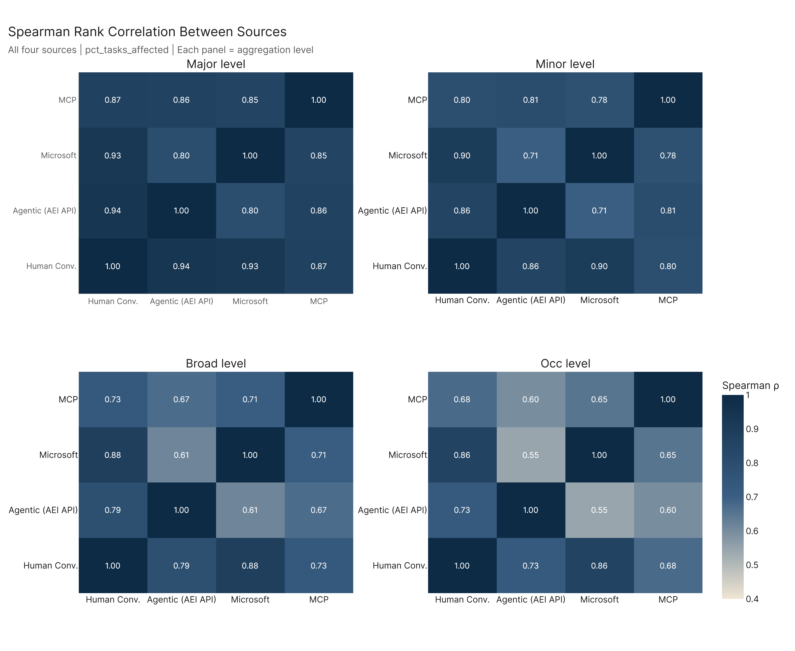
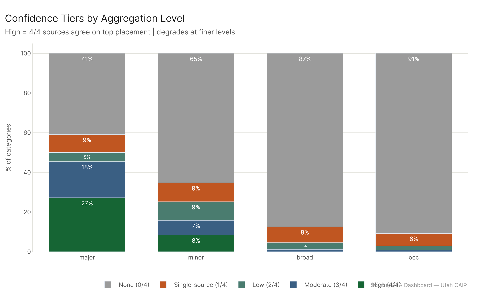
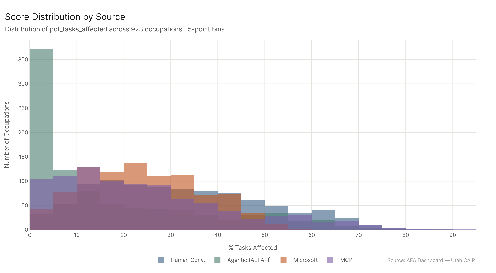
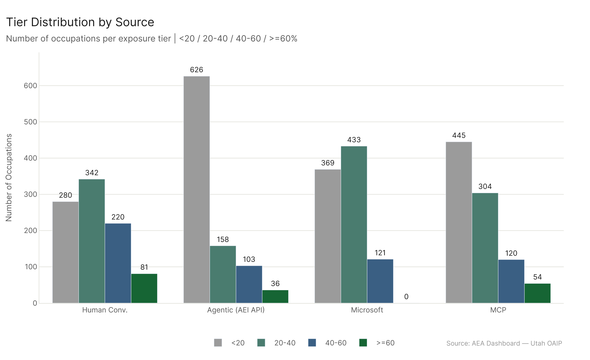
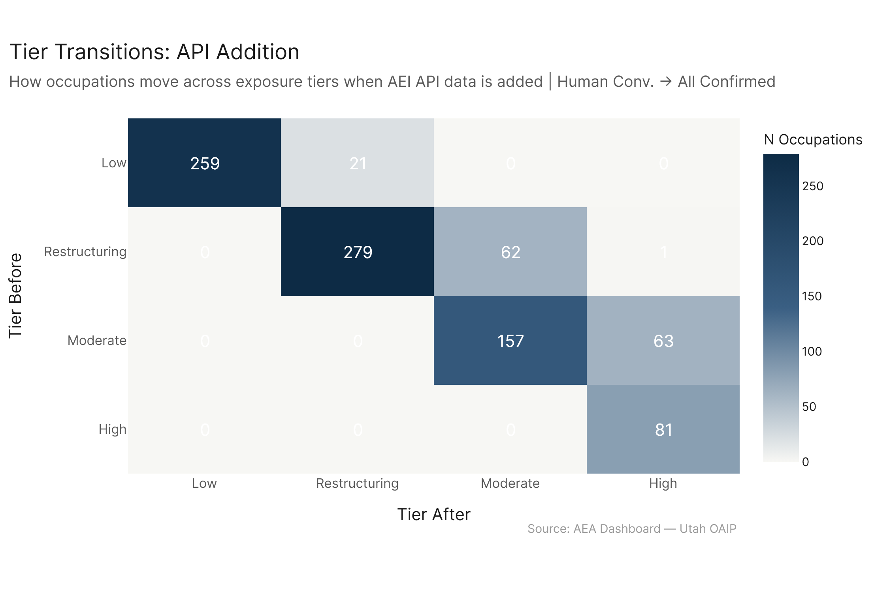
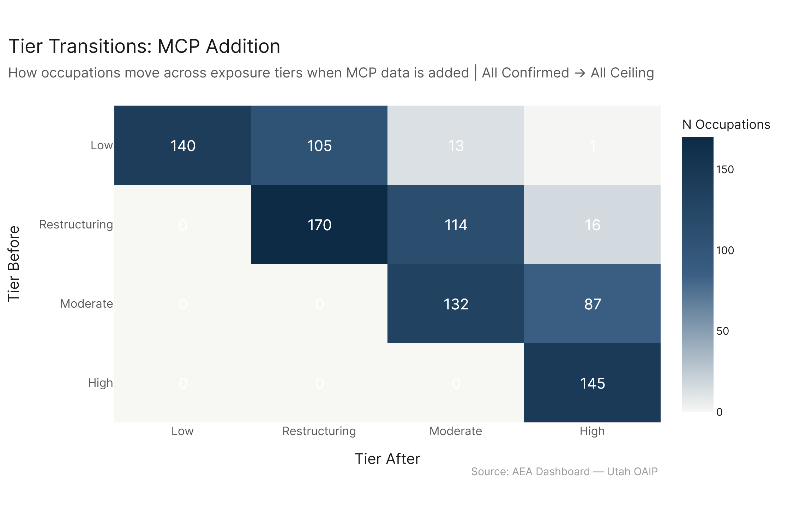
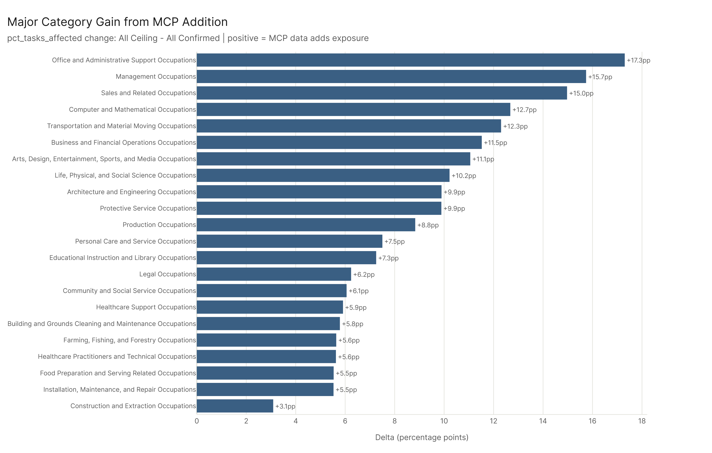

*Primary config: Four sources compared — AEI Conv + Micro 2026-02-12 | AEI API 2026-02-12 | Microsoft | MCP Cumul. v4 | Method: freq | Auto-aug ON | National*

The four data sources in this analysis are measuring related but genuinely distinct things. Human Conv. captures where AI has changed human conversation and knowledge work. AEI API captures where agentic tool-use has been confirmed in enterprise workflows. Microsoft captures task-level overlap with AI capabilities based on their own methodology. MCP captures what AI can do when given access to systems and tools via the Model Context Protocol. Each is a valid lens on AI's labor market footprint — and because they measure different things, their disagreements are informative, not noise.

The most important finding across all four sub-analyses is structural: agreement is strong at the sector level and collapses at the occupation level. The four sources agree that Computer/Math, Office/Admin, and Sales-facing work is highly exposed. They disagree sharply about which specific occupations within those sectors matter most. For policy purposes, this means sector-level planning can proceed with high confidence, while occupation-level interventions need source-specific justification.

## 1. Ranking Agreement
*Full detail: [ranking_agreement_report.md](ranking_agreement/ranking_agreement_report.md)*

Spearman rank correlations between sources are strong at the major level (mean rho=0.875) and degrade predictably as you zoom in — minor (0.807), broad (0.732), occupation (0.676). This is the expected pattern: broad sector agreement, specific occupation disagreement.

Six major categories achieve unanimous high-confidence consensus (4/4 sources agree on top placement): Arts/Design/Entertainment, Business/Financial Operations, Computer/Mathematical, Life/Physical/Social Science, Office/Admin Support, and Sales. Ten major categories are effectively single-source or no-source — Construction, Farming, Food Prep, the two Healthcare groups, Installation/Maintenance, Personal Care, Production, Protective Service, and Transportation. These sectors are consistently rated as low AI-exposure by every source, which is itself informative.

The disagreement is not random: sources with similar methodological assumptions correlate more highly. AEI API and Human Conv. are the most closely correlated pair despite their different measurement approaches, because both ground their estimates in actual AI usage. Microsoft and MCP show more idiosyncratic rank orderings.

## 2. Score Distributions
*Full detail: [score_distributions_report.md](score_distributions/score_distributions_report.md)*

The four sources produce dramatically different score distributions. Human Conv. is the most aggressive (mean 32.1%, 81 occupations in the high tier). AEI API is the most conservative (median 8.6%, 626 occupations below 20%). Microsoft is compressed with a hard ceiling near 58% and zero high-tier occupations. MCP spreads more than Microsoft but has a large low-tier cohort (445 below 20%).

The variance structure at the occupation level is monotone with AI-intensity: the more knowledge-intensive the role, the more sources disagree. Data Scientists (std=30.0), Penetration Testers (std=27.6), and Actors (std=28.0) show the most disagreement. Floor Sanders and Rail Operators show near-perfect consensus at near-zero exposure.

Tier breakdown across 923 occupations:

| Source | <20% | 20-40% | 40-60% | >=60% |
|---|---|---|---|---|
| Human Conv. | 280 | 342 | 220 | 81 |
| Agentic (AEI API) | 626 | 158 | 103 | 36 |
| Microsoft | 369 | 433 | 121 | 0 |
| MCP | 445 | 304 | 120 | 54 |

## 3. Source Portraits
*Full detail: [source_portraits_report.md](source_portraits/source_portraits_report.md)*

Each source has a distinctive occupational fingerprint. Human Conv. uniquely emphasizes tutoring, creative work, and lab-science roles (Tutors 67.2%, Chemical Technicians 43.4%). AEI API's distinctive hits are healthcare education, media production, and adult literacy instruction — occupations where conversational agentic AI has genuinely penetrated. Microsoft has no clearly distinctive occupations (z-scores near 1.0); it's the most generic rater. MCP uniquely flags GIS technicians (z=297), infrastructure operators, and technical coordination roles — the system-interaction side of AI.

Summary statistics confirm the spread:
- Human Conv.: median 30.2%, mean 32.1%, 8.8% in high tier
- AEI API: median 8.7%, mean 16.5%, 3.9% in high tier
- Microsoft: median 23.2%, mean 24.1%, 0.0% in high tier
- MCP: median 20.8%, mean 24.8%, 5.8% in high tier

The GWA-level portrait (eco_2025 sources) shows Human Conv. leading on information-processing GWAs, MCP spiking on scheduling and planning GWAs, and Microsoft maintaining consistent but moderate coverage.

## 4. Marginal Contributions
*Full detail: [marginal_contributions_report.md](marginal_contributions/marginal_contributions_report.md)*

Adding each data layer changes the picture in structurally different ways. The API addition (Human Conv. -> All Confirmed) upgrades 64 occupations to the High tier; it's precise, concentrated in tech-adjacent and analytical roles. The MCP addition (All Confirmed -> All Ceiling) upgrades 104 occupations to High; it's broader, sweeping Office/Admin (+17.3pp), Management (+15.7pp), and Sales (+15.0pp) at the major-category level. At the IWA level, MCP causes 42 work activities to cross the 33% threshold vs. just 10 for the API addition.

The tier shift matrices show that neither addition causes occupations to lose exposure — the transitions are strictly upward. This means each layer adds independent signal with no cancellation.

The MCP addition's 5 biggest sector gains: Office/Admin (+17.3pp), Management (+15.7pp), Sales (+15.0pp), Computer/Math (+12.7pp), Transportation (+12.3pp). These are coordination-heavy sectors where tool-calling AI agents directly add value.

## Cross-Cutting Findings

1. **Source agreement is a function of abstraction level** — all four sources agree on which major sectors are most exposed. At the occupation level, agreement drops to 0.676 mean Spearman rho, meaning source choice matters for any occupation-specific analysis.

2. **The sources measure complementary dimensions** — Human Conv. = conversational usage; AEI API = confirmed agentic deployment; Microsoft = task-level capability overlap; MCP = system-interaction capability. None is redundant.

3. **Microsoft's hard ceiling near 58% constrains its usefulness for high-tier analysis** — any question about occupations at the frontier of AI exposure needs Human Conv., AEI API, or MCP.

4. **MCP is the most distinctive source** — it uniquely captures technical operations, infrastructure, and system-coordination work. If your question is about AI agents interacting with enterprise systems, MCP is the right lens.

5. **The marginal contribution analysis clarifies causality** — the API layer adds precision in tech-adjacent roles; MCP adds breadth in operational roles. Understanding which layer drove a finding matters for interpretation.

6. **High-variance occupations are the policy blind spot** — Data Scientists, Penetration Testers, and similar roles show 30-point standard deviations across sources. Policy that targets these roles based on one source may be wrong by a factor of 3.

## Key Takeaways

1. **Strong sector-level consensus, weak occupation-level consensus** — major-level rho=0.875, occupation-level rho=0.676. Build sector policy with confidence; treat occupation-specific findings as provisional until multi-source corroboration.
2. **Six major categories are universally high-confidence** — Arts/Design, Business/Financial, Computer/Math, Life/Physical/Social Science, Office/Admin, and Sales are flagged by all four sources in their respective top groups.
3. **AEI API's 36 high-tier occupations are the most defensible** — these are roles where confirmed agentic usage has been documented. They should be the priority for early workforce planning.
4. **MCP addition is the bigger marginal step** — it upgrades 104 occupations to High tier and causes 42 IWA threshold crossings. The operational breadth it adds is not captured by any other source.
5. **Microsoft's compression makes it useful as a floor estimate** — if Microsoft rates something highly, it's almost certainly genuinely exposed, even if the exact score is capped.

## Sub-Report Index

| Sub-Analysis | Report | What It Answers |
|---|---|---|
| Ranking Agreement | [ranking_agreement_report.md](ranking_agreement/ranking_agreement_report.md) | Do sources agree on which occupations are most exposed? |
| Score Distributions | [score_distributions_report.md](score_distributions/score_distributions_report.md) | How do scores cluster and spread across 923 occupations? |
| Source Portraits | [source_portraits_report.md](source_portraits/source_portraits_report.md) | What does each source uniquely contribute? |
| Marginal Contributions | [marginal_contributions_report.md](marginal_contributions/marginal_contributions_report.md) | What does each data layer add to the exposure picture? |

## Config Reference

| Config Key | Dataset | Role |
|---|---|---|
| human_conversation | AEI Conv + Micro 2026-02-12 | Conversational AI usage baseline |
| agentic_confirmed | AEI API 2026-02-12 | Confirmed agentic tool-use |
| all_confirmed | AEI Both + Micro 2026-02-12 | All confirmed usage combined |
| all_ceiling | All 2026-02-18 | All sources combined ceiling |
| mcp (source) | MCP Cumul. v4 | MCP benchmark tool-calling capability |
| microsoft (source) | Microsoft | Task-level capability overlap |
