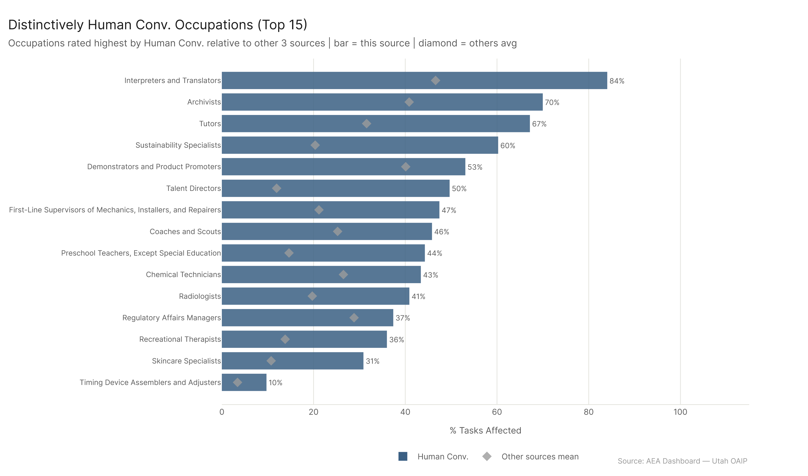
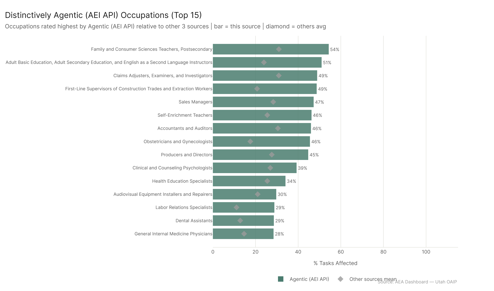
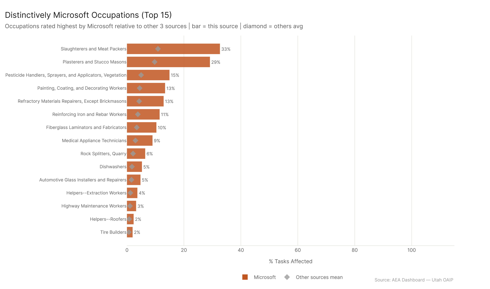
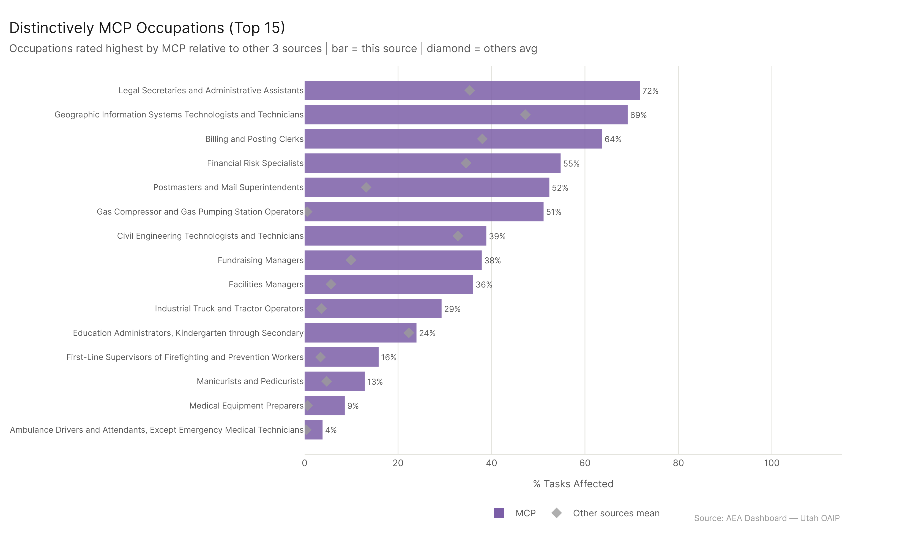
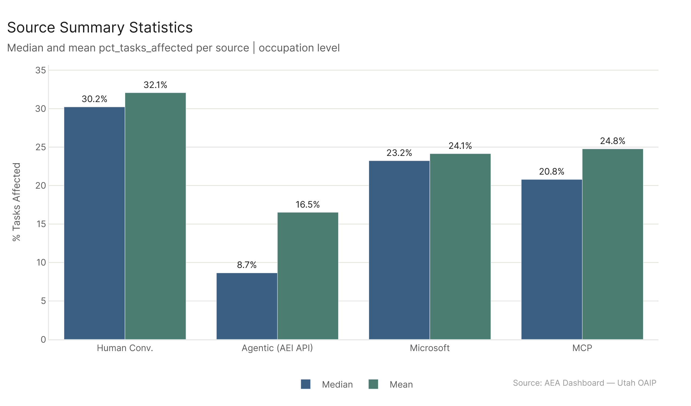
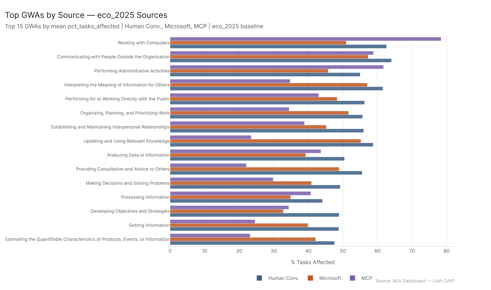

*Primary config: Four sources compared — AEI Conv + Micro 2026-02-12 | AEI API 2026-02-12 | Microsoft | MCP Cumul. v4 | Method: freq | Auto-aug ON | National*

**TLDR:** Each source has a distinctive "fingerprint" of which occupations it rates highest. Human Conv. uniquely emphasizes tutoring, creative, and lab-science roles. AEI API uniquely hits healthcare education, production-adjacent office roles, and some postsecondary teaching. Microsoft doesn't have distinctive highs — it's the most generic rater, consistent but undifferentiated. MCP is the wild card: it uniquely scores GIS technicians, infrastructure operators, and a set of white-collar roles that no other source flags. The result is that no single source is "right" — each captures a different slice of AI's actual reach.

## Human Conv. Portrait

Human Conv. is the broadest assessor. Median 30.2%, mean 32.1%. It rates 81 occupations in the high tier (>=60%) — more than any other source. Its distinctively high occupations aren't the first ones you'd guess: Tutors (67.2%) and Chemical Technicians (43.4%) score uniquely high, as do Sustainability Specialists and Talent Directors. These reflect the kinds of tasks that AI has demonstrably changed in human-led conversations: writing, structured advisory work, research-heavy roles, and creative support. The source captures the "has this been affected?" question from the practitioner's perspective.

## AEI API Portrait

AEI API is the confirmed-agentic signal. Median of 8.7%, mean 16.5%. 67.8% of occupations score below 20%. But its distinctive occupations are revealing: Dental Assistants (28.6%), Family and Consumer Sciences Teachers (54.3%), Producers and Directors (44.7%). These suggest that when agentic AI does show up in work, it's cutting across unexpected sectors — not just the usual white-collar suspects. The high-scoring occupations for AEI API often involve a mix of coordination, documentation, and communication that agentic tools excel at. The AEI API is the most "honest" about where autonomous AI has actually been deployed.

## Microsoft Portrait

Microsoft is the tightest rater. Mean 24.1%, std 12.3%. Zero occupations in the high tier. Its five most "distinctive" occupations barely differ from others (z-scores of ~1.15) — this source doesn't clearly favor any particular role type. The compression likely reflects a methodology that capped scores at task-level overlap rather than extrapolating from domain-level AI capability. The value of Microsoft data isn't distinctive peaks — it's systematic coverage, consistent with a framework applied uniformly across the occupation taxonomy.

## MCP Portrait

MCP is the most idiosyncratic source. It uniquely flags roles involving system administration, infrastructure operations, and technical coordination — the kinds of tasks where AI agents with tool-calling capabilities (file access, API calls, script execution) provide direct value. Geographic Information Systems Technologists (z=297, pct=69.1%) and Gas Compressor Operators (z=105, pct=51.1%) are MCP's most distinctive hits. These aren't roles that show up as distinctively high in any other source. This makes sense: MCP benchmarks expose how AI can interact with external systems, which directly maps to technical operations work.

The flip side: MCP scores near zero on occupations that AEI API rates highly — Patient Representatives (22.4% vs. AEI 75.1%), Actors (10.1% vs. 57.8%). MCP measures a different kind of AI capability than human-facing conversational work.

## GWA-Level Portraits (eco_2025 Sources)

Across 37 GWAs, the eco_2025 sources show similar rank-ordering but different magnitudes. Human Conv. scores the highest on information-processing GWAs (Working with Computers, Getting Information). Microsoft scores most consistently across GWAs with little spread. MCP shows clear spikes on "Organizing, Planning, and Prioritizing Work" and "Scheduling Work and Activities" — GWAs that directly map to the kinds of tasks MCP benchmarks test.

## Key Figures

## Key Takeaways

1. **Human Conv. is the broadest estimator** — best for understanding what has already changed in knowledge work, but likely includes some occupations where AI is peripheral.
2. **AEI API is the most precise signal** — lower coverage, but the occupations it flags are genuinely heavily agentic. Use it for confirmed-deployment analysis.
3. **Microsoft adds systematic baseline coverage** — not distinctive, but the consistent methodology makes it useful as a floor estimate.
4. **MCP uniquely captures technical operations and infrastructure roles** — if your question is about AI agents interacting with systems (not people), MCP is the relevant lens.
5. **No source is redundant** — each captures a different dimension of AI's occupational reach. The highest-confidence picture comes from combining them.
