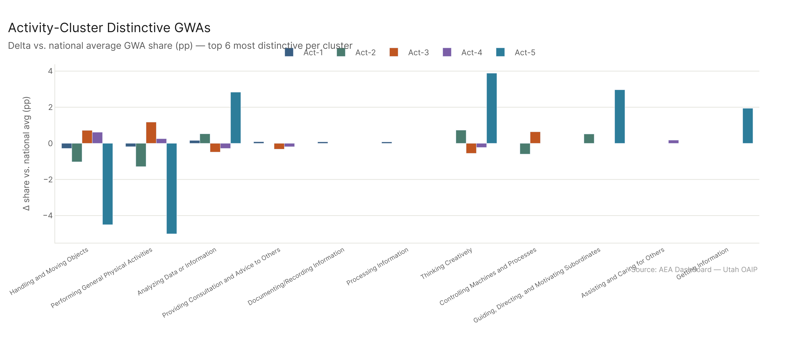
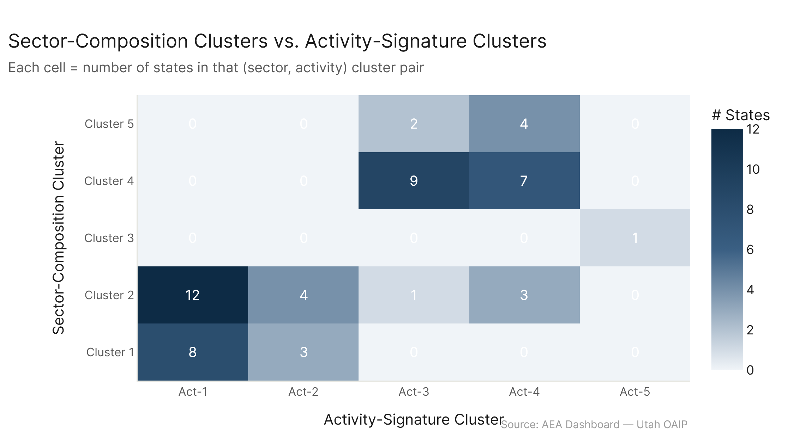

# State Clusters: Activity Signature

*Primary config: All Confirmed (AEI Both + Micro 2026-02-12) | eco_2025 GWA classifications | freq method | auto-aug on*

When you cluster states by the General Work Activity (GWA) fingerprint of their AI-exposed workforce — what types of work AI is actually touching in each state — you get five activity groups with low overlap with the sector-composition clusters (ARI = 0.26). The biggest finding is that most states look nearly identical by GWA share (differences of <1pp on any given activity), and one state is completely unlike everyone else: DC, where analytical, creative, and leadership work account for a dramatically larger share of the AI-exposed workforce.

---

## What This Analysis Does

Every task in O*NET 2025 belongs to a General Work Activity (GWA) — there are about 37 categories ranging from "Performing General Physical Activities" to "Thinking Creatively" to "Documenting/Recording Information." This analysis splits each occupation's employment across its tasks using frequency weights (same method as the dashboard's "Time" computation), then aggregates to the GWA level per state.

The result: for each state, what fraction of AI-exposed task employment is in each GWA? That's the feature matrix. K-means with k=5 clusters on those ~37 GWA shares.

---

## Five Activity Clusters

**Act-1 — Analytical/Administrative** (20 states including UT, TX, MD, AZ, FL, NY, PA, NJ, IL, and more): The largest cluster. These states have a slightly above-average concentration in analytical activities — "Analyzing Data or Information" (+0.16pp), "Documenting/Recording Information" (+0.08pp). The differences are small in absolute terms. This is the "baseline" cluster and covers both tech states and major industrial states — a diverse group united mainly by not having the more distinctive signatures of other clusters.

**Act-2 — Creative/Executive** (7 states: CO, MA, NY, VA, VT, and ~2 more): Higher shares of "Thinking Creatively" (+0.73pp), "Guiding/Directing/Motivating Subordinates" (+0.52pp), and "Developing Objectives and Strategies" (+0.25pp). These are states with heavier concentrations of knowledge-economy professional roles — strategy, creative work, senior leadership functions. Colorado and Massachusetts exemplify this: a lot of tech-adjacent professional work, management consulting, and creative industries.

**Act-3 — Physical/Industrial** (12 states including industrial Midwest and South): Higher shares of "Performing General Physical Activities" (+1.18pp), "Handling and Moving Objects" (+0.72pp), and "Controlling Machines and Processes" (+0.64pp). Manufacturing-heavy states where a meaningful chunk of AI exposure is touching production, inspection, and physical work activities — not just the office.

**Act-4 — Manual/Service** (14 states including WV, ME, WI, KS, WY, AK, MO, and rural states): Similar physical activity profile to Act-3 but with more "Assisting and Caring for Others" (+0.18pp) and "Performing Administrative Activities" (+0.16pp). The mix suggests a blend of healthcare, agricultural, and service activities. Many of these are Cluster 2 (diversified industrial) and Cluster 4 (rural/inland) states.

**Act-5 — DC only**: Washington DC is so analytically concentrated that it forms its own cluster with a margin of ~3-4pp on every distinctive GWA. "Thinking Creatively" (+3.89pp), "Analyzing Data or Information" (+2.83pp), "Getting Information" (+1.94pp), "Providing Consultation and Advice" (+1.93pp). Nothing comes close. The federal government and contractor ecosystem is dominated by analytical, advisory, and strategic work in a way that no other geography replicates.

---

## What These Clusters Actually Tell You

The honest answer is: the activity signature clusters mostly confirm what we already know. Physical-economy states cluster together. Knowledge-economy states cluster together. DC is uniquely analytical. The sector composition and activity signature capture related but different aspects of the same underlying economic structure.

What's notable is how small the actual differences are. The gap between Act-1 and Act-4 on any single GWA is less than 1 percentage point. States that look very different on sector composition (a tech hub vs. a farming state) actually have surprisingly similar overall GWA portfolios because the "AI-exposed" portion of work is already somewhat pre-selected for informational and administrative tasks regardless of industry.

This is a feature of how AI exposure works: it predominantly touches cognitive and administrative tasks. Physical activities are less AI-exposed, so they contribute less to each state's GWA signature. The remaining AI-exposed work tends to look similar across sectors.

---

## Relationship to Sector Composition

ARI = 0.26 — the highest pairwise score among any of the four new clusterings vs. sector composition. This makes intuitive sense: sector composition and activity signature are both capturing "what type of work" states do, just from different angles. They agree moderately.

DC is consistent — it's Cluster 3 in sector composition and Act-5 in activity signature. Both schemes correctly identify it as an outlier. The territories (GU, PR, VI) mostly end up in Act-3 or Act-4, which reflects their service-and-physical-labor economy mix.

---

## Config

| Setting | Value |
|---|---|
| Dataset | AEI Both + Micro 2026-02-12 (all_confirmed) |
| Eco baseline | eco_2025 (O*NET 2025), GWA via gwa_title column |
| Employment split | Freq-weighted (_emp_frac = freq_mean / sum(freq_mean) per occ) |
| Feature | GWA share of total task employment per state (~37 GWAs, >0.001 variance kept) |
| Clustering | k-means k=5, StandardScaler, n_init=20 |

## Files

| File | Description |
|---|---|
| `results/state_gwa_features.csv` | Per-state GWA employment shares |
| `results/cluster_assignments.csv` | State → activity cluster |
| `results/cluster_profiles.csv` | Avg GWA shares per cluster |
| `results/top_gwas_per_cluster.csv` | Top 5 distinctive GWAs per cluster (delta vs. national avg) |
| `results/vs_sector_composition.csv` | Both cluster assignments side-by-side |
| `figures/gwa_heatmap.png` | Heatmap: state × GWA, sorted by cluster |
| `figures/cluster_profiles.png` | Cluster-distinctive GWAs (delta vs. nat avg) |
| `figures/vs_sector_comp.png` | Sector vs. activity cluster tile count |
