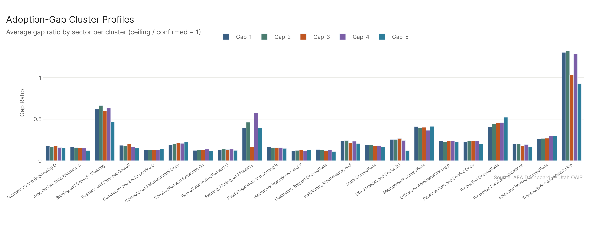
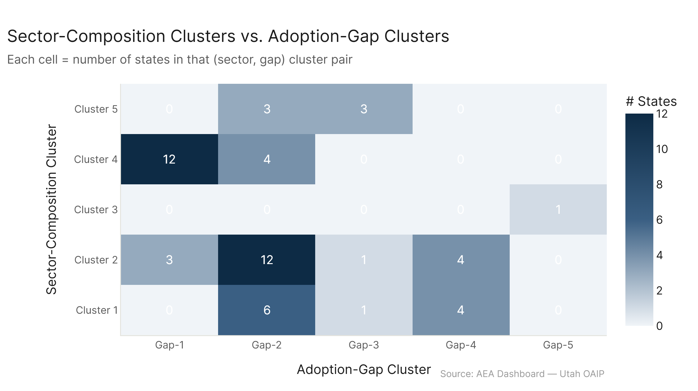

# State Clusters: Adoption Gap

*Primary config: All Confirmed (AEI Both + Micro 2026-02-12) vs. All Ceiling (All 2026-02-18) | freq method | auto-aug on*

**TLDR:** When you cluster states by the shape of their adoption gap — how much further AI could spread beyond current confirmed usage, broken down by sector — the resulting clusters are nearly random relative to every other clustering scheme (ARI < 0.20 vs. all others). The adoption gap is geographically uniform: virtually every state has an overall ceiling/confirmed gap ratio of roughly 0.24–0.25. The exceptions are Kentucky (highest gap, 0.277) and DC (lowest gap, 0.216). Within that narrow range, the sectoral *shape* of the gap differs slightly, but not in ways that cleanly map to any other state typology.

---

## What This Analysis Does

The adoption gap ratio per state × sector is:
> gap_ratio = (ceiling workers − confirmed workers) / confirmed workers

where ceiling workers use `all_ceiling` (AEI + MCP + Microsoft) and confirmed workers use `all_confirmed` (AEI + Microsoft, no MCP). The gap is essentially MCP's contribution — tool-use AI that is demonstrated as capable but not yet in confirmed conversational AI usage.

Feature matrix: 22 major sector gap ratios per state. K-means k=5 clusters on those features.

---

## National Baseline: Uniformly ~24%

Nationally, the ceiling is about 26% higher than confirmed usage (77M workers at ceiling vs. 61M confirmed). At the state level, the overall gap ratio averages 0.243 across all states, with a standard deviation of less than 0.01. Every state is within roughly ±3% of that figure.

This confirms and extends the state_profiles finding that pct_tasks_affected is uniform across states: the *gap* between confirmed and ceiling is also uniform. State economies have similar-shaped exposure gaps because the national occupation-level data doesn't vary by state, and the employment mixes are similar enough across most states to not produce outliers.

---

## Five Gap Clusters

**Gap-1 — Moderately elevated gap** (15 states including KY, IN, TN, SC, OK): Avg gap ratio ~0.248. These states have above-average gaps in several mid-tier sectors — likely Transportation, Production, and Office/Admin, where MCP's capability extends notably beyond confirmed conversational usage. Kentucky has the highest gap of any state (0.277), driven by its Transportation and Production sectors.

**Gap-2 — Near national average** (25 states — the largest cluster): Avg gap ratio ~0.243. The "everyone else" cluster. Most states in Cluster 2 and Cluster 4 land here. The adoption gap has no special character.

**Gap-3 — Islands/territories** (5 states: GU, HI, NM, NV, PR): Avg gap ratio ~0.242. Similar overall to Gap-2 but with slight differences in *which* sectors have the gap. Tourism and service economies have smaller gaps in production sectors but somewhat larger gaps in personal care and protective services.

**Gap-4 — Larger economies, varied gap profile** (8 states including IL, NY, PA, MA, CO, VA): Avg gap ratio ~0.239. Some of the largest state economies cluster here. Their size means they have more occupations represented, and the sector-level gap ratios can settle differently.

**Gap-5 — DC only** (gap ratio 0.216 — the lowest): DC has the smallest adoption gap of any geography. This makes intuitive sense: DC's workforce is dominated by high-engagement professional knowledge workers who are already heavy users of conversational AI. The gap from confirmed to ceiling is smaller because confirmed usage is already high. MCP-style tool automation adds proportionally less on top of the already-large confirmed baseline.

---

## Relationship to Other Clusterings

ARI vs. sector composition: 0.19 — weak but slightly above random.

ARI vs. risk profile: 0.08 — essentially random.

ARI vs. agentic profile: 0.03 — the lowest pairwise ARI of any pair in the analysis. Knowing whether a state's exposure is agentic-intensive tells you nothing about the shape of its adoption gap.

The near-zero ARI between agentic profile and adoption gap is a conceptually interesting finding. These two dimensions might seem like they should be related — both involve agentic/tool-use AI. But the agentic intensity ratio measures what fraction of *confirmed* exposure is tool-use; the adoption gap measures how far *ceiling* extends beyond confirmed. They capture genuinely different things.

---

## Policy Implication

The uniformity of the adoption gap means that the "latent potential" of AI adoption is not geographically concentrated. It's not the case that some states have vastly more room for AI expansion than others. The economic implications of closing the adoption gap — taking the economy from confirmed to ceiling — are distributed fairly evenly.

Where the gap *does* vary is across sectors within states. Transportation, Production, and Office/Admin in rural and mid-sized industrial states (Gap-1 group) have the largest relative gaps. Those are sectors where MCP-style automation capability exists but confirmed AI usage is lower — the kinds of workflow-intensive, procedural tasks that agentic AI can potentially handle but haven't been widely deployed for yet.

---

## Config

| Setting | Value |
|---|---|
| Confirmed dataset | AEI Both + Micro 2026-02-12 (all_confirmed) |
| Ceiling dataset | All 2026-02-18 (all_ceiling) |
| Employment | eco_2025 emp_tot_{geo}_2024 per occupation |
| Feature | Gap ratio = (ceiling − confirmed workers) / confirmed workers by sector |
| Min workers | 100 confirmed workers in sector per state to include ratio |
| Clustering | k-means k=5, StandardScaler, n_init=20 |

## Files

| File | Description |
|---|---|
| `results/state_gap_features.csv` | Per-state gap ratio by sector (readable names) |
| `results/cluster_assignments.csv` | State → gap cluster |
| `results/cluster_profiles.csv` | Avg gap ratio by sector per cluster |
| `results/overall_gap.csv` | Overall gap ratio + confirmed/ceiling totals + cluster per state |
| `results/vs_sector_composition.csv` | Both cluster assignments side-by-side |
| `figures/gap_heatmap.png` | State × sector gap ratio heatmap |
| `figures/cluster_profiles.png` | Avg gap ratio by sector per cluster |
| `figures/overall_gap_bar.png` | States ranked by overall gap ratio |
| `figures/vs_sector_comp.png` | Sector vs. gap cluster tile count |
