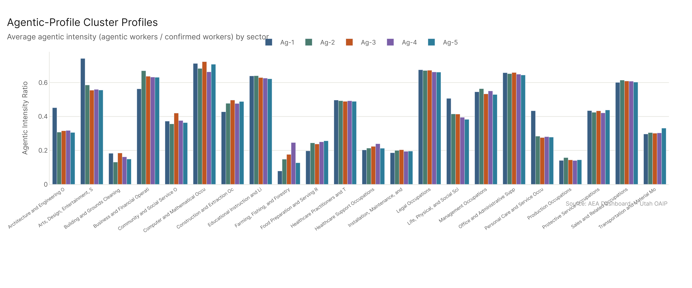
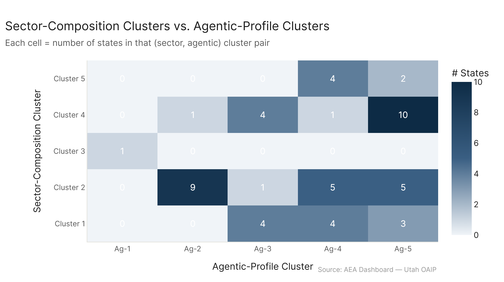

# State Clusters: Agentic Profile

*Primary config: Agentic Confirmed (AEI API 2026-02-12) vs. All Confirmed (AEI Both + Micro 2026-02-12) | freq method | auto-aug on*

**TLDR:** When you cluster states by how much of their AI exposure is agentic (tool-use API) versus conversational, the variation is strikingly narrow. Nationally, about 50.7% of confirmed exposure comes from agentic sources. No state deviates from that by more than ~7 percentage points, and most states are within 1-2pp of the national average. DC is the outlier at 57.1% agentic intensity. The five agentic clusters are largely driven by tiny differences — this is the weakest clustering in the analysis.

---

## What This Analysis Does

For each state × major sector, this analysis computes:

> agentic intensity = (agentic workers in sector) / (confirmed workers in sector)

where agentic workers = pct_agentic_confirmed/100 × occupation employment, and confirmed workers = pct_all_confirmed/100 × occupation employment, summed across all occupations in that sector in that state.

This ratio measures how "agentic-leaning" each sector is in each state's workforce mix. The feature matrix is states × sectors (22 major categories). K-means clusters on those 22 features.

---

## The Core Finding: Very Little Variation

The national average agentic intensity is 0.507. The state range runs from 0.474 (Guam) to 0.571 (DC). That's a 10pp spread across the entire country — small enough that the cluster differences are essentially noise at the state level.

This is not a surprise given the data structure. The agentic_confirmed dataset (AEI API) captures programmatic/tool-use AI interactions. The ratio of agentic to confirmed exposure is determined primarily by *occupation mix* — which types of workers a state has — rather than anything state-specific. And since occupation-level pct values are national, states with similar occupation mixes will have similar agentic intensities.

The occupations that are most agentic-intensive (high agentic pct relative to confirmed pct) are Computer/Math and Business/Finance. States with more of those workers have higher overall agentic intensity. But even the tech-heavy states don't have such different Computer/Math concentrations that the intensities separate dramatically.

---

## Five Agentic Clusters

**Ag-1 — DC only** (intensity 0.571): DC's combination of high Computer/Math and Business/Financial Operations shares means a disproportionate fraction of its AI exposure is from API/agentic use. No other state is close to this.

**Ag-2 — Higher-than-average** (10 states: MO, NH, NY, RI, and similar): Intensity ~0.514. These are mostly Cluster 2 (diversified industrial/NE) states with somewhat elevated tech and finance employment relative to their size.

**Ag-3 — Moderate** (9 states including MD, CA, CO): Intensity ~0.510. Tech states with strong Computer/Math shares, but also large healthcare and service sectors that pull the overall intensity down slightly.

**Ag-4 — Slightly below average** (14 states): Intensity ~0.503. Broad mix.

**Ag-5 — Closest to national avg / slightly below** (20 states): Intensity ~0.501. The largest group, anchored near the national baseline.

The differences between Ag-2 through Ag-5 are essentially 1-2pp — smaller than the uncertainty in the underlying data. The meaningful comparison is really DC vs. everyone else.

---

## Relationship to Other Clusterings

ARI vs. sector composition: 0.12 — very low. The sector economy of a state is not predictive of its agentic intensity distribution.

ARI vs. risk profile: 0.04 — essentially random. Risk tier composition and agentic intensity are completely independent dimensions.

ARI vs. adoption gap: 0.03 — also essentially random.

These low ARI values mean that knowing how agentic-intensive a state's workforce is tells you almost nothing about its sector composition, risk profile, or adoption gap. The agentic dimension is genuinely orthogonal to those other ways of slicing state economies.

---

## What This Means

The narrow variation in state-level agentic intensity has a clear policy implication: agentic AI deployment is not particularly geographically concentrated (except for DC). The "agentic wave" of tool-use AI will hit states relatively uniformly in terms of intensity. What differs across states is the *type* of sectors that will be affected, not the fraction that will be agentic.

This contrasts with, say, the risk-profile finding where some states (PR, VI) have dramatically more high-risk workers than others. Agentic exposure doesn't cluster that way.

---

## Config

| Setting | Value |
|---|---|
| Agentic dataset | AEI API 2026-02-12 (agentic_confirmed) |
| Confirmed dataset | AEI Both + Micro 2026-02-12 (all_confirmed) |
| Employment | eco_2025 emp_tot_{geo}_2024 per occupation |
| Feature | Agentic intensity per sector (agentic workers / confirmed workers) — 22 sectors |
| Clustering | k-means k=5, StandardScaler, n_init=20 |

## Files

| File | Description |
|---|---|
| `results/state_agentic_features.csv` | Per-state agentic intensity by sector (readable sector names) |
| `results/cluster_assignments.csv` | State → agentic cluster |
| `results/cluster_profiles.csv` | Avg agentic intensity by sector per cluster |
| `results/overall_agentic_share.csv` | Overall agentic intensity per state + cluster |
| `results/vs_sector_composition.csv` | Both cluster assignments side-by-side |
| `figures/agentic_intensity_heatmap.png` | State × sector intensity heatmap |
| `figures/cluster_profiles.png` | Avg intensity by sector per cluster |
| `figures/overall_agentic_bar.png` | States ranked by overall agentic intensity |
| `figures/vs_sector_comp.png` | Sector vs. agentic cluster tile count |
