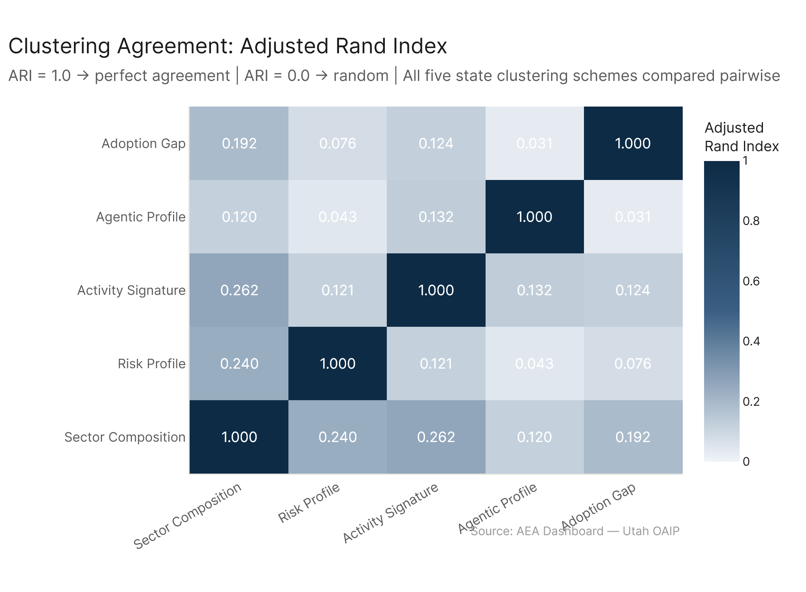
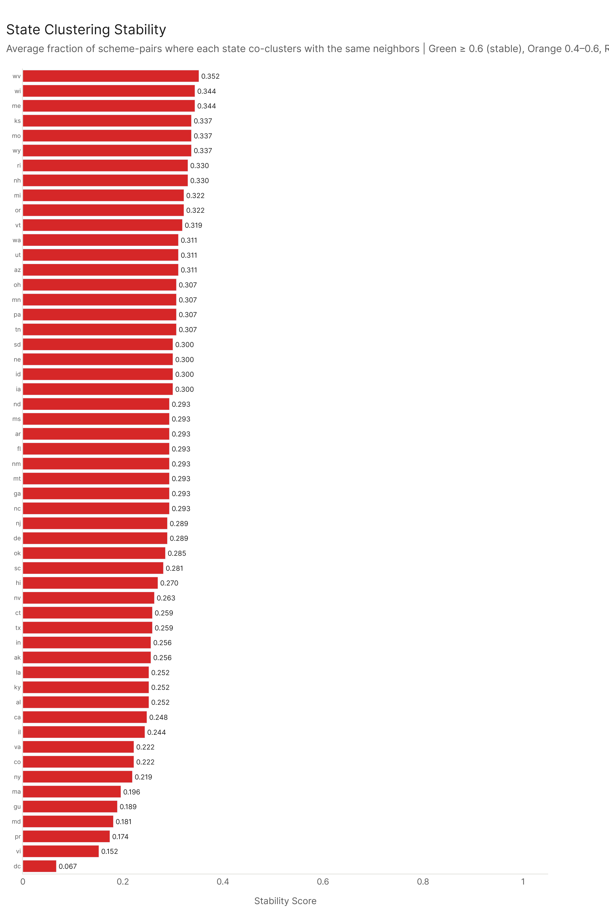
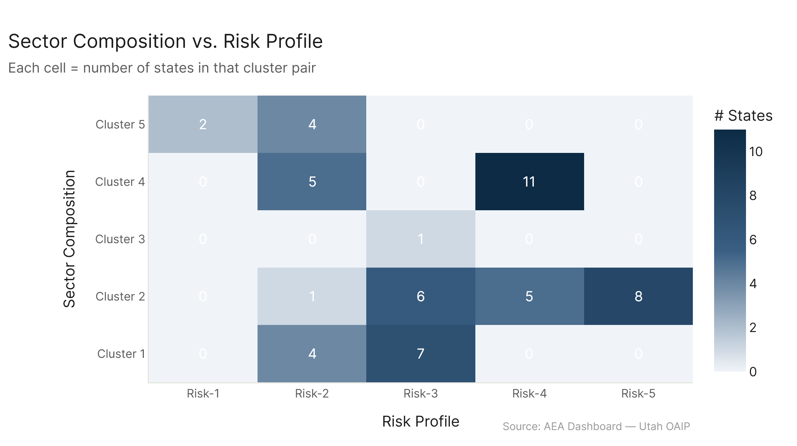
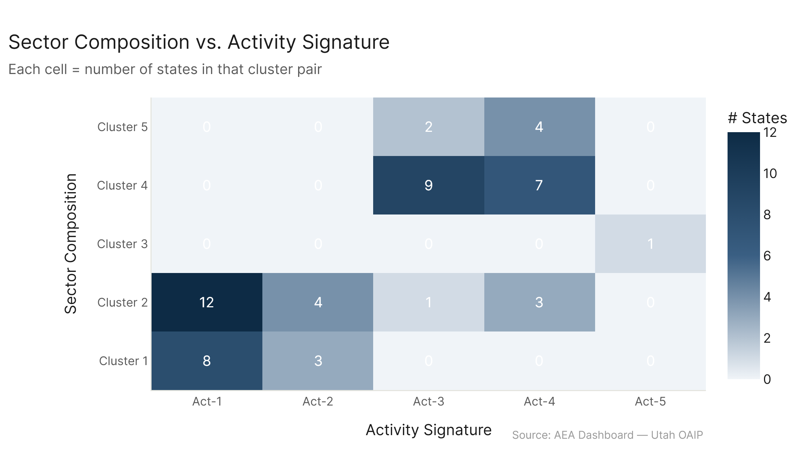
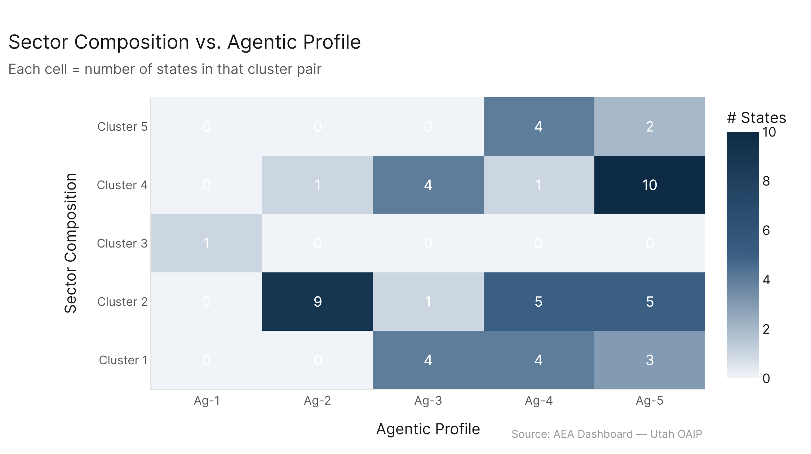
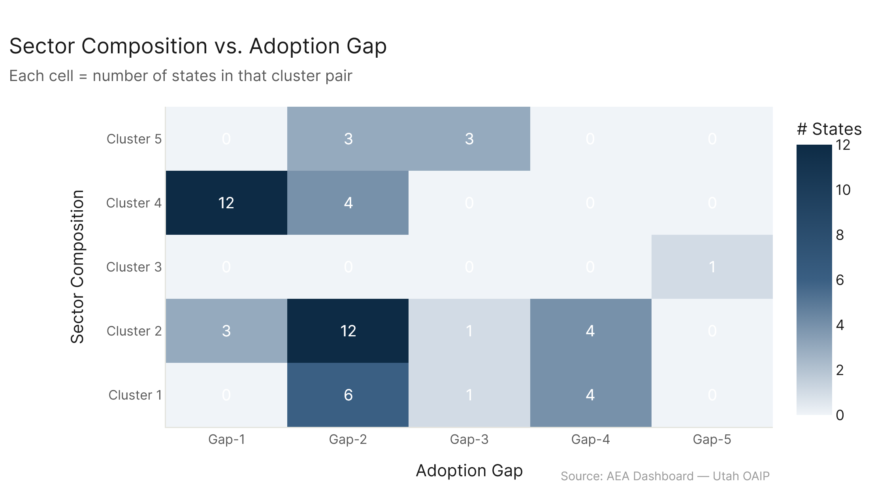

# State Clusters: Cluster Convergence

*Five clustering schemes compared: sector composition | risk profile | activity signature | agentic profile | adoption gap*

The five state clustering schemes largely disagree with each other (all pairwise ARI values are low, max 0.26). This is not a failure — it means each lens is measuring something genuinely different about state economies, not just restating the same underlying structure. States that cluster together by sector composition don't reliably cluster together by risk tier, agentic intensity, or adoption gap. DC is the most unstable state (ARI = 0.07), consistently an outlier by every metric but not the same outlier each time. Most stable states are rural/industrial Midwest and Northeast.

---

## The ARI Matrix

Adjusted Rand Index measures agreement between two clusterings: 1.0 = perfect, 0.0 = random, < 0 = systematic disagreement.

| | Sector | Risk | Activity | Agentic | Gap |
|---|---|---|---|---|---|
| **Sector Composition** | 1.00 | 0.24 | 0.26 | 0.12 | 0.19 |
| **Risk Profile** | 0.24 | 1.00 | 0.12 | 0.04 | 0.08 |
| **Activity Signature** | 0.26 | 0.12 | 1.00 | 0.13 | 0.12 |
| **Agentic Profile** | 0.12 | 0.04 | 0.13 | 1.00 | 0.03 |
| **Adoption Gap** | 0.19 | 0.08 | 0.12 | 0.03 | 1.00 |

Every off-diagonal value is below 0.27. The highest is sector vs. activity (0.26) — both capture "what type of work" states do. The lowest is agentic vs. gap (0.03) and agentic vs. risk (0.04) — essentially random agreement.

---

## What the Disagreement Means

**Sector composition captures structure, not dynamics.** It tells you what kinds of industries a state has. But that doesn't predict which workers are in dangerous positions (risk), what specific activities AI is touching (activity), how agentic vs. conversational the exposure is (agentic), or how large the remaining gap is (adoption gap). A tech-heavy state and a diversified industrial state might have similar risk profiles and nearly identical adoption gaps.

**Risk profile and sector composition agree moderately (0.24).** This is expected: the structural-vulnerability risk factors (job zone, outlook, n_software) are correlated with industry. Manufacturing, agricultural, and service sectors have more lower-zone jobs. But the correlation is noisy — within any sector, the actual occupation-level risk distribution varies, and large states have enough occupational diversity that sector labels don't determine risk outcomes.

**Activity signature and sector composition agree moderately (0.26).** Also expected: the type of work AI is touching follows roughly from the industry mix. Physical industries → more physical GWAs in the exposure profile. Knowledge industries → more analytical GWAs. But again, noisy.

**Agentic profile agrees with nothing (max ARI 0.13).** Agentic intensity is driven by very small differences in occupation mix (specifically, Computer/Math and Business/Finance concentration). Those small differences don't align with sector composition or risk or gap in any consistent way. Only DC is a systematic outlier.

**Adoption gap agrees with nothing (max ARI 0.19 with sector).** The gap is nearly uniform across all states. The clusters exist but are carved from narrow variation. Nothing about a state's economy predicts its gap profile reliably.

---

## State Stability

Stability score = for each state, the average fraction of other states that co-cluster with it consistently across schemes.

**Most stable states (highest stability):**
- WV (0.35), ME (0.34), WI (0.34), MO (0.34), KS/WY (0.34)

These are predominantly Cluster 2 (diversified industrial) and Cluster 4 (rural/inland) states. They consistently group with each other across multiple schemes because they share a combination of features: moderate risk, physical/service activity mix, average agentic intensity, average adoption gap. They're "typical" state economies in multiple dimensions simultaneously, so they find each other in multiple clusterings.

**Least stable states (lowest stability):**
- DC (0.07), VI (0.15), PR (0.17), GU (0.19), MD (0.18)

DC is the most unstable by far. Under every scheme, DC is either a singleton or a small outlier cluster, but with *different neighbors* in each one: a lone outlier in sector composition and activity signature, grouped with moderate-knowledge-economy states in risk, and with other high-agentic-intensity states in the agentic clustering. DC is consistently anomalous but not anomalous in the same direction twice.

The territories (PR, VI, GU) are also unstable because they have unusual profiles on multiple dimensions — high risk tier (PR, VI), unusual activity mixes, and service-economy structures that put them as outliers on several schemes.

Maryland is unusual for a contiguous state — it's caught between the DC orbit (in sector clustering it's Cluster 1) and the diversified northeast (it has large healthcare and government sectors). It doesn't sit cleanly in any cluster across all schemes.

---

## How Sector Clusters Map to Other Schemes

**Sector Composition → Risk Profile:**

Cluster 2 (diversified industrial/NE) spreads across Risk-3, Risk-4, Risk-5 — no clean mapping. Cluster 1 (tech/Sun Belt) goes mostly Risk-2, Risk-3. Cluster 5 (tourism/service) concentrates in Risk-1 and Risk-2.

**Sector Composition → Activity Signature:**

Cluster 2 mostly ends up in Act-1, Act-3, Act-4. Cluster 4 (rural) mostly Act-3, Act-4. Cluster 1 (tech) mostly Act-1, Act-2. Cluster 3 (DC) → Act-5. This has the most coherence of the four cross-comparisons.

**Sector Composition → Agentic Profile:**

All sector clusters spread widely across agentic clusters. No pattern. DC (Cluster 3) → Ag-1, but otherwise no concentration.

**Sector Composition → Adoption Gap:**

Some slight concentration — Cluster 4 (rural) slightly overrepresents in Gap-1 (elevated gap). Cluster 1 (tech/Sun Belt) has a few states in Gap-4. But the overall picture is diffuse.

---

## What the Disagreement Implies for Policy

If the clusterings agreed strongly, you'd have a clean typology: "these five state types have consistently aligned exposure profiles." You could say "State X is a Type 2 economy: medium risk, analytical work, average agentic, average gap." You can't say that.

Instead, each dimension tells you something independent:
- **Sector composition**: what industries employ the AI-exposed workforce
- **Risk profile**: how many of those workers are in structurally vulnerable positions
- **Activity signature**: what types of work AI is reaching in those states
- **Agentic intensity**: how much of that exposure is from tool-use vs. conversational AI
- **Adoption gap**: how much further AI *could* spread beyond current confirmed usage

A state policy response calibrated only to sector composition — "we're a healthcare-heavy state so we should focus on healthcare AI disruption" — would miss risk, agentic, and gap dimensions that don't follow from the sector label. Comprehensive state-level AI policy probably needs to engage all five dimensions independently.

---

## Config

| Setting | Value |
|---|---|
| Schemes compared | sector_composition, risk_profile, activity_signature, agentic_profile, adoption_gap |
| ARI metric | sklearn.metrics.adjusted_rand_score |
| Stability | Pairwise co-cluster agreement fraction, averaged across states |
| States included | 54 (intersection of all 5 scheme assignments) |

## Files

| File | Description |
|---|---|
| `results/all_assignments.csv` | State → cluster in each of the 5 schemes |
| `results/ari_matrix.csv` | Pairwise ARI between all scheme pairs |
| `results/state_stability.csv` | Per-state stability score + all 5 cluster assignments |
| `figures/ari_heatmap.png` | Pairwise ARI heatmap |
| `figures/stability_bar.png` | States ranked by stability score |
| `figures/sector_to_risk_profile.png` | Sector vs. risk cross-cluster tile map |
| `figures/sector_to_activity_signature.png` | Sector vs. activity cross-cluster tile map |
| `figures/sector_to_agentic_profile.png` | Sector vs. agentic cross-cluster tile map |
| `figures/sector_to_adoption_gap.png` | Sector vs. gap cross-cluster tile map |
