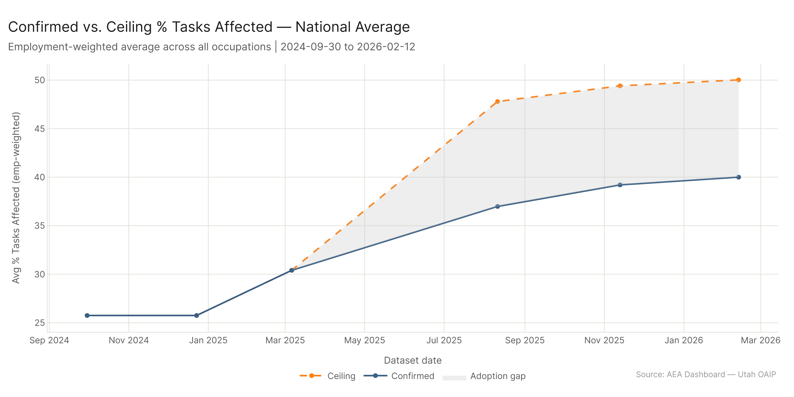
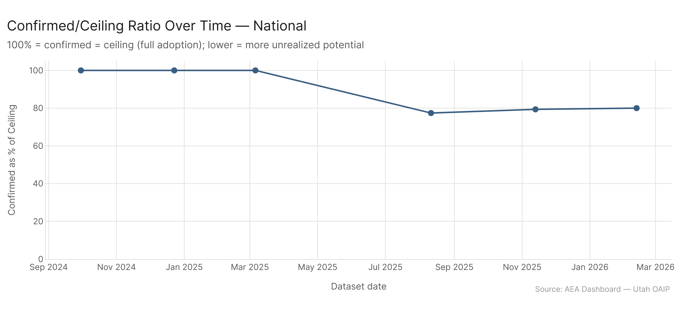
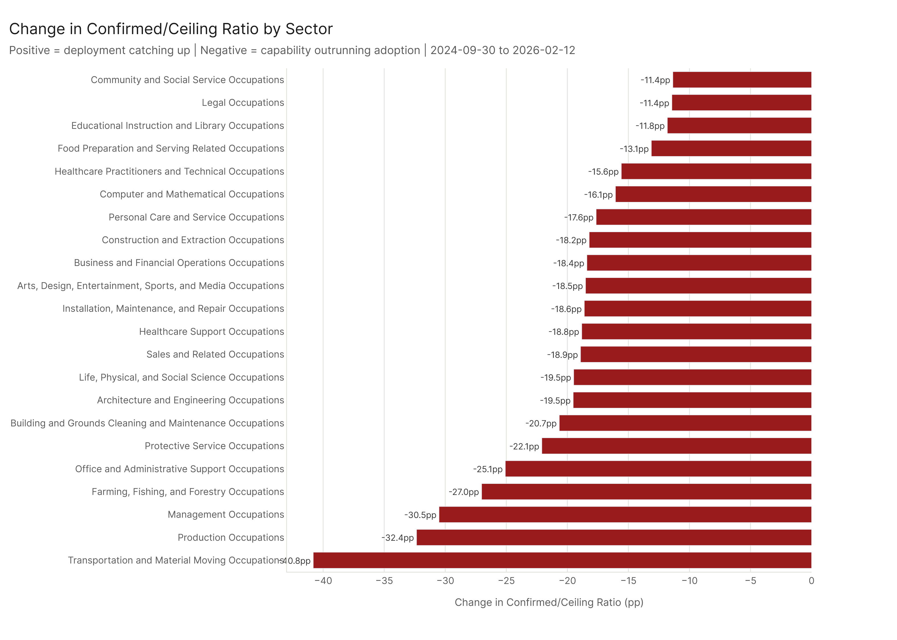
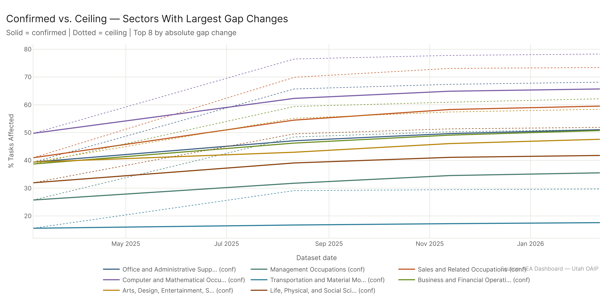

# Confirmed vs. Ceiling Convergence: Is Deployment Catching Up?

*Config: all_confirmed (AEI Both + Micro) vs. all_ceiling (All Sources) series | 6 shared dates Sep 2024 – Feb 2026 | Method: freq | Auto-aug ON | National*

---

There was no confirmed/ceiling gap before April 2025 — because MCP (the main thing that makes the ceiling larger than confirmed) didn't exist yet. The gap opened in August 2025 when MCP data was incorporated, putting the confirmed/ceiling ratio at 77%. Since then, the ratio has crept upward: 77% in August 2025, 79% in November 2025, 80% in February 2026. The gap is not closing dramatically, but confirmed exposure is growing slightly faster than ceiling exposure at the national level. The sectors where confirmed is furthest below ceiling (Transportation at 59%, Production at 68%) are precisely the sectors where MCP adds the most exposure — tool-use AI has a different occupational footprint than conversational AI, and those sectors are where the gap lives.

---

## The Gap That Didn't Exist Until Mid-2025

The confirmed/ceiling comparison has a structural quirk that shapes every finding: MCP data — the primary source that makes the ceiling larger than confirmed — only started in April 2025. The "All Sources" ceiling series and the "AEI Both + Micro" confirmed series are effectively the same dataset for all dates before that. The gap is entirely a post-April 2025 phenomenon.

What this means: the "adoption gap" isn't a gap that has been widening since 2024 while organizations fail to keep up with AI capability. It's a gap that was created by new measurement — by the addition of MCP benchmarks that showed AI capability in areas where confirmed usage hadn't been documented. Before MCP, there was no measurable ceiling-confirmed divergence.

| Date | Confirmed | Ceiling | Gap | Ratio |
|------|-----------|---------|-----|-------|
| Sep 2024 | 25.8% | 25.8% | 0.0pp | 100% |
| Dec 2024 | 25.8% | 25.8% | 0.0pp | 100% |
| Mar 2025 | 30.4% | 30.4% | 0.0pp | 100% |
| Aug 2025 | 37.0% | 47.8% | 10.8pp | 77% |
| Nov 2025 | 39.2% | 49.4% | 10.2pp | 79% |
| Feb 2026 | 40.0% | 50.0% | 10.0pp | 80% |

The gap is around 10 percentage points nationally and has barely moved since it opened. Ceiling grew from 47.8% to 50.0% between August 2025 and February 2026 — a 2.2pp increase. Confirmed grew from 37.0% to 40.0% — a 3.0pp increase. Confirmed grew faster, which is why the ratio improved slightly (77% to 80%), but both are growing, and the absolute gap is barely narrowing.

---

## Where MCP Adds the Most

The sector-level confirmed/ceiling ratios show where MCP has opened the largest gaps. These are the sectors where tool-use AI capability (what MCP measures) extends furthest beyond what human conversational and API usage has confirmed.

**Sectors with the highest confirmed/ceiling ratio at Feb 2026** (closest to full adoption):
- Community and Social Service: 88.6%
- Legal: 88.6%
- Educational Instruction and Library: 88.2%

These sectors' high ratios don't mean deployment is strong — they mean MCP doesn't add much exposure there beyond what conversational AI already covers. Legal, Education, and Community/Social Service work is primarily text-based and relationship-oriented; MCP's tool-use benchmarks don't reach much further than conversational AI in these domains.

**Sectors with the lowest confirmed/ceiling ratio** (largest MCP-specific gap):
- Transportation and Material Moving: 59.2%
- Production: 67.7%
- Management: 69.5%

Transportation at 59% means only 59% of the ceiling is reflected in confirmed usage. The MCP-specific capability gap is 41 percentage points. This makes intuitive sense: transportation work involves logistics coordination, routing, tracking, and scheduling — exactly the kind of system-interaction tasks that MCP benchmarks well but that aren't showing up as confirmed human conversational use. The exposure is theoretically there, but organizations haven't confirmed it through actual deployments.

---

## The Interpretation Problem

All 22 major sectors started at a 100% confirmed/ceiling ratio (because the ceiling was the same as confirmed before MCP existed). Every sector's ratio declined when MCP was added. The question is whether the decline reflects genuine unrealized adoption potential or an artifact of MCP capturing a different type of capability than what's reflected in confirmed usage data.

For sectors like Legal and Education, where MCP adds only 11-12pp gap, the story is clean: these sectors' ceiling is close to their confirmed usage because the type of AI capability relevant to their work (text generation, analysis, summarization) is well-represented in both confirmed and ceiling sources.

For Transportation and Production, the 40-33pp gaps could mean either: (1) huge unrealized adoption potential that organizations haven't yet deployed, or (2) MCP benchmarks that measure AI's theoretical capability to interact with logistics/production systems without that translating into widespread confirmed deployment. Both could be true simultaneously.

The narrowing at the national level (77% → 80% since August 2025) is the more interpretable signal: confirmed usage is growing slightly faster than the ceiling, meaning deployment is making modest progress relative to capability. If confirmed keeps growing at ~3pp per six months and ceiling at ~2pp, the gap continues to close slowly.

---

## Config

Confirmed series: `AEI Both + Micro` (2024-09-30, 2024-12-23, 2025-03-06, 2025-08-11, 2025-11-13, 2026-02-12) | Ceiling series: `All` (same dates subset) | Employment-weighted average at national level | Major category pct from backend groupby

## Files

| File | Description |
|------|-------------|
| `results/national_convergence.csv` | National emp-weighted avg pct, gap, ratio at each shared date |
| `results/major_category_convergence.csv` | Per-sector confirmed and ceiling pct at each date |
| `results/sector_convergence_summary.csv` | Sector-level ratio change and gap change from first to last date |
| `figures/national_confirmed_vs_ceiling.png` | Shaded area showing confirmed, ceiling, and gap over time (committed) |
| `figures/national_ratio_over_time.png` | Confirmed as % of ceiling over time (committed) |
| `figures/sector_ratio_delta.png` | Sector ratio change bar chart (committed) |
| `figures/sector_lines_confirmed_vs_ceiling.png` | Confirmed vs ceiling lines for 8 sectors with largest gap changes (committed) |
