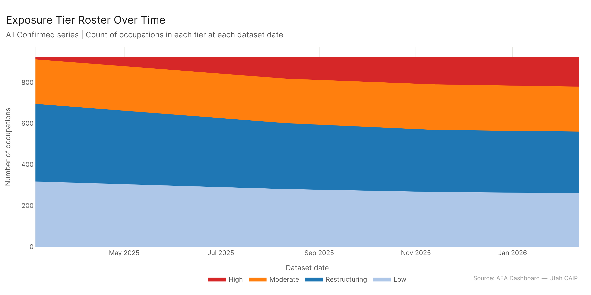
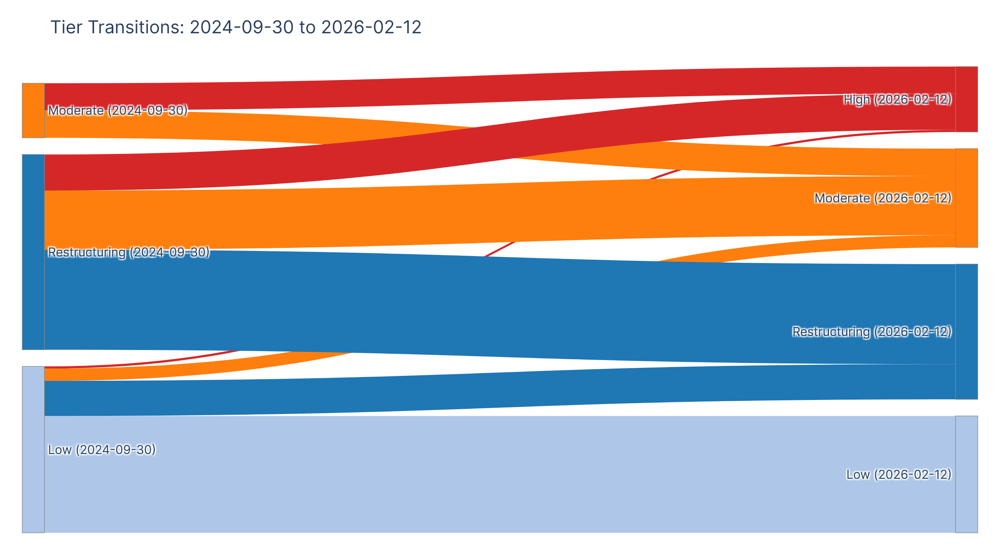
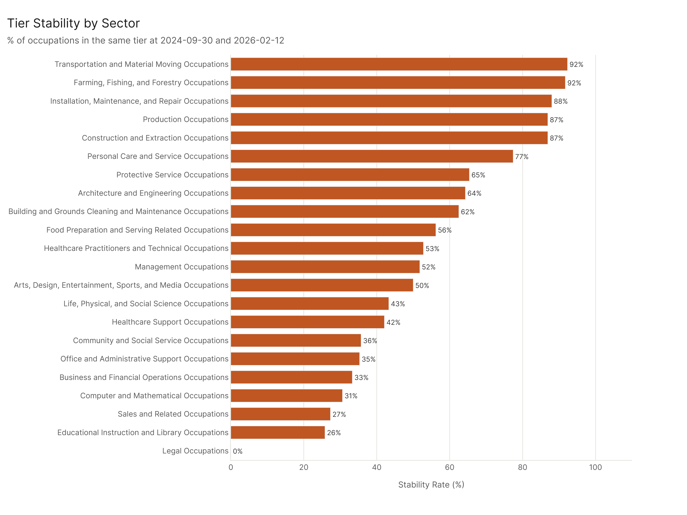
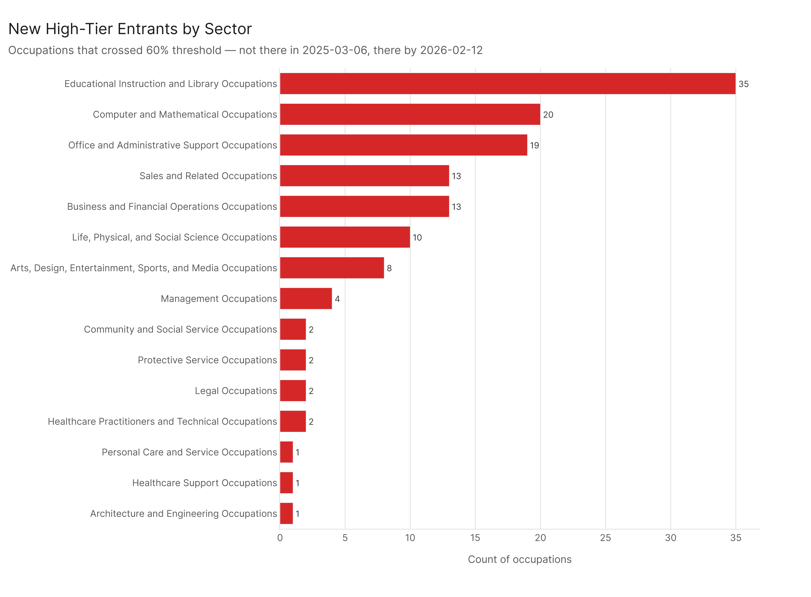

# Tier Churn: Exposure Tier Mobility Over Time

*Config: all_confirmed series (AEI Both + Micro, 6 dates Sep 2024 – Feb 2026) | Method: freq | Auto-aug ON | National*

---

In September 2024, zero occupations had >= 60% confirmed AI exposure. By February 2026, 145 did. That's the single most striking number in this analysis: the entire high-exposure tier was created during the measurement window. Alongside that, 41% of all occupations changed tier over the period — mostly moving upward from the "restructuring" (20–39%) band toward moderate (40–59%) and high (>=60%). Legal Occupations was the most unstable sector, with 100% of its occupations changing tier. Transportation and Material Moving was the most stable — 92% stayed put.

---

## The Tier System

Four tiers based on confirmed pct_tasks_affected:
- **High**: >= 60%
- **Moderate**: 40–59%
- **Restructuring**: 20–39%
- **Low**: < 20%

The 33% threshold also matters as the risk-scoring "exposure gate" — occupations below 33% can't be classified as high-risk regardless of other factors.

---

## From Zero to 145

The most important finding here is the starting condition. In September 2024, the all_confirmed dataset showed no occupation with >= 60% confirmed AI task exposure. None. The threshold wasn't approached — it didn't exist yet in the data.

By February 2026, 145 occupations crossed it. That means the "high-exposure" tier is entirely a product of the 16-month measurement window. Every occupation currently classified as high-exposure made that transition during the observation period.

The 145 new high-tier entrants weren't evenly distributed. Three sectors account for the bulk:
- **Educational Instruction and Library**: 37 new high-tier occupations (out of 62 total in the sector — 60% of all education occupations are now high-exposure)
- **Computer and Mathematical**: 23 new high-tier occupations
- **Office and Administrative Support**: 19 new high-tier occupations

---

## The Tier Transition Matrix

Of 923 occupations:
- **381 (41%) changed tier** from their September 2024 position to February 2026
- **542 (59%) stayed in the same tier**

But "stayed" covers very different situations. The 259 occupations that stayed in the Low tier were stable because nothing changed for them — these are the physical and operational occupations where AI hasn't made confirmed inroads. The 222 occupations that stayed in the Restructuring tier are a more ambiguous group: they started there and ended there, but many of them moved within that band.

The most movement was in the Restructuring (20–39%) band. Of the 433 occupations there in September 2024:
- 80 moved up to High
- 131 moved up to Moderate
- 222 stayed in Restructuring

More than half of the September 2024 Restructuring occupations moved upward. The Restructuring tier is functionally a waiting room — a band that occupations pass through on their way to higher exposure. It lost 211 occupations while only gaining new ones from the Low tier (78 upward moves from Low to Restructuring).

---

## The 33% Risk Gate: 212 Crossings

The risk scoring framework uses 33% as an exposure gate — occupations below it can't be classified as high-risk regardless of other factors. During the measurement window, 212 occupations crossed this threshold for the first time (starting below 33%, ending at or above it). That's more than a fifth of all 923 occupations. The exposure gate is not a stable line — it's a boundary that a large fraction of the occupational landscape has recently passed.

For risk scoring purposes, this matters significantly. Any risk tier assignment made in September 2024 would have excluded 212 occupations that are now gate-eligible. The risk portrait has changed materially.

---

## Sector Tier Stability

Tier stability varies enormously by sector. The sectors that changed the most have two different underlying dynamics:

**Fastest-changing sectors:**
- Legal Occupations (0% stable): All 7 legal occupations changed tier. Legal AI went from minimal confirmed presence to significant confirmed exposure during this period.
- Educational Instruction and Library (25.8% stable): Only 16 of 62 education occupations stayed in the same tier.
- Sales (27.3% stable) and Computer/Math (30.6% stable)

**Most stable sectors:**
- Transportation and Material Moving (92.3% stable): 48 of 52 occupations didn't move. This isn't because transportation is exposed — it's because transportation is overwhelmingly in the Low tier and stayed there.
- Farming, Fishing, and Forestry (91.7% stable)
- Installation, Maintenance, and Repair (88.0% stable)
- Production (86.9% stable)

The most stable sectors are the ones where AI hasn't arrived at all. The most unstable are the ones where AI was actively expanding its confirmed footprint. "Stability" in this context is bimodal: either you're stable because nothing happened (physical sectors), or you're stable because you were already at peak exposure (very few occupations). Everyone in between was moving.

---

## What This Means for Risk Assessment

Any risk tier assignment made using September 2024 data would now be significantly wrong for a large fraction of occupations:
- 145 occupations are now in the high-exposure tier that weren't there
- 212 occupations crossed the risk gate (now risk-eligible that weren't before)
- 381 occupations changed tier entirely

Risk assessments based on static snapshots have a short shelf life. The tier roster is not a stable property of an occupation — it's a function of the state of AI capability measurement at the time of assessment. Given the pace of change observed here, a risk tier assignment older than 12 months should be treated as provisional.

---

## Config

Dataset: `AEI Both + Micro` series (6 dates: 2024-09-30, 2024-12-23, 2025-03-06, 2025-08-11, 2025-11-13, 2026-02-12) | Method: freq | Auto-aug ON | National | Thresholds: Low <20%, Restructuring 20-39%, Moderate 40-59%, High >=60%

## Files

| File | Description |
|------|-------------|
| `results/tier_first_last.csv` | All 923 occupations: tier at first and last date, whether tier changed |
| `results/tier_transition_matrix.csv` | Count of occupations in each (first tier, last tier) pair |
| `results/tier_counts_over_time.csv` | Count of occupations in each tier at each date |
| `results/new_high_tier_entrants.csv` | All 145 occupations that crossed into the high tier (>=60%) |
| `results/gate_crossings_33pct.csv` | All 212 occupations that crossed the 33% risk gate |
| `results/sector_tier_stability.csv` | Per-sector: n stable, n changed, stability rate |
| `figures/tier_counts_over_time.png` | Stacked area: tier roster over time (committed) |
| `figures/tier_transition_sankey.png` | Sankey diagram of tier transitions (committed) |
| `figures/sector_tier_stability.png` | Sector stability rates (committed) |
| `figures/new_high_tier_by_sector.png` | New high-tier entrants by sector (committed) |
