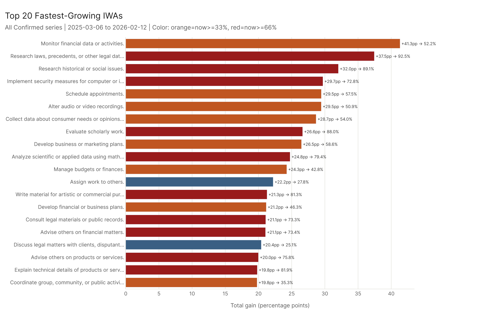
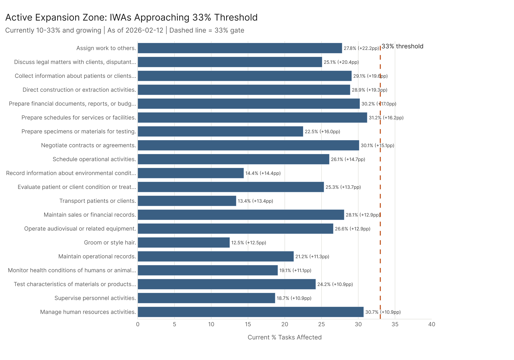

*Primary config: All Confirmed (AEI Both + Micro series, Mar 2025–Feb 2026) | Ceiling: All Sources (All series) | IWA level: eco_2025 baseline | Method: freq | Auto-aug ON | National*

The trends don't tell a smooth story. AI exposure expanded significantly over 11 months — but the expansion was concentrated in occupations that grew in the August 2025 update, while more than half of all occupations barely moved at all. In March 2025, just 12 occupations were at >=60% confirmed exposure; by February 2026, 145 were. At the IWA level, only 3 IWAs were above 66% in March 2025; 52 are now. The gap between confirmed usage and ceiling capability opened in August 2025 when MCP data was incorporated, and has barely moved since — confirmed is growing slightly faster than ceiling, but neither is pulling away. Software Developers and Data Scientists have had completely stable confirmed exposure across all four dates; Customer Service Representatives and Technical Writers saw the largest absolute gains in this window.

---

## 1. Trajectory Shapes: How Occupations Grew

*Full detail: [trajectory_shapes_report.md](trajectory_shapes/trajectory_shapes_report.md)*

51% of occupations — 468 of 923 — are laggards: less than 5 percentage points of confirmed exposure gain over the 11-month window. These are overwhelmingly physical, operational occupations where AI hasn't made confirmed inroads. The large laggard count also reflects that the window starts in March 2025, after many occupations had already gone through their major growth phase. The AI expansion story within this window is concentrated in a 209-occupation "plateaued" cohort (strong August 2025 jump, slower thereafter) and a 63-occupation steady-grower group.

110 occupations qualify as "early movers" — already at high exposure in March 2025 with little additional gain. These include Computer and Mathematical and Architecture and Engineering occupations that reached their current confirmed level before the window opens. The early movers averaged 47% at the start and ended at 52%.

Only 1 occupation fit a "late mover" pattern — starting below 28% at the midpoint and jumping 10+ percentage points in the second half. The near-zero count suggests truly new AI footholds in previously untouched work were essentially absent in this window.

---

## 2. Tier Churn: Exposure Tier Mobility Over Time

*Full detail: [tier_churn_report.md](tier_churn/tier_churn_report.md)*

In March 2025, just 12 occupations had >=60% confirmed AI exposure. By February 2026, 145 did — 133 new high-tier entrants in 11 months. 33% of all occupations (302 of 923) changed tier over the period. The 33% risk gate — which determines eligibility for high-risk classification — was crossed by 104 occupations that started below it.

Sector stability was bimodal. Legal Occupations: 0% stable (all 7 legal occupations changed tier). Transportation: 92% stable. But "stable" in Transportation means frozen in the Low tier; "stable" in Computer/Math means holding at high exposure.

---

## 3. Confirmed vs. Ceiling Convergence

*Full detail: [confirmed_ceiling_convergence_report.md](confirmed_ceiling_convergence/confirmed_ceiling_convergence_report.md)*

There was no confirmed/ceiling gap before April 2025. The gap didn't exist because MCP — the primary source that makes the ceiling larger than confirmed — launched in April 2025. When MCP was incorporated in the August 2025 dataset, the ceiling jumped to 47.8% while confirmed was at 37.0%, creating a 10.8pp gap and pushing the confirmed/ceiling ratio down to 77%.

Since then: modest improvement. The ratio has moved from 77% (Aug 2025) to 80% (Feb 2026). Confirmed is growing slightly faster than ceiling, but both are growing, and the absolute gap has barely changed.

The sector-level breakdown reveals where MCP adds the most exposure above what conversational AI confirms. Transportation (59% ratio) and Production (68%) have the largest MCP-specific gaps — these are sectors where tool-use AI has theoretical reach into logistics, scheduling, and production systems that isn't yet reflected in confirmed human usage. Legal and Education (both ~88%) have the smallest gaps, reflecting that MCP doesn't add much in those domains beyond what conversational AI already covers.

---

## 4. Work Activity Tipping Points

*Full detail: [wa_tipping_points_report.md](wa_tipping_points/wa_tipping_points_report.md)*

At the IWA level, only 3 IWAs were at >=66% confirmed exposure in March 2025. By February 2026, 52 are — 49 newly crossed the threshold during the window. The fastest-growing IWA within this window — "Monitor financial data or activities" — gained +41.3pp (10.9% → 52.2%). "Research laws, precedents, or other legal data" reached 92.5%, the highest final level of any fast grower.

The timing of threshold crossings concentrates in August 2025. The pattern isn't smooth accumulation — it's discrete jumps as new capabilities get confirmed across clusters of related activities.

60 IWAs are currently in the active expansion zone (10–33%, growing), including "Prepare financial documents" (30.2%), "Negotiate contracts" (30.1%), "Collect information about patients or clients" (29.1%), and "Record information about legal matters" (26.5%). These are the IWAs most likely to cross 33% in the next dataset update.

---

## 5. Occupations of Interest Timeline

*Full detail: [occs_timeline_report.md](occs_timeline/occs_timeline_report.md)*

The 29 named occupations divide sharply between dramatic movers and complete non-movers. Customer Service Representatives gained 35.0pp (49.1% → 84.1%), with 31.1pp of that in the August 2025 update. Technical Writers: +30.6pp to 85.8%. Network and Computer Systems Administrators: +26.8pp to 73.7%.

Meanwhile: Software Developers (45.2%), Data Scientists (46.0%), and Accountants and Auditors (28.1%) have the exact same confirmed value across all four dates — their confirmed exposure had already stabilized before the window opens.

Registered Nurses crossed from 10.0% to 33.4%, crossing the 33% risk gate via the August 2025 update (+22.1pp). The jump reflects healthcare documentation and care planning tasks getting broader confirmed coverage.

Note: HR Specialists and Market Research Analysts showed larger total gains over the full dataset history (53.5pp and 49.7pp respectively), but their biggest jumps occurred at March 2025 — before this window opens. Their starting values in March 2025 (56.5% and 66.9%) already reflect those gains.

---

## Cross-Cutting Findings

**The high-exposure tier was sparse at the start.** At the occupation level, only 12 occupations were at >=60% confirmed in March 2025. At the IWA level, only 3 activities were at >=66%. By February 2026, 145 occupations and 52 IWAs had crossed those thresholds. The bulk of the high-exposure tier was built during this 11-month window.

**August 2025 was the dominant inflection point.** Across trajectory analysis, tier transitions, IWA threshold crossings, and occupation-of-interest timelines, August 2025 is consistently the single moment of largest confirmed capability expansion within this window. The confirmed series doesn't grow smoothly — it advances in discrete jumps. (March 2025 was also a major jump date for some occupations, but those gains appear as the starting values of this window.)

**The gap is a MCP artifact, not a deployment failure.** The confirmed/ceiling gap opened in August 2025 when MCP data was incorporated. In March 2025, confirmed = ceiling (both at 30.4%). The gap reflects a different measurement (tool-use benchmarks vs. confirmed deployment), not a deployment failure. Confirmed has been growing slightly faster than ceiling since August 2025, narrowing the ratio from 77% to 80%.

**The "obvious" AI occupations are flat; others are growing.** Software Developers, Data Scientists, and Accountants show zero confirmed growth across all four dates — their confirmed exposure had fully stabilized before the window opens. Customer Service Representatives, Technical Writers, and Network/Computer Systems Administrators show the largest absolute gains within this window.

**Tier instability is concentrated in specific sectors.** Legal (0% stable), Education, and Sales are the most volatile. Physical sectors (Transportation 92%) are frozen in the Low tier. The two-speed structure of the AI transition is visible in the tier stability data.

**The next wave is identifiable.** 60 IWAs are in the active expansion zone (10–33%, growing consistently), including financial document preparation, legal record-keeping, patient data collection, and contract negotiation. These are the activities most likely to cross the 33% meaningful-presence threshold in the next dataset update.

---

## Key Takeaways

1. **12 to 145 high-tier occupations in 11 months.** Only 12 occupations were at >=60% confirmed exposure in March 2025. 133 more crossed that threshold during the window. The bulk of the high-exposure tier is a recent creation.

2. **51% of occupations barely moved (+0.8pp avg gain for laggards).** The AI expansion is concentrated in a fraction of occupations. Physical and operational occupations are largely untouched. The high laggard count also reflects that many occupations had completed their major growth before this window opens.

3. **August 2025 drove most of the change.** Confirmed exposure advances in discrete jumps, not smooth curves. The August 2025 update was the dominant inflection point for nearly every occupation and IWA that moved during this window.

4. **The confirmed/ceiling gap is ~10pp nationally and barely moving.** Confirmed is growing slightly faster (ratio improved from 77% to 80%), but both are growing. The gap was created by MCP's addition to the ceiling.

5. **Software Developers and Data Scientists haven't grown at all in confirmed exposure.** Their confirmed values are identical across all four dates — their profile was fully established before the window. Customer Service Representatives (+35.0pp), Technical Writers (+30.6pp), and Network Admins (+26.8pp) show the largest gains within this window.

6. **104 occupations crossed the 33% risk gate during the window.** Risk profiles need to be treated as time-indexed, not permanent.

7. **The next exposure wave is in financial, legal, and healthcare documentation work.** The top approaching IWAs include "Prepare financial documents" (30.2%), "Negotiate contracts" (30.1%), and "Collect patient information" (29.1%) — all currently growing and approaching the 33% threshold.

---

## Sub-Report Index

| Sub-Analysis | Report | What It Answers |
|-------------|--------|-----------------|
| Trajectory Shapes | [trajectory_shapes_report.md](trajectory_shapes/trajectory_shapes_report.md) | How did occupations grow? Steady, plateaued, laggard, early mover, late mover patterns |
| Tier Churn | [tier_churn_report.md](tier_churn/tier_churn_report.md) | How stable are exposure tiers? Which occupations crossed into high-tier or past the 33% gate? |
| Confirmed/Ceiling Convergence | [confirmed_ceiling_convergence_report.md](confirmed_ceiling_convergence/confirmed_ceiling_convergence_report.md) | Is deployment catching up to capability? Sector-level gap dynamics |
| WA Tipping Points | [wa_tipping_points_report.md](wa_tipping_points/wa_tipping_points_report.md) | Which work activities crossed meaningful thresholds, and what's next? |
| Occupations of Interest Timeline | [occs_timeline_report.md](occs_timeline/occs_timeline_report.md) | Full time-series for the 29 named occupations |

---

## Config Reference

| Config Key | Dataset | Role |
|-----------|---------|------|
| `all_confirmed` | `AEI Both + Micro` series (4 dates: Mar 2025–Feb 2026) | Primary — all confirmed usage trends |
| `all_ceiling` | `All` series (8 dates: Mar 2025–Feb 2026) | Comparison — ceiling for convergence analysis |
| — | IWA level via `compute_work_activities` | Work activity tipping points (eco_2025 baseline) |
