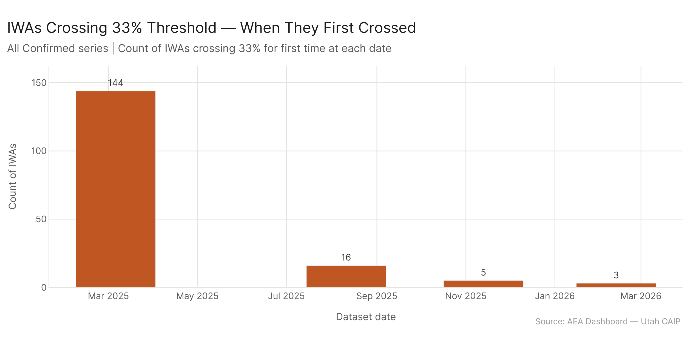
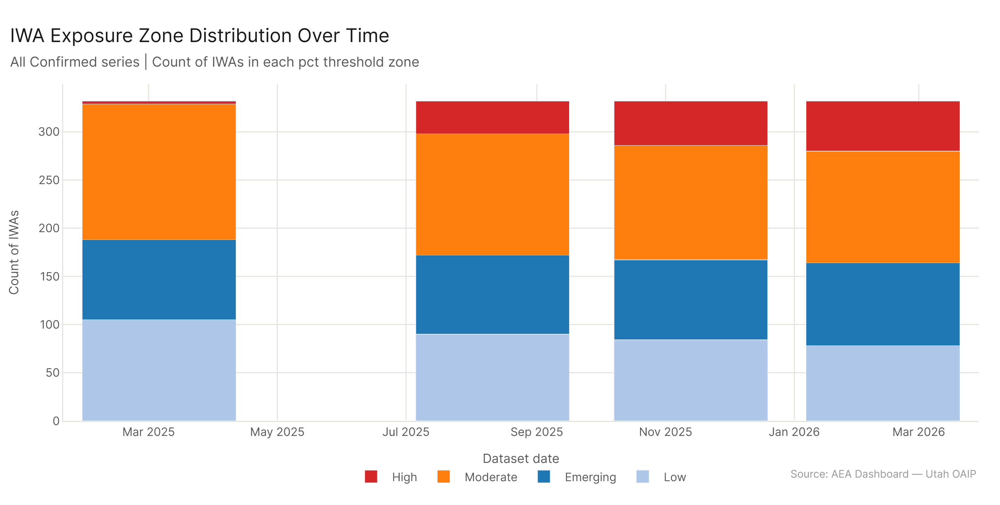

# Work Activity Tipping Points: What Crossed the Threshold

*Config: all_confirmed series (AEI Both + Micro, 4 dates Mar 2025 – Feb 2026) | IWA level | eco_2025 baseline | Method: freq | Auto-aug ON | National*

---

The series starts in March 2025 with just 3 IWAs already above the 66% threshold. By February 2026, 52 are there — 49 new high-exposure IWAs in 11 months. Another 24 IWAs crossed the 33% threshold for the first time, and 60 are currently in the 10–33% active expansion zone, growing consistently. The fastest-growing IWA by total gain within the window is "Evaluate scholarly work" (+26.6pp), extending an already high base. Three of the top-five fastest-growing IWAs are education-adjacent. The next wave — IWAs currently between 25-33% and growing — includes financial planning, legal document work, and patient data management.

---

## Starting Conditions in March 2025

The 66% threshold is the tipping point where a majority of an IWA's associated task weight is confirmed AI-exposed. In March 2025, just 3 IWAs were above it. By February 2026, 52 are — 49 IWAs crossed the threshold during the 11-month window.

| Zone | Count (Mar 2025) | Count (Feb 2026) | Change |
|------|-----------------|-----------------|--------|
| High (>=66%) | 3 | 52 | +49 |
| Moderate (33–66%) | 141 | 116 | -25 |
| Emerging (10–33%) | 83 | 86 | +3 |
| Low (<10%) | 105 | 78 | -27 |

The Moderate zone shrank (141 → 116) because many of its members graduated to High. The Low zone shrank (105 → 78) as activities moved into the Emerging band. The dominant flow during this window was Moderate → High: the activities that had already crossed 33% continued accelerating.

---

## The Fastest Growers

The top IWAs by total gain over the 11-month window reflect a concentrated story in education and professional information work:

| IWA | Gain | Final Level |
|-----|------|-------------|
| Monitor financial data or activities | +41.3pp | 52.2% |
| Research laws, precedents, or other legal data | +37.5pp | 92.5% |
| Research historical or social issues | +32.0pp | 89.1% |
| Implement security measures for computer or information systems | +29.7pp | 72.8% |
| Schedule appointments | +29.5pp | 57.5% |
| Alter audio or video recordings | +29.5pp | 50.9% |
| Collect data about consumer needs or opinions | +28.7pp | 54.0% |
| Evaluate scholarly work | +26.6pp | 88.0% |
| Develop business or marketing plans | +26.5pp | 58.6% |
| Analyze scientific or applied data using mathematical principles | +24.8pp | 79.4% |

Legal research and historical research lead on absolute gain within the window. Financial monitoring (+41.3pp) shows the largest raw gain — starting at 10.9% in March 2025 and ending at 52.2%. Legal research was already at 55% and reached 92.5% — very high final level. Security implementation, scheduling, and audio/video work all gained 29+ pp during the window. The pattern is consistent: AI's expanding confirmed footprint is heaviest in legal, financial, and knowledge work.

---

## When IWAs Crossed 33%

The 33% threshold matters as the level at which AI exposure becomes meaningful rather than marginal for an IWA. 24 IWAs crossed it for the first time during the window (March 2025 – February 2026).

The timing clusters strongly around one major transition date:

- **August 2025**: The dominant crossing date. "Develop business or marketing plans" (59%), "Schedule appointments" (58%), "Collect data about consumer needs" (54%), and "Alter audio or video recordings" (51%) all crossed here. Financial and healthcare IWAs — "Manage budgets" and "Order medical tests" — also crossed in August 2025.

- **November 2025 and February 2026**: Smaller batches of crossings. Healthcare coordination and community health IWAs crossed in these later updates.

Note: IWAs that crossed 33% in March 2025 already appear in the dataset at their post-crossing value — those crossings occurred before the window opens.

---

## The Active Expansion Zone: What's Coming Next

The 60 IWAs currently between 10% and 33%, with positive growth over the window, represent the next potential wave. These are activities where confirmed AI exposure has been building but hasn't yet crossed the meaningful-presence threshold.

The top approaching IWAs by total gain, currently between 25-33%:

| IWA | Current Level | Gain |
|-----|--------------|------|
| Record information about legal matters | 26.5% | +25.5pp |
| Prepare financial documents, reports, or budgets | 30.2% | +25.0pp |
| Assign work to others | 27.8% | +24.7pp |
| Collect information about patients or clients | 29.1% | +23.9pp |
| Discuss legal matters with clients | 25.1% | +23.7pp |
| Negotiate contracts or agreements | 30.1% | +23.6pp |
| Develop public or community health programs | 31.2% | +23.6pp |

Several of these IWAs involve routine professional documentation — legal recording, financial document preparation, patient intake, contract management. If the growth rates observed over the past 11 months continue, activities like "Prepare financial documents" (currently 30%) and "Negotiate contracts" (30%) could cross the 33% threshold in the next dataset update.

Healthcare work appears repeatedly in this zone: patient intake, care planning, health program development. This is consistent with healthcare being a sector with high confirmed-exposure growth but still trailing the top sectors.

---

## The Zone Distribution Is Shifting

Looking at all 332 IWAs at each date, the distribution is shifting away from Low and Emerging and toward Moderate and High. The current (Feb 2026) split: 52 High, 116 Moderate, 86 Emerging, 78 Low. The 78 IWAs still in the Low zone are predominantly physical and operational activities — not text, analysis, or document work.

What's notable is how much the Moderate zone has grown (84 → 116 IWAs) while the Emerging zone has simultaneously shrunk. The Moderate zone is filling from below as Emerging IWAs graduate, while simultaneously emptying from above as Moderate IWAs cross into High. It's a fluid zone — not a destination.

---

## Config

Dataset: `AEI Both + Micro` series (4 dates: 2025-03-06, 2025-08-11, 2025-11-13, 2026-02-12) | IWA level | eco_2025 baseline (mcp_group) | Method: freq | Auto-aug ON | National | Thresholds: Low <10%, Emerging 10-33%, Moderate 33-66%, High >=66%

## Files

| File | Description |
|------|-------------|
| `results/iwa_series.csv` | IWA pct/workers/wages at each date across confirmed series |
| `results/threshold_crossings.csv` | For each IWA × threshold, when (if ever) it crossed |
| `results/new_threshold_crossings.csv` | Threshold crossings that happened during (not at start of) the window |
| `results/iwa_growth.csv` | Per-IWA: first/last pct, total gain, early/late gain split, current zone |
| `results/iwa_approaching_33pct.csv` | IWAs currently 10-33% with positive growth |
| `results/iwa_crossed_33pct.csv` | IWAs that crossed 33% for first time during window |
| `results/iwa_zone_over_time.csv` | Zone counts at each date |
| `figures/top20_iwa_growth.png` | Top 20 fastest-growing IWAs bar chart (committed) |
| `figures/iwa_33pct_crossing_dates.png` | When IWAs first crossed 33% (committed) |
| `figures/iwa_approaching_33pct.png` | Active expansion zone IWAs approaching 33% (committed) |
| `figures/iwa_zone_over_time.png` | Zone distribution stacked bar over time (committed) |
