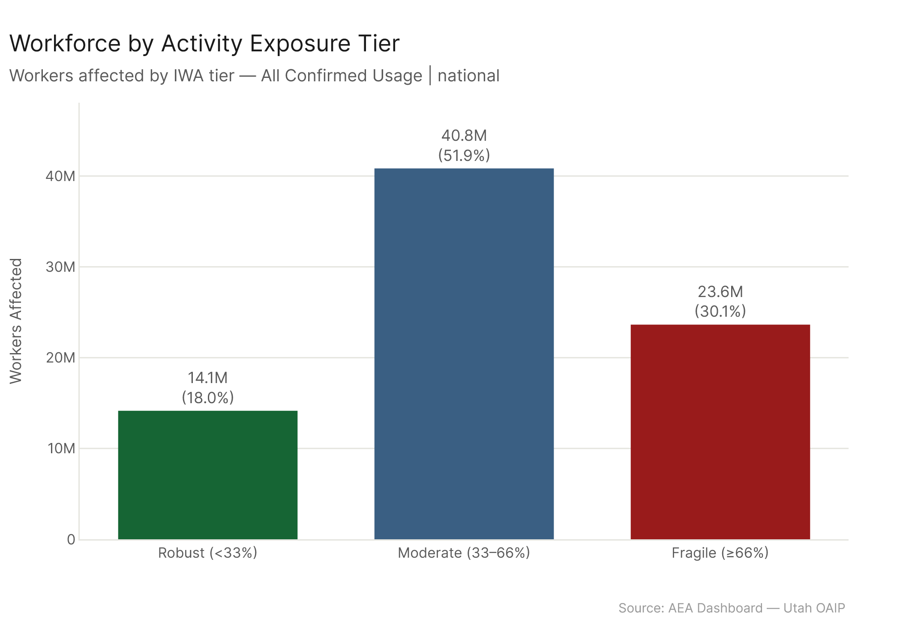
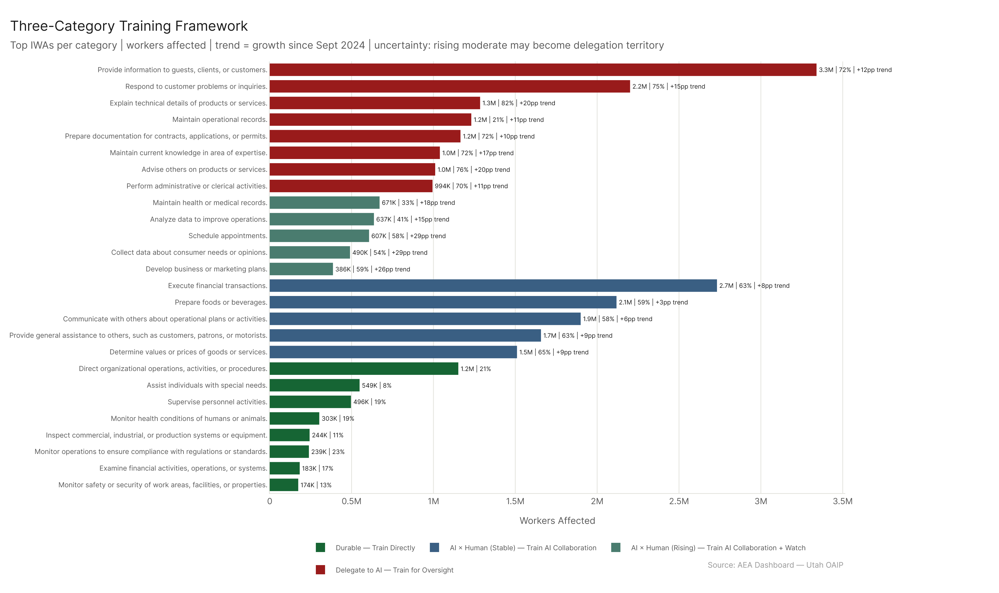
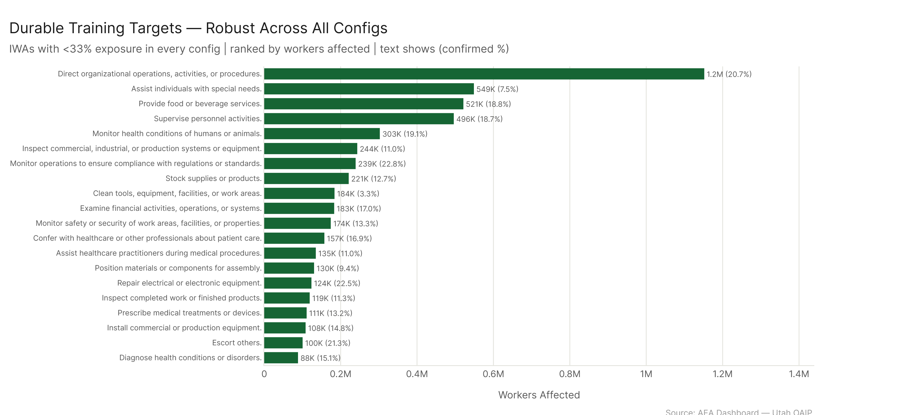
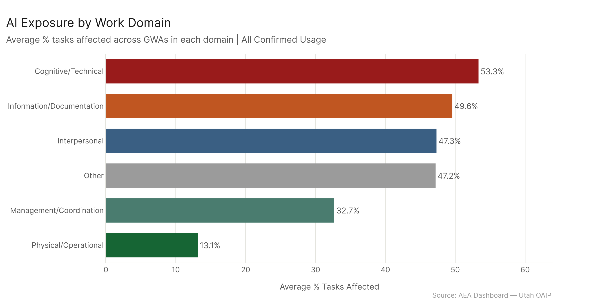
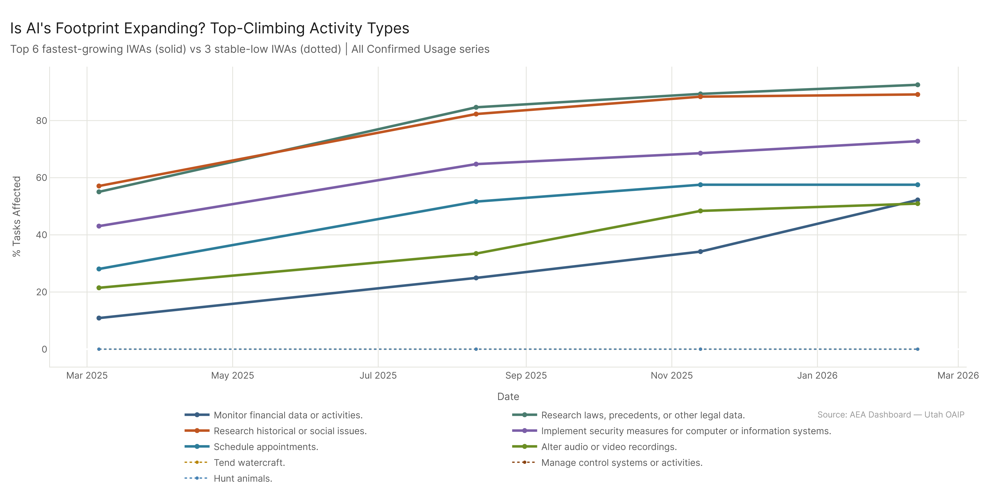

# Work Activity Exposure: Education Lens

82% of affected workers are in activities with ≥33% AI exposure — the workforce is not split between an AI-affected minority and a safe majority. Thinking about what to teach and train requires a three-category framework: (1) Durable activities where training directly builds lasting value, (2) AI × Human pair activities where training should focus on AI collaboration and judgment, and (3) Delegation activities where the human role is shifting to oversight and direction. All three categories have large workforces. The right training strategy depends on which category each activity falls into — and given that trend data shows many activities moving between categories, that judgment needs updating regularly.

---

## Who Is Doing What

The first education question is: who is actually doing the exposed activities? If AI primarily displaces a small slice of specialized workers, the education system doesn't need to change much. If it touches half the working population, the implications are different.

### Workforce by Exposure Tier

| Tier | IWAs | Workers Affected | Share of Total |
|------|------|-----------------|----------------|
| Fragile (≥ 66%) | 52 | 23.6M | 30% |
| Moderate (33–66%) | 116 | 40.8M | 52% |
| Robust (< 33%) | 164 | 14.1M | 18% |

18% of affected workers are in robust activities. 82% are in activities with meaningful AI exposure. The moderate tier alone — 40.8M workers — is where the restructuring will happen for the majority of the U.S. workforce.

---

## Three-Category Training Framework

The tier structure gives us a starting point, but the training implications differ within tiers. A useful framework for education and workforce planning:

**Category 1 — Durable: Train Directly.** Robust activities (<33%) in all five configs AND associated with occupations requiring meaningful education or training (mean job zone ≥2.5). These activities will hold value as AI reshapes adjacent work. The right training investment here is in the activity itself — the skills and judgment it requires — not primarily in AI tools.

**Category 2 — AI × Human Pair: Train for AI Collaboration.** Moderate tier (33–66%). Human judgment combined with AI is still better than AI alone here. The right investment is developing the judgment layer above what AI produces: evaluating AI outputs, directing AI effectively, and building the deeper contextual knowledge that makes AI more useful rather than less reliable. This category splits by trend:
- *Stable moderate* (slow-growing, <15pp since Mar 2025): likely to remain AI-human partnership for the medium term. Build AI literacy alongside substantive skills.
- *Rising moderate* (fast-growing, ≥15pp): moving toward the delegation category. Prioritize oversight and quality-review skills alongside AI fluency.

**Category 3 — Delegate to AI / Oversight: Train for Direction and Review.** Fragile activities (≥66%) and "next wave" activities (confirmed <33% but ceiling ≥33%). The human role here is increasingly setup, quality review, exception handling, and accountability. Training should build: setting AI context effectively, reviewing AI outputs for accuracy and appropriateness, managing the edge cases AI misses, and maintaining the judgment needed to catch errors.

**Uncertainty caveat:** This is not a fixed map. Activities move across categories as AI capabilities and usage expand. Rising moderate activities will likely enter the delegation category as agentic AI deploys at scale. Some activities may stay in the AI × human category for a long time if the human contribution remains genuinely valuable — or if regulatory, ethical, or relationship constraints limit AI replacement. The framework is directional, not deterministic.

### Workers by Training Category

| Category | Sub-type | IWAs | Workers |
|----------|----------|------|---------|
| 1 — Durable | — | 68 | 5.2M |
| 2 — AI × Human | Stable moderate | 84 | 32.7M |
| 2 — AI × Human | Rising moderate | 32 | 8.2M |
| 3 — Delegate/Oversight | Fragile | 52 | 23.6M |
| 3 — Delegate/Oversight | Next wave | 42 | 7.0M |

The largest group by far is stable moderate (32.7M workers, 84 IWAs) — this is the core of the AI × human pair category where human + AI collaboration is the likely near-term reality.

---

## Durable Training Targets (Educationally Relevant)

Not all robust activities are relevant to what education systems actually train people for. Food service, stocking shelves, and cleaning equipment are all AI-resistant — but they're not typically the focus of workforce development programs. Filtering the stable-robust set to activities associated with occupations requiring meaningful education or training (mean job zone ≥2.5) gives a more useful target list.

The top educationally-relevant durable targets by workers affected:

| IWA | Workers | Confirmed % | Mean Job Zone |
|-----|---------|------------|--------------|
| Direct organizational operations, activities, or procedures | 1.15M | 20.7% | 3.51 |
| Assist individuals with special needs | 549K | 7.5% | 3.04 |
| Supervise personnel activities | 496K | 18.7% | 4.07 |
| Monitor health conditions of humans or animals | 303K | 19.1% | 3.91 |
| Inspect commercial, industrial, or production systems | 244K | 11.0% | 2.65 |
| Monitor operations for regulatory compliance | 239K | 22.8% | 3.48 |
| Examine financial activities, operations, or systems | 183K | 17.0% | 3.62 |
| Monitor safety or security of work areas | 174K | 13.3% | 2.57 |
| Confer with healthcare or other professionals about patient care | 157K | 16.9% | 4.22 |
| Assist healthcare practitioners during medical procedures | 135K | 11.0% | 3.09 |

This is a more useful list. Healthcare work, supervisory and management activities, financial examination, safety and compliance monitoring — these are activities that require training, that education programs can build toward, and that the data says will remain valuable.

The job zone filter matters here: mean job zone 3–4 means these activities are associated with occupations requiring medium-level preparation (vocational training to bachelor's degree). They're not "anyone can do this tomorrow" activities — they require real training — and they're AI-resistant.

---

## AI × Human Pair: The Moderate Tier

116 IWAs are in the moderate tier (33–66%), covering 40.9M workers. These are the activities where human + AI partnership is the current and likely near-term reality. The training question is: what does the human bring to this partnership?

**Stable moderate examples** (slow-growing, <15pp growth): "Execute financial transactions" (63%, 2.7M workers), "Communicate with others about operational plans" (58%, 1.9M), "Read documents or materials to inform work processes" (62%, 1.3M). These activities are AI-reached but growing slowly — the human judgment layer remains important for the foreseeable future.

**Rising moderate examples** (fast-growing, ≥15pp growth): "Analyze data to improve operations" (+31pp to 41%, 637K workers), "Develop educational programs and procedures" (+29pp to 37%, 628K), "Schedule appointments" (+37pp to 58%, 607K), "Maintain health or medical records" (+27pp to 33%, 671K). These are growing quickly and may move into the delegation category as AI capabilities expand.

For training programs targeting this tier: the core investment is not "how to do the activity" (AI handles more and more of that) but "how to direct AI doing the activity" — setting context, validating outputs, handling exceptions, maintaining accountability. The growing exposure in rising moderate activities means this training investment needs to happen now, not after the transition.

---

## Delegation Territory: Fragile and Next Wave

The fragile tier (52 IWAs, 23.6M workers) is where the human role has already shifted substantially. Top examples: "Provide information to guests/clients" (72%, 3.3M workers), "Respond to customer inquiries" (75%, 2.2M), "Explain technical details" (82%, 1.3M), "Prepare documentation for contracts" (72%, 1.2M).

Training for this category is less about the activity itself and more about:
- Knowing when AI output requires human review vs. can be passed through
- Understanding the failure modes of AI doing this work
- Maintaining the domain knowledge needed to catch errors
- Managing the accountability that remains with humans even when AI does the execution

The next-wave IWAs (42 activities, 7.0M workers) are the upcoming delegation cases — currently below 33% confirmed but heading there when agentic AI deploys at scale. "Maintain operational records," "prepare schedules," "assign work to others" — the workflow and administrative infrastructure of organizations. Training programs built around these activities should be building toward oversight and direction skills, not just execution skills.

---

## Domain Exposure

Classifying GWAs into broad domains:

| Domain | GWAs | Avg % Exposed |
|--------|------|--------------|
| Cognitive/Technical | 9 | 53.3% |
| Information/Documentation | 3 | 49.6% |
| Interpersonal | 9 | 47.3% |
| Management/Coordination | 4 | 32.7% |
| Physical/Operational | 6 | 13.1% |

Physical/Operational (13%) is the floor. The gap between 13% and 53% is the distance between what AI can do and what a person has to be physically present to do. Management/Coordination at 33% is notable — coordination and scheduling activities are already in the moderate range, and the agentic configs push coordination work substantially higher toward the delegation end.

---

## Is AI a Fad?

The quantitative answer: no. 275 of 332 IWAs (83%) grew in exposure between March 2025 and February 2026. 27 IWAs crossed the 10% threshold for the first time during the window.

The top growers within the window:

| IWA | Mar 2025 | Feb 2026 | Growth |
|-----|----------|----------|--------|
| Monitor financial data or activities | 10.9% | 52.2% | +41.3pp |
| Research laws, precedents, or other legal data | 55.1% | 92.5% | +37.5pp |
| Research historical or social issues | 57.1% | 89.1% | +32.0pp |
| Implement security measures for computer systems | 43.1% | 72.8% | +29.7pp |
| Schedule appointments | 28.1% | 57.5% | +29.5pp |
| Evaluate scholarly work | 61.3% | 88.0% | +26.6pp |

Financial monitoring, legal research, and security implementation lead the growth table for this window. Note that IWAs like "Evaluate scholarly work" (already at 61.3% in March 2025) had most of their growth before the window opens — they're still growing, just from a higher base. If AI were a fad, we would expect growth to slow as novelty wears off. Instead, 83% of IWAs continued growing through February 2026.

---

## Config

- **Primary**: AEI Both + Micro 2026-02-12 | freq | auto-aug on | national
- **Stability check**: All five configs for durable targets
- **Trend**: AEI Both + Micro series (2025-03-06 → 2026-02-12)
- **Job zone filter**: mean job zone ≥2.5 from eco_2025

## Files

| File | Description |
|------|-------------|
| `results/workforce_by_tier.csv` | Workers in each exposure tier |
| `results/durable_training_targets.csv` | 68 IWAs robust in all 5 configs AND job zone ≥2.5 |
| `results/durable_training_targets_all.csv` | All 122 stably-robust IWAs (unfiltered) |
| `results/training_framework_categories.csv` | All IWAs with category/subcategory assignment |
| `results/gwa_domain_classified.csv` | GWAs with domain classification |
| `results/iwa_growth.csv` | Per-IWA growth first → last date |
| `results/domain_exposure_summary.csv` | Domain avg pct and workers |
