# Workforce Meeting — Presentation Charts

*Config: All Confirmed (AEI Both + Micro 2026-02-12) | Freq | Auto-aug ON | Utah*

---

921,000 Utah workers — 54% of the state's workforce — work in occupations where a meaningful share of tasks overlap with current AI capabilities. That translates to $62.6 billion in wages in scope. This is not a prediction that those workers will be replaced; it means that portion of Utah's workforce performs tasks that AI systems have demonstrated capability on. The charts below break this down by sector, work activity, growth trajectory, and skill composition to identify where the greatest need and potential for intervention lies.

---

## Key Caveats

These apply to every chart in this set:

- **"Affected" does not mean "replaced."** A worker is counted as affected if any meaningful share of their tasks overlap with demonstrated AI capability.
- **The analysis assumes full adoption.** The numbers reflect what would happen if every worker in an affected occupation used AI for all the tasks AI can currently do. Actual adoption is lower. Think of these as the ceiling of current-capability exposure, not a snapshot of current deployment.
- **Scores come from multiple AI sources.** "All Confirmed" is an aggregate of capabilities across Claude conversation data, Claude API data, and Microsoft Copilot data.
- **Utah employment from BLS 2024 OEWS.** 

---

## Chart 01: Utah Headline

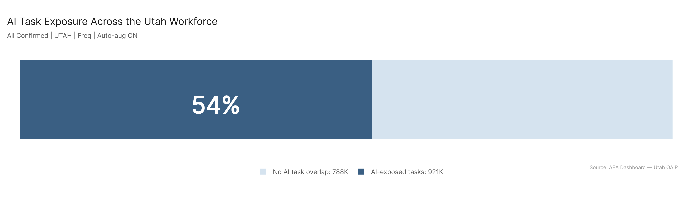

**What it shows:** Proportion of Utah's 1.71M workers in occupations with AI-exposed tasks.

**How it's computed:** For each of Utah's 923 occupations, the pipeline computes % tasks affected (ratio of AI-weighted task completion to total task completion). Workers affected = (% tasks / 100) x occupation employment. Summed across all occupations: 921K workers, or 54% of Utah's workforce.

**Interpretation:** More than half of Utah's workforce carries AI-exposed tasks. Utah's number is higher than the national average (~40%) because Utah's economy is more concentrated in technology, business services, and professional occupations — sectors with higher AI task overlap. This is the motivation: the scale is large enough that workforce strategy needs to account for it.

---

## Chart 02: Top Sectors by Workers Affected

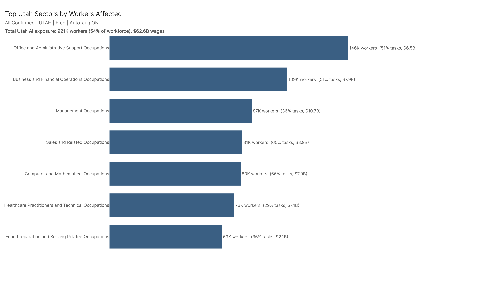

**What it shows:** The 7 largest Utah sectors ranked by number of workers with AI-exposed tasks. Labels include % tasks affected and wages affected.

**How it's computed:** Workers affected per sector = sum of (pct_tasks_affected / 100 x employment) across all occupations in that major category, using Utah BLS employment figures.

**Caveats:** Sector size drives the ranking — Office/Admin leads because it's large and deeply exposed (51%). Computer/Math has the highest task penetration (66%) but fewer Utah workers.

**Interpretation:** Office/Admin (146K), Business/Finance (109K), and Management (87K) are the top three. Together with Sales, Computer/Math, Healthcare, and Food Prep, these 7 sectors account for the bulk of Utah's AI-exposed workforce. The dollar figures signal where productivity gains (or displacement pressure) will be largest.

---

## Chart 03: Top Work Activities by % Tasks Affected

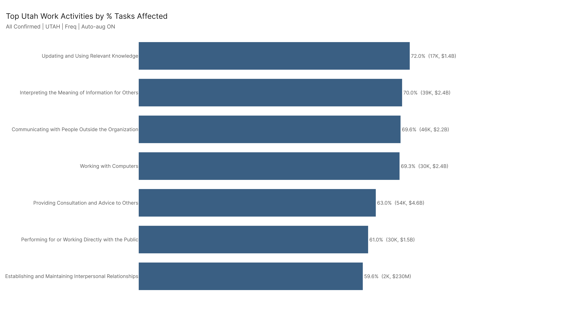

**What it shows:** The 7 most AI-exposed general work activities, ranked by % of tasks affected.

**How it's computed:** For each GWA (General Work Activity), the pipeline aggregates AI-weighted task completion across all tasks and occupations mapped to that activity. % tasks affected is the ratio of AI-weighted to total task completion.

**Caveats:** GWAs are cross-cutting — the same activity (e.g., "Working with Computers") appears across many occupations. The worker count next to each GWA represents employment allocated proportionally to that activity.

**Interpretation:** The top 4 are all information-intensive: Updating Knowledge (72%), Interpreting Information (70%), External Communication (70%), Working with Computers (69%). The AI-resistant activities (not shown) are all physical-operations categories. The clean divide between cognitive/communicative and physical work is the most consistent structural finding in the data.

---

## Chart 04: Fastest-Growing Sectors — Workers Affected

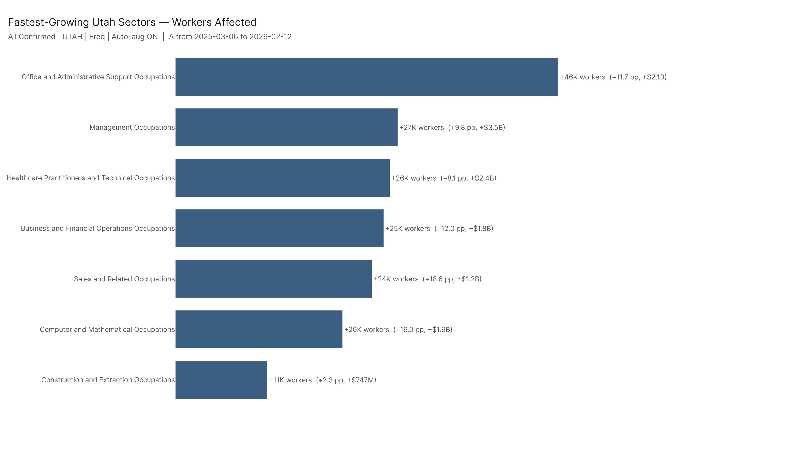

**What it shows:** The 7 sectors with the largest increase in workers affected between March 2025 and February 2026.

**How it's computed:** Delta = workers_affected at the latest dataset date minus workers_affected at the earliest date. Labels show the change in percentage points of tasks affected and wages.

**Caveats:** Growth reflects expanding AI capability data (new AEI conversation and API interactions), not necessarily new AI deployments in Utah workplaces. The March 2025 baseline already includes Microsoft Copilot data.

**Interpretation:** Office/Admin grew the most (+46K workers, +11.7pp), followed by Management (+27K, +9.8pp) and Healthcare (+26K, +8.1pp). Sales showed the largest percentage-point jump (+18.6pp) despite fewer absolute workers, suggesting rapid task penetration. These growth numbers indicate where AI capability is expanding fastest — and where workforce preparation is most time-sensitive.

---

## Chart 05: Fastest-Growing Work Activities — % Tasks Affected

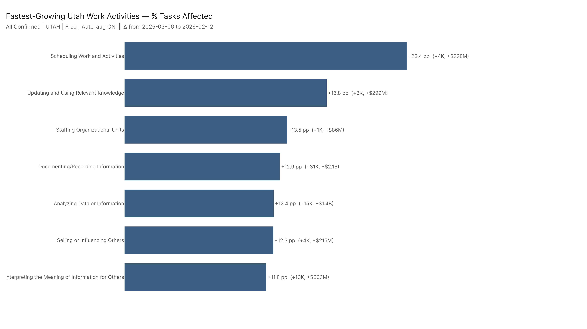

**What it shows:** The 7 work activities with the largest increase in % tasks affected between March 2025 and February 2026.

**How it's computed:** Same delta methodology as Chart 04, applied to GWA-level data.

**Interpretation:** This reveals which types of work are being absorbed fastest. If an activity appears here, the AI capability evidence base for that type of work grew substantially in under a year.

---

## Chart 06: Adoption Gap by Sector — Where AI Could Expand Next

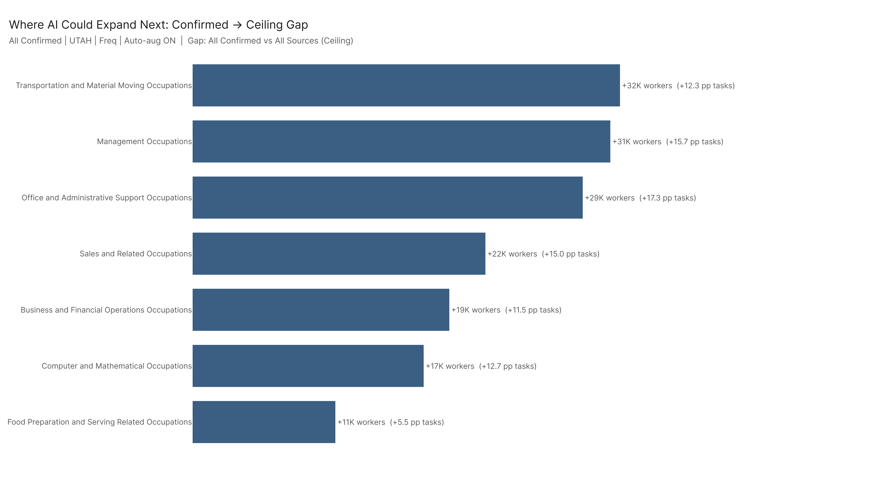

**What it shows:** The gap between confirmed AI usage and the full capability ceiling, by sector (Utah workers).

**How it's computed:** Gap = workers_affected under all_ceiling (AEI + MCP + Microsoft combined) minus workers_affected under all_confirmed (confirmed usage only). The ceiling includes MCP server capability data — tools that have demonstrated they can do these tasks but aren't yet widely deployed.

**Caveats:** The ceiling is more speculative than confirmed usage. MCP data captures what tools *can* do, not what organizations *are* doing.

**Interpretation:** Transportation (+32K workers), Management (+31K), and Office/Admin (+29K) have the largest gaps. These are sectors where agentic AI tools have demonstrated task capability but confirmed human usage hasn't caught up. For workforce planners, the gap signals where the next wave of adoption pressure is most likely.

---

## Chart 07: Adoption Gap by Work Activity

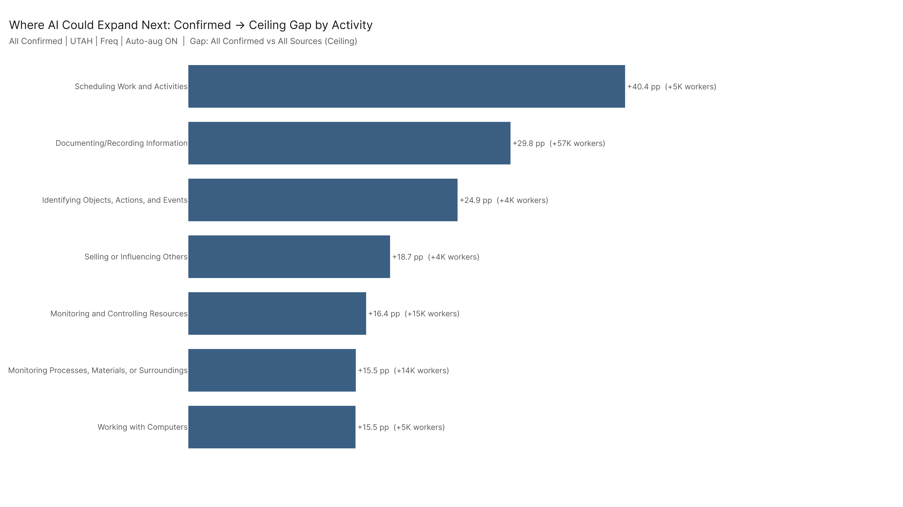

**What it shows:** Same confirmed-to-ceiling gap analysis at the work activity level.

**Interpretation:** Activities with the largest gaps tend to be operational and administrative: scheduling, record-keeping, document management. These are the activities where agentic AI (tool-use automation) dramatically outperforms conversational AI coverage. The gap represents latent automation potential in structured, repetitive work.

---

## Chart 08: Agentic Deployment Gap by Sector

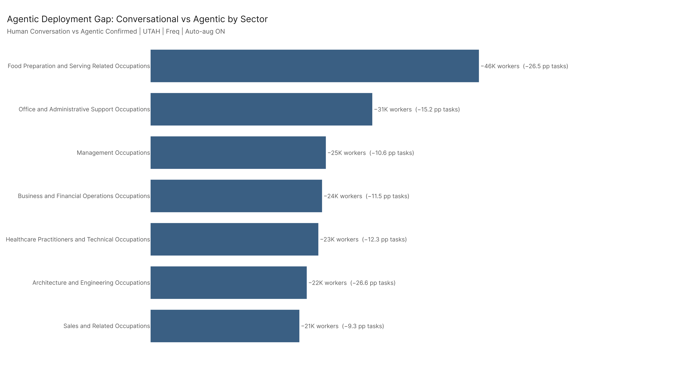

**What it shows:** The drop in workers affected when moving from conversational AI (chat, Copilot) to confirmed agentic AI (API tool-use only), by sector.

**How it's computed:** Drop = workers_affected under human_conversation minus workers_affected under agentic_confirmed. Larger drops indicate sectors where conversational AI is embedded but agentic tool-use hasn't followed.

**Caveats:** Agentic confirmed (AEI API) reflects a narrower sample: production API usage, developer workflows, complex automation. Conversational AI is more broadly deployed.

**Interpretation:** Food Prep (-46K), Office/Admin (-31K), and Management (-25K) see the largest drops. These sectors rely on conversational AI (drafting, answering questions, information lookup) but haven't yet adopted agentic automation pipelines. As agentic infrastructure matures, these sectors are where expansion is most likely — and where workers should prepare for AI moving from "assistant" to "operator."

---

## Chart 09: AI Augmentation Potential by Sector

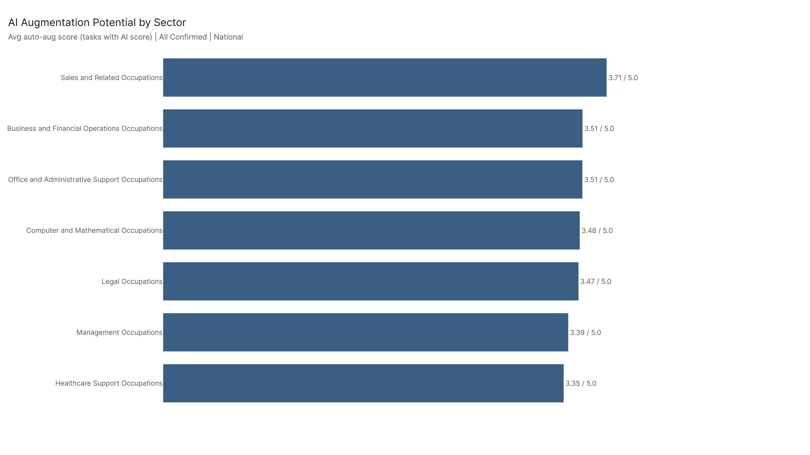

**What it shows:** Average auto-augmentability score (1–5 scale) for tasks that AI has actually scored, by sector.

**How it's computed:** For each major sector, average the auto_aug_mean score across all unique tasks in the AI dataset that have a score. Tasks not in the dataset are excluded (this is the "tasks with value" variant — showing how augmentable AI-touched tasks are, not overall coverage).

**Caveats:** This metric measures augmentation potential, not replacement risk. A score of 3.5 means "AI can meaningfully amplify output on this task." National scope (task properties don't vary by geography).

**Interpretation:** Sales (3.71), Business/Finance (3.51), and Office/Admin (3.51) have the highest augmentation scores. When AI is involved in these sectors' tasks, it can substantially boost worker productivity. This framing matters for the pro-AI initiative: these are the sectors where AI adoption is most likely to augment rather than displace.

---

## Chart 10: Reskilling Cost by Job Zone

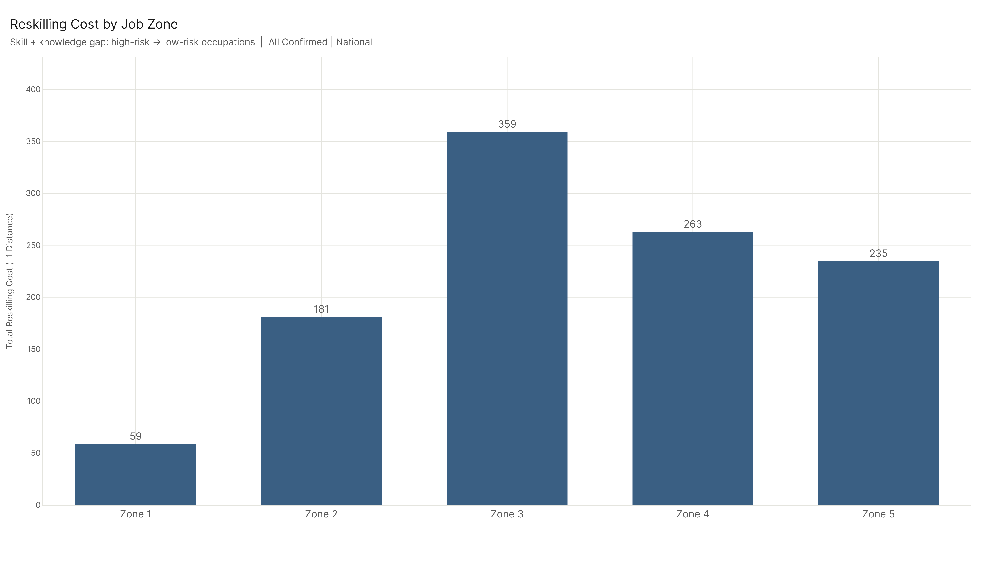

**What it shows:** The total reskilling cost (L1 distance in skill + knowledge units) for a high-risk worker to pivot to a low-risk occupation within the same job zone.

**How it's computed:** For each of the 5 job zones, identify the 10 highest-risk and 10 lowest-risk occupations (based on risk scoring). Compute the L1 rectified distance: sum of positive differences between the low-risk and high-risk skill/knowledge profiles. Only skills and knowledge with importance >= 3 are included.

**Caveats:** National scope. Job zones correspond to preparation levels: Zone 1 = little/no prep, Zone 3 = medium prep (some college), Zone 5 = extensive prep (graduate degree). The cost is in abstract units — higher means more skills/knowledge gaps to close.

**Interpretation:** Zone 3 workers (office clerks, bookkeepers, billing specialists) face the most expensive reskilling path at 359 units — nearly double Zone 2 (181). The gaps are mechanical, physical, and construction-related, not soft skills. Zone 5 is surprisingly moderate (235) because high-risk academics and low-risk clinicians share intellectual infrastructure. For workforce investment decisions: Zone 3 is where reskilling programs need the most resources per worker.

---

## Charts 11–12: Durable Skills and Knowledge — Where Humans Still Lead

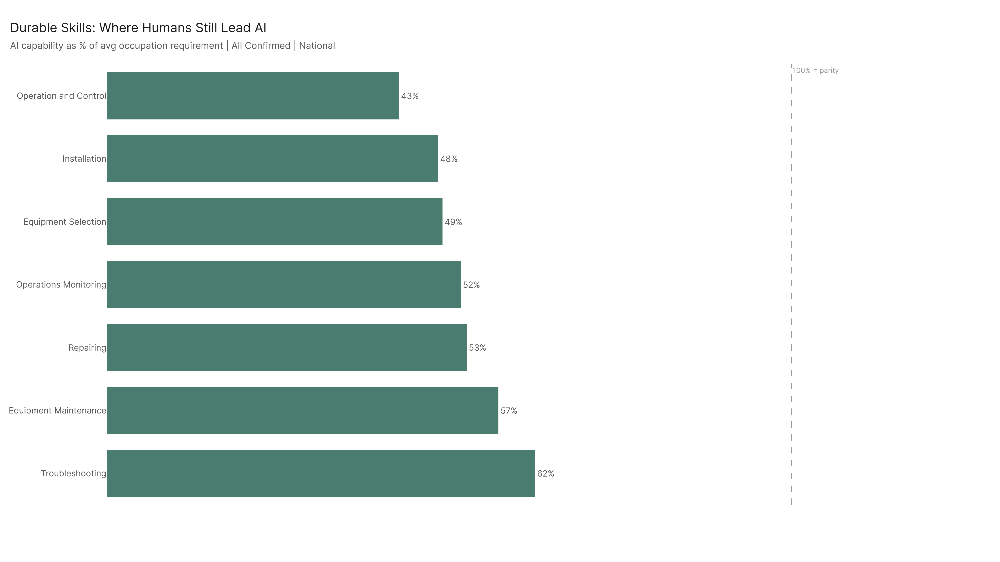

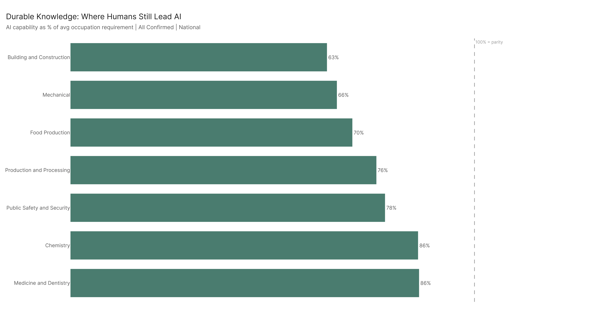

**What they show:** The 7 skills and 7 knowledge domains where AI's demonstrated capability is furthest below what occupations require. The dashed line at 100% represents parity.

**How it's computed:** For each SKA element across all ~893 occupations (importance >= 3), compute AI capability as % of the average occupation requirement: (95th percentile AI score / mean occupation score) x 100. Elements below 100% = humans lead. Lower % = larger human advantage.

**Caveats:** National scope. These are averages across all occupations that use each element — individual occupations may vary.

**Interpretation:** The durable skills are all physical-operational: Operation and Control (43%), Installation (48%), Equipment Selection (49%). The durable knowledge domains are applied-technical: Building/Construction (63%), Mechanical (66%), Food Production (70%). These are the skills and knowledge areas where investing in human training has the highest return — AI isn't close to replacing them, and they're unlikely to be automated in the near term.

---

## Charts 13–14: AI-Dominated Skills and Knowledge

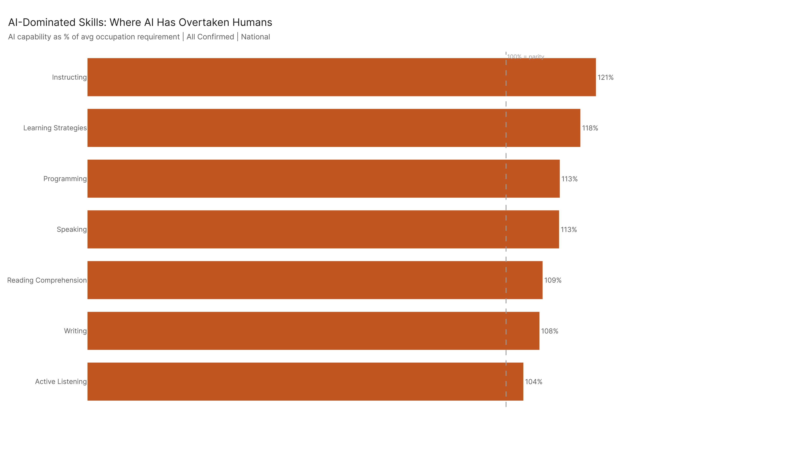

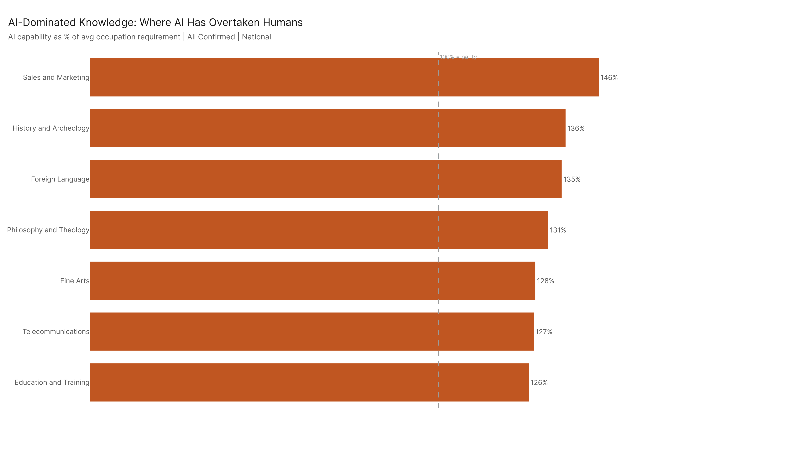

**What they show:** The 7 skills and 7 knowledge domains where AI's demonstrated capability exceeds what occupations require (above the 100% parity line).

**Interpretation:** AI has overtaken human job requirements in instructional skills (Instructing 121%, Learning Strategies 118%), language skills (Speaking 113%, Writing 108%), and broad knowledge domains (Sales/Marketing 146%, History 136%, Foreign Language 135%). These are areas where AI is already capable of doing more than the average job formally requires. For education leaders: training workers deeply in these areas alone won't create durable advantage — the focus should shift to combining these with the durable physical/operational skills from Charts 11–12.

---

## Config Reference

| Setting | Value |
|---------|-------|
| Primary dataset | AEI Both + Micro 2026-02-12 (All Confirmed) |
| Ceiling dataset | All 2026-02-18 (All Sources) |
| Conversational | AEI Conv + Micro 2026-02-12 |
| Agentic | AEI API 2026-02-12 |
| Method | freq (time-weighted) |
| Auto-aug | ON |
| Geography | Utah (BLS 2024 OEWS) |
| Utah total employment | 1,709,790 |
| Trend window | 2025-03-06 → 2026-02-12 |

## Files

| File | Description |
|------|-------------|
| `results/chart_index.csv` | Index of all generated charts |
| `figures/01–14_*.png` | 14 presentation-quality chart PNGs |
