# AEA Dashboard Analysis Report

Automation Exposure Analysis — Findings from the AEA Dashboard data pipeline.

Built for Utah's Office of Artificial Intelligence Policy (OAIP).

---

## Executive Summary

AI currently touches **27.2% of the US workforce — 41.7 million workers — representing $2.7 trillion in annual wages.** That's our best combined estimate, triangulating across three independent data sources: Anthropic's Economic Index (AEI, real Claude conversations), MCP server logs (AI tool-use capability), and Microsoft's Copilot usage analysis. The range of estimates spans 25.7% (current conversational usage floor) to 34.8% (capability ceiling across all sources), a gap of 14 million workers whose jobs AI can demonstrably reach but hasn't yet penetrated through regular use.

**The economic impact is concentrated.** Three sectors alone — Management ($407B), Office/Administrative Support ($405B), and Business/Financial Operations ($327B) — account for 42% of all AI-exposed wages. Computer and Mathematical occupations have the deepest exposure (52% of tasks affected) but a smaller workforce. The largest exposed workforce is in Office/Admin at 8.6 million workers.

**The three data sources agree on the big picture but diverge sharply on specifics.** AEI and Microsoft produce nearly identical total exposure (~25.5%) while MCP sees 30.4%. But those similar totals mask very different views: AEI over-indexes on education and knowledge work (conversational AI), MCP over-indexes on technical and tool-amenable work (data science, QA testing, admin), and Microsoft sees broad moderate exposure everywhere but never rates any single occupation above 60%. At the occupation level, Spearman correlations between source pairs are only 0.55–0.65, and just 2 of 20 top occupations overlap between any pair. These are complementary signals measuring fundamentally different things — which is why combining them produces the most defensible picture.

**The gap between what AI *can* do and what it *is* doing reveals where the biggest disruptions are coming.** Transportation and Material Moving has the largest absolute worker gap (2.5M workers), driven by a massive workforce where AI tools reach 18% of tasks but conversational adoption covers only 5.5%. Office/Admin (2.4M gap), Sales (2.1M), and Food Preparation (2.0M) follow. At the occupation level, Cashiers (1.2M gap), Sales Reps of Services (842K, zero current usage), and General/Operations Managers (805K) have the most untapped potential. Education is the sole exception where usage already exceeds measured capability — conversational AI (tutoring, writing help) has outpaced tool-based automation in this sector.

**Nine occupations cross the 60% usage-confirmed threshold today, representing 1.5 million workers.** The largest are Market Research Analysts (431K workers, 63%), Search Marketing Strategists (431K, 66%), and Instructional Coordinators (211K, 61%). These are information-processing jobs where AI's core strengths — data analysis, content generation, pattern recognition — directly overlap with the most valuable parts of the work. Another 146 occupations (35.9M workers) sit in the moderate risk tier (40–60%), where restructuring is more likely than elimination. The capability ceiling paints a far more dramatic picture: 124 occupations would be high-risk if peak AI capability from any source were fully deployed. That gap of 115 "emerging risk" occupations — including Cashiers (3.1M), Customer Service Reps (2.7M), and Office Clerks (2.5M) — represents the next wave as AI adoption spreads.

**Utah mirrors the national picture almost exactly at the aggregate level** (27.4% vs 27.2%), but the composition differs. Utah's AI-exposed workforce is more concentrated in tech (+4.1pp in Computer/Math) and business/financial occupations (+2.8pp) and less in retail and traditional office work — reflecting Silicon Slopes. Most notably, **Utah has double the national share of workers in high-risk occupations** (2.0% vs 1.0%), driven by outsized employment in tech and digital marketing roles. Six occupations that appear in Utah's top 20 at-risk list — including Search Marketing Strategists, Computer Systems Engineers, and Web Administrators — don't appear in the national top 20 at all.

**Methodological robustness is strong.** The auto-aug quality toggle is the biggest lever (nearly doubling exposure from 27% to 46% when turned off), but the top 10 major categories remain perfectly stable across all methodology variations. Time vs Value weighting barely matters (0.7pp). Rankings hold across all four toggle combinations. The findings are not artifacts of the methodology.

---

## Table of Contents

- [AI Economic Footprint](#ai-economic-footprint) — Total workforce and wage exposure to AI across the US economy
- [Dataset Source Comparison](#dataset-source-comparison) — How the three AI data sources agree and diverge
- [AI Transformative Potential](#ai-transformative-potential) — Where the gap between AI capability and adoption is largest
- [Job Elimination Risk](#job-elimination-risk) — Which occupations are most at risk of being lost to AI
- [Utah vs National](#utah-vs-national) — How Utah's AI exposure differs from the national picture

---

## AI Economic Footprint

**Question:** What is AI's total economic footprint across the US economy — how many workers, how many wage dollars, and what share of the total does it represent?

**Method:** Run the pipeline across three source perspectives — current usage (AEI Cumul. Both v4 + Microsoft), capability ceiling (all three sources, Max), and combined best estimate (all three, Average) — plus agentic and conversational splits. Test sensitivity across auto-aug ON/OFF, Time/Value method, physical/non-physical, and National/Utah.

### Headline numbers

Between 26% and 35% of the US workforce is AI-exposed, depending on which data you trust:

| Source Perspective | Workers Affected | % of Employment | Wages Affected | % of Wage Bill |
|---|---:|---:|---:|---:|
| **Current Usage** (floor) | 39.3M | 25.7% | $2,570B | 27.3% |
| **Capability Ceiling** (max) | 53.3M | 34.8% | $3,398B | 36.0% |
| **Combined** (best estimate) | 41.7M | 27.2% | $2,703B | 28.7% |

The 14.0M-worker gap between floor and ceiling — $828 billion in wages — represents the range between confirmed AI usage and the maximum exposure any source detects.

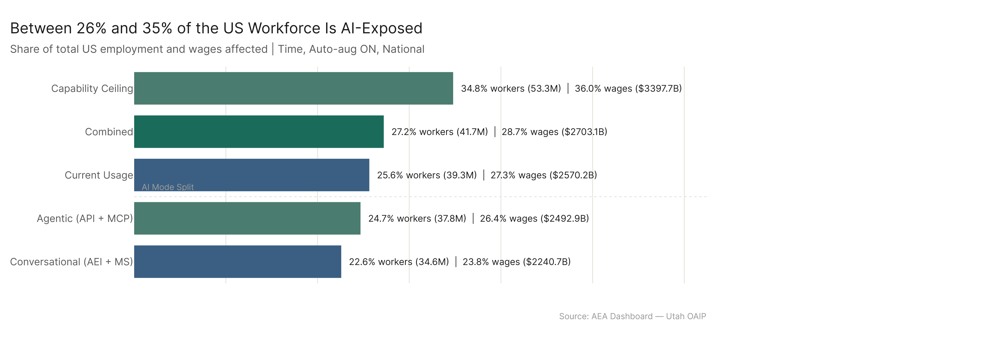

### Where the money is

Three major categories account for 42% of all AI-exposed wages:

| Rank | Major Category | Workers Affected | Wages Affected | % Tasks Affected |
|---:|---|---:|---:|---:|
| 1 | Management | 3.3M | $407B | 25.5% |
| 2 | Office and Administrative Support | 8.6M | $405B | 40.6% |
| 3 | Business and Financial Operations | 4.0M | $327B | 36.6% |
| 4 | Sales and Related | 5.7 M | $272B | 44.7% |
| 5 | Computer and Mathematical | 2.7M | $269B | 52.2% |

Management tops the wage impact ($407B) despite moderate task exposure (25.5%) — sheer workforce size and high salaries make it the largest dollar-value category. Computer/Math has the highest intensity (52.2% of tasks) but a smaller workforce.

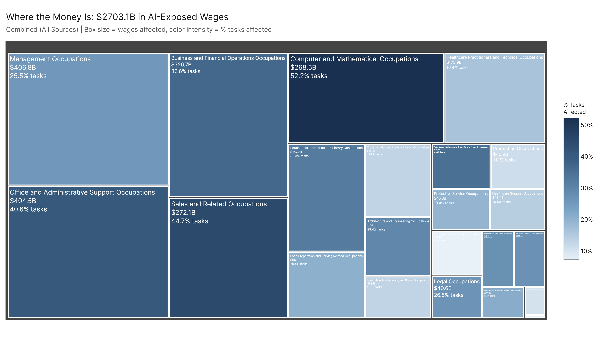

### The uncertainty range by sector

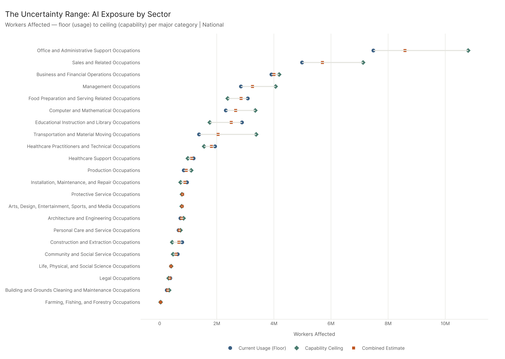

Office/Admin has the widest absolute range: 7.1M workers (usage) to over 11M (ceiling). Computer/Math shows a narrow range — sources agree it's heavily exposed. Education is unusual: current usage approaches the ceiling closely, driven by strong conversational AI adoption. Construction, Farming, and Building Maintenance show uniformly low exposure with narrow ranges.

### Agentic vs conversational AI

| AI Mode | Datasets | Workers | % of Employment |
|---|---|---:|---:|
| **Agentic / Tool-use** | AEI API Cumul. v4 + MCP Cumul. v4 | 37.8M | 24.7% |
| **Conversational / Copilot** | AEI Cumul. Conv. v4 + Microsoft | 34.6M | 22.6% |

Agentic AI (tool-using, API-calling, autonomous) now slightly exceeds conversational AI (chatbots, copilots, writing assistants) in total reach — 37.8M vs 34.6M workers. This challenges the assumption that chatbots are the dominant mode of AI impact. Agentic AI leads in Office/Admin, Sales, Computer/Math, Healthcare, and Transportation. Conversational AI leads in Education, Management, and Arts/Entertainment.

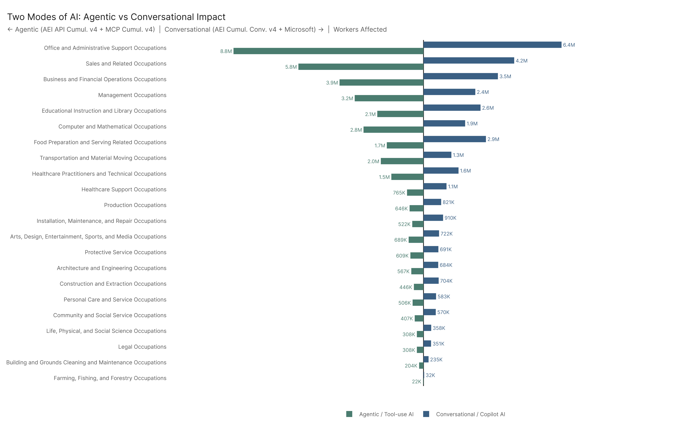

### Physical vs non-physical work

Non-physical work is **1.7x more AI-exposed** than physical work (33.2% vs 19.7%). When physical tasks are excluded, exposure jumps to 33.2% — one in three workers. Occupations that are primarily cognitive face meaningfully higher AI overlap.

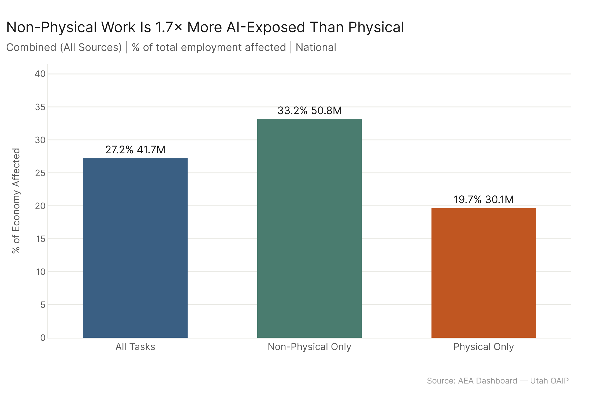

### Methodology sensitivity

The auto-aug toggle is the biggest lever: turning it off nearly doubles exposure from 27.2% to 45.5%, adding 28.1M workers. This separates "quality-adjusted" exposure (how much work AI can do *well*) from "raw coverage" (every task AI has touched regardless of quality). Time vs Value method barely matters (0.7pp difference). **All 10 top major categories are perfectly stable** across all four toggle combinations.

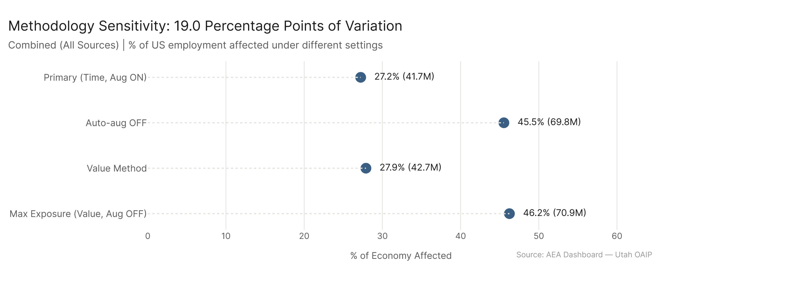

### Automatability distribution

The employment-weighted average auto-aug score is **2.08/5** — moderate automatability. 56% of workers are in occupations scoring >= 2.0. The distribution peaks at 2.0–2.5 (34.8M workers). 70% of all O*NET tasks have been rated by at least one AI source.

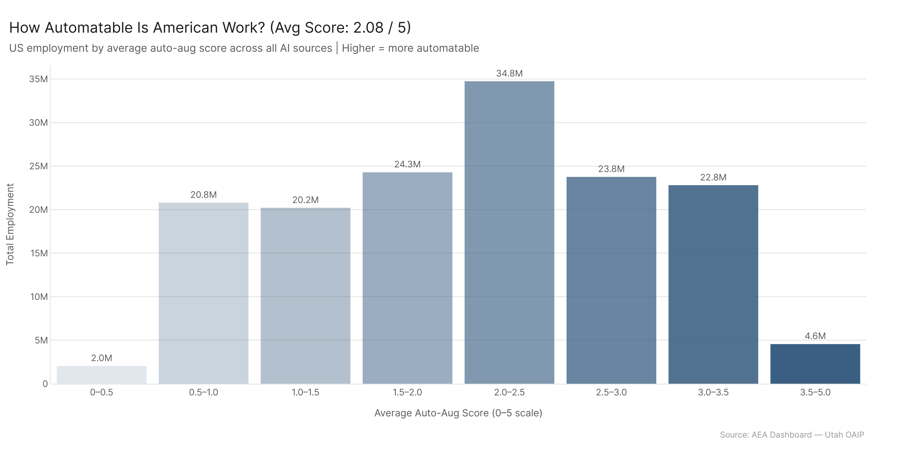

*Config: AEI Cumul. (Both) v4 + MCP Cumul. v4 + Microsoft | Average | Time | Auto-aug ON | National | All tasks. Ceiling uses Max. Agentic: AEI API Cumul. v4 + MCP Cumul. v4. Conversational: AEI Cumul. Conv. v4 + Microsoft. Sensitivity: Auto-aug OFF, Value method, Physical split. Full data in [questions/economic_footprint/](../questions/economic_footprint/economic_footprint.md).*

---

## Dataset Source Comparison

**Question:** How do the three AI data sources — AEI, MCP, and Microsoft — differ in what they see, and what does that tell us about the robustness of the findings?

**Method:** Run each source solo through the same pipeline. Compare totals, rankings, rank correlations, top-20 overlap, risk tier distributions, and sensitivity to methodology toggles.

### Similar totals, different distributions

At the aggregate level, AEI and Microsoft produce nearly identical total exposure — 25.5% and 25.7% of workers. MCP stands apart at 30.4% (46.5M workers), roughly 5 percentage points higher, reflecting its measurement of what AI *can* do with tools rather than what users *are* doing in conversations.

| Source | Workers Affected | % of Workforce | Wages Affected |
|---|---:|---:|---:|
| AEI | 39.1M | 25.5% | $2,676B |
| MCP | 46.5M | 30.4% | $2,969B |
| Microsoft | 39.5M | 25.7% | $2,464B |

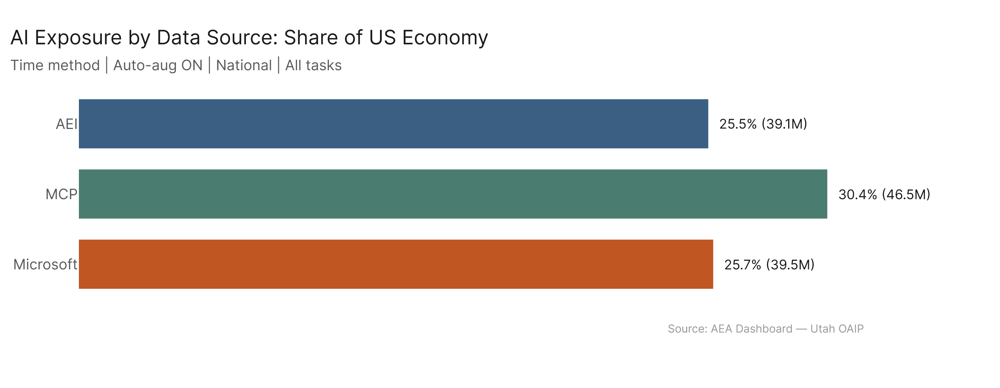

### Where the sources agree and diverge

All three agree that Computer/Math has the highest % tasks affected and Office/Admin is the largest by workers. After that, agreement breaks down:

| Major Category | AEI | MCP | Microsoft | Pattern |
|---|---:|---:|---:|---|
| Computer & Mathematical | 48.0% | 65.3% | 43.4% | MCP sees 20pp more |
| Education | 45.2% | 22.9% | 28.8% | AEI sees 2x what MCP sees |
| Office & Admin | 32.8% | 54.4% | 34.5% | MCP sees admin as highly tool-automatable |
| Transportation | 5.5% | 18.0% | 15.2% | AEI barely sees it |
| Food Preparation | 15.2% | 16.6% | 29.3% | Microsoft sees 2x more than AEI/MCP |
| Production | 4.2% | 13.2% | 15.8% | AEI sees almost nothing |

**The pattern:** AEI over-indexes on knowledge-intensive conversational work (education, science, legal). MCP over-indexes on technical/tool-amenable work (computing, admin, sales). Microsoft has a more uniform distribution, seeing moderate exposure across categories that AEI and MCP both overlook.

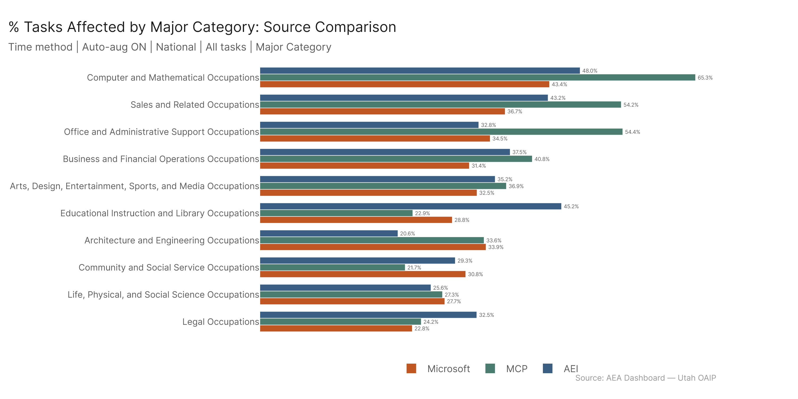

### Low occupation-level agreement

At the occupation level (923 occupations), the sources show moderate rank correlation but strikingly low agreement on *which* occupations are most affected:

| Pair | Spearman rho | Top-20 Overlap |
|---|:---:|:---:|
| AEI vs MCP | 0.584 | 2 / 20 |
| AEI vs Microsoft | 0.557 | 2 / 20 |
| MCP vs Microsoft | 0.650 | 2 / 20 |

The Spearman correlations of 0.55–0.65 mean the sources roughly agree on the overall shape, but only 2 out of 20 top occupations overlap for *any* pair. They are measuring fundamentally different things.

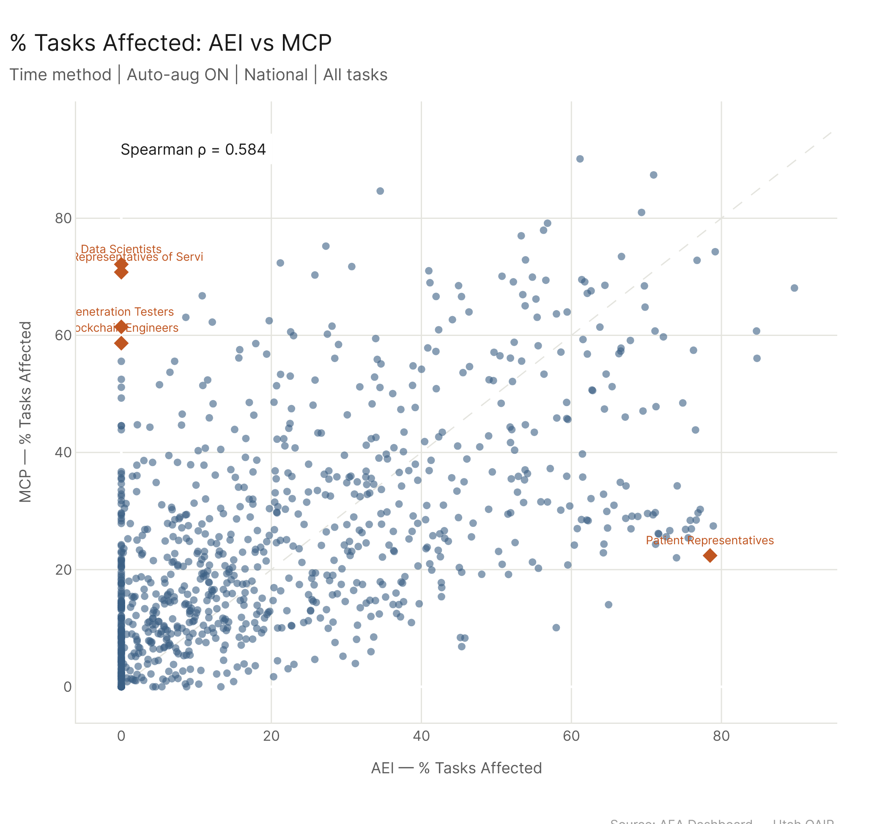

### What each source uniquely captures

**MCP sees what AEI misses** — tool-use occupations: Data Scientists (72% MCP vs 0% AEI), Sales Reps of Services (71% vs 0%), Penetration Testers (61% vs 0%), Software QA Testers (72% vs 21%). These are occupations that heavily use AI *tools* rather than AI *conversations*.

**AEI sees what MCP misses** — conversational/knowledge roles: Physics Teachers (79% AEI vs 27% MCP), Education Teachers (76% vs 27%), Patient Representatives (78% vs 22%). People are using Claude for drafting, research, and explanation — work that doesn't require external tools.

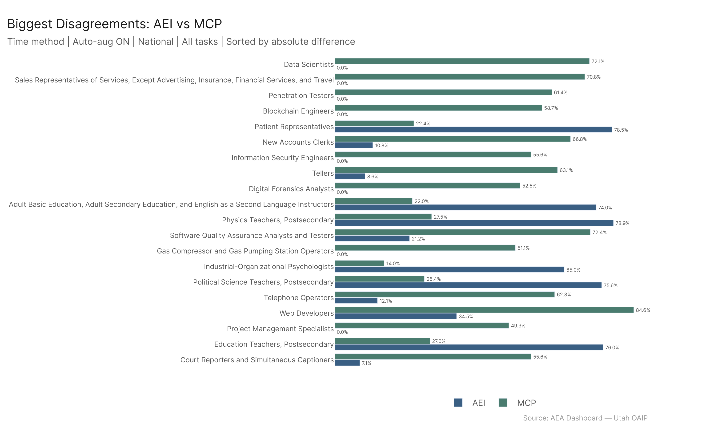

### Microsoft never reaches "high risk"

The risk tier analysis reveals the most striking single finding about source differences:

| Tier | AEI | MCP | Microsoft |
|---|---:|---:|---:|
| High Risk (>=60%) | 76 | 54 | **0** |
| Moderate (40–60%) | 113 | 120 | 121 |
| Restructuring (20–40%) | 198 | 304 | 433 |
| Low Exposure (<20%) | 536 | 445 | 369 |

Microsoft's Copilot-based measurement sees broad, moderate exposure across many occupations but never sees any single occupation as overwhelmingly AI-exposed. AEI is the most "concentrated" — it sees 76 high-risk occupations but also has the most (536) in low exposure. MCP falls between, with fewer high-risk but also fewer low-exposure occupations.

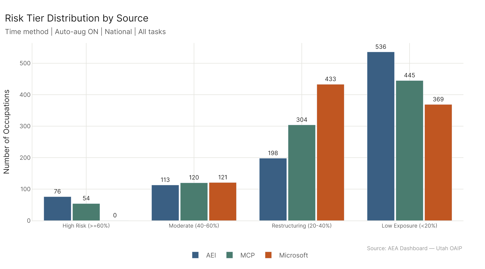

### The auto-aug toggle reveals a structural difference between sources

Turning off auto-aug nearly doubles MCP and Microsoft's footprint (30% to 57%, 26% to 49%) **but barely changes AEI** (26% to 31%). This means MCP and Microsoft flag many tasks as AI-relevant but rate them with low automatability scores. AEI's tasks tend to have higher auto-aug scores because the tasks appearing in real conversations are the ones where AI is actually effective.

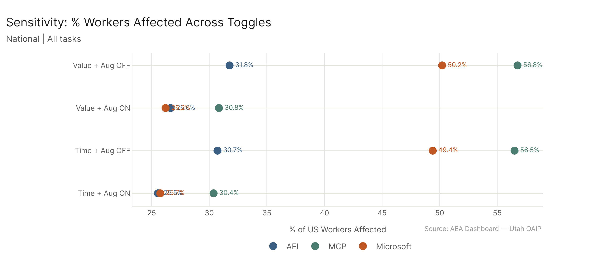

AEI also underrepresents physical task exposure (15.1% vs 22% for MCP/Microsoft) — people don't typically have conversations with AI about physical tasks, but AI tools and copilots can still assist with the informational components of physical jobs.

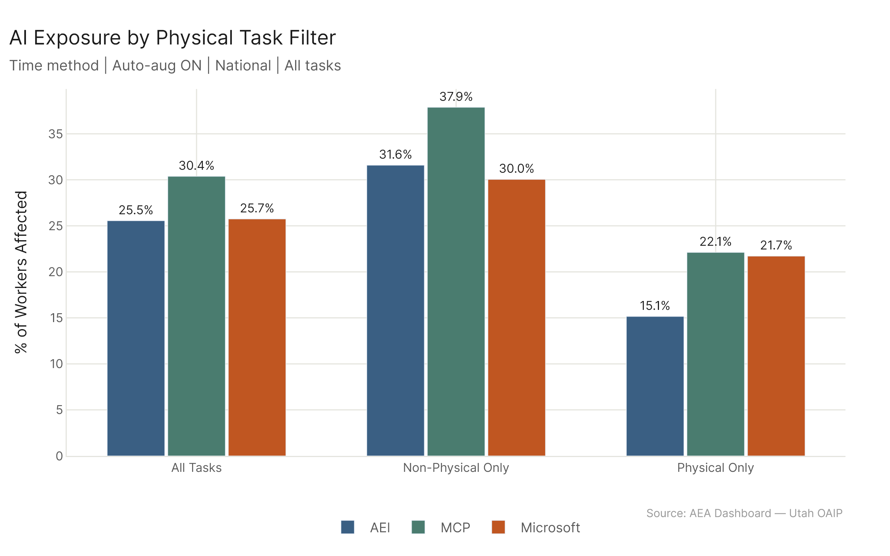

### Bottom line

Each source has a distinctive blind spot: AEI misses tool-use occupations, MCP underweights teaching and psychology, Microsoft identifies no high-risk occupations. These are complementary signals, not competing ones. The combined average used as the dashboard default is the right approach — it triangulates across fundamentally different measurement methodologies, and the top-10 major categories are stable across all three sources and all methodology toggles.

*Config: Time | Auto-aug ON | National | All tasks. Sources run solo: AEI Cumul. (Both) v4, MCP Cumul. v4, Microsoft. Sensitivity: Time/Value, Auto-aug ON/OFF, Physical toggle. Full data in [questions/dataset_source_comparison/](../questions/dataset_source_comparison/dataset_source_comparison.md).*

---

## AI Transformative Potential

**Question:** Where are the jobs and sectors with the greatest potential for AI to be transformative — where is the gap between what AI can do and what it's actually being used for?

**Method:** Compare a capability ceiling (all three sources combined with Max — the highest score any source gives each task) against current conversational usage (AEI Cumul. Both v4 alone). The gap represents unrealized potential. Tested across 4 config variants: Time/Value method x auto-aug ON/OFF.

### The largest gaps by sector

| Rank | Major Category | Ceiling % | Current % | Gap (pp) | Workers Gap |
|---:|---|---:|---:|---:|---:|
| 1 | Transportation and Material Moving | 18.0% | 5.5% | +12.5 | +2.5M |
| 2 | Office and Administrative Support | 54.4% | 32.8% | +21.6 | +2.4M |
| 3 | Sales and Related | 54.2% | 43.2% | +11.0 | +2.1M |
| 4 | Food Preparation and Serving | 29.3% | 15.2% | +14.1 | +2.0M |
| 5 | Production | 15.8% | 4.2% | +11.6 | +1.0M |
| 6 | Computer and Mathematical | 65.3% | 48.0% | +17.3 | +947K |
| 7 | Management | 31.8% | 24.2% | +7.6 | +886K |
| 8 | Installation, Maintenance, Repair | 20.5% | 7.4% | +13.1 | +734K |

**Transportation is #1 by workers gap** despite modest overall exposure (18% ceiling). The huge workforce (18.8M) means even a small percentage gap translates to 2.5M workers of untapped potential — warehouse, shipping, and logistics roles where AI scheduling, routing, and inventory tools exist but haven't been broadly adopted.

**Education has zero gap.** AEI conversational usage already equals the ceiling — the only sector where adoption has saturated measured capability. Healthcare Practitioners and Business/Financial are also near-zero, leaving minimal room for growth.

### Top occupations by untapped potential

| Rank | Occupation | Ceiling % | Current % | Gap (pp) | Workers Gap |
|---:|---|---:|---:|---:|---:|
| 1 | Cashiers | 60.6% | 22.6% | +38.0 | +1.20M |
| 2 | Sales Reps of Services | 70.8% | 0.0% | +70.8 | +842K |
| 3 | General and Operations Managers | 37.1% | 14.6% | +22.5 | +805K |
| 4 | Stockers and Order Fillers | 37.8% | 11.0% | +26.8 | +745K |
| 5 | Waiters and Waitresses | 37.9% | 6.2% | +31.8 | +731K |
| 6 | Secretaries and Admin Assistants | 77.0% | 53.3% | +23.7 | +412K |
| 7 | Laborers and Freight Movers | 16.6% | 3.0% | +13.6 | +406K |
| 8 | Software QA Testers | 72.4% | 21.2% | +51.2 | +371K |

Several occupations have **0% current conversational usage** but significant capability: Sales Reps of Services (70.8% ceiling), Project Management Specialists (49.3%), Industrial Truck Operators (29.3%), Substitute Teachers (38.1%). These represent totally untapped AI potential.

### Auto-aug OFF reveals a second layer of potential

When auto-aug is turned off (treating all AI-flagged tasks as fully automatable), the gaps expand dramatically. **Management** has the most dramatic shift: from +886K workers gap to +5.3M — a 6x increase. This means most Management tasks flagged by AI sources have low automation scores currently. If AI tools improve for these tasks, Management could see the single largest increase in realized impact. Food Prep, Office/Admin, and Sales also see massive increases.

### Stability

The story is highly robust: 8 of 10 top major categories appear in the top-10 gap ranking across all 4 config variants (Time/Value x auto-aug ON/OFF). At the occupation level, 6 of 10 are stable: Cashiers, General/Ops Managers, Laborers/Freight, Sales Reps of Services, Stockers/Order Fillers, Waiters/Waitresses.

*Config: Ceiling = AEI Cumul. (Both) v4 + MCP Cumul. v4 + Microsoft | Max. Current = AEI Cumul. (Both) v4 alone. Time | Auto-aug ON | National | All tasks. Sensitivity: 4 variants. Full data in [questions/ai_transformative_potential/](../questions/ai_transformative_potential/ai_transformative_potential.md).*

---

## Job Elimination Risk

**Question:** Which occupations are most at risk of being lost to AI — where most of the job's task value is already being done by AI?

**Method:** Use AEI Cumul. (Both) v4 + Microsoft (actual usage data from Claude conversations and Copilot sessions), averaged, with auto-aug ON and Value weighting (importance-weighted). Tier occupations by % tasks affected: High Risk (>=60%), Moderate Risk (40–60%), Restructuring (20–40%), Low Exposure (<20%). Compare against a capability ceiling (all three sources, Max) to identify emerging risks.

### Tier distribution

| Tier | Occupations | Workers | Share of Economy |
|---|---:|---:|---:|
| High Risk (>=60%) | 9 | 1.5M | 1.0% |
| Moderate Risk (40–60%) | 146 | 35.9M | 23.4% |
| Restructuring (20–40%) | 311 | 53.1M | 34.6% |
| Low Exposure (<20%) | 457 | 62.7M | 40.9% |

Almost half of occupations (457 of 923) have less than 20% task exposure from current usage. But the moderate tier alone covers 35.9 million workers — nearly a quarter of the national workforce.

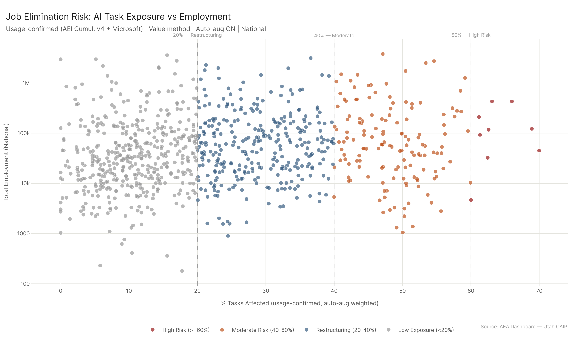

### The 9 high-risk occupations

These are the occupations where usage-confirmed data shows 60%+ of the job's task value is already AI-exposed:

| Occupation | % Tasks | Employment | Median Wage |
|---|---:|---:|---:|
| Poets, Lyricists and Creative Writers | 70.0% | 45K | $73K |
| Business Intelligence Analysts | 68.9% | 122K | $101K |
| Search Marketing Strategists | 66.0% | 431K | $75K |
| Market Research Analysts and Marketing Specialists | 63.1% | 431K | $75K |
| Patient Representatives | 62.6% | 117K | $41K |
| Data Warehousing Specialists | 62.5% | 32K | $101K |
| Financial Quantitative Analysts | 61.3% | 93K | $108K |
| Instructional Coordinators | 61.2% | 211K | $66K |
| Bioinformatics Technicians | 60.0% | 5K | $50K |

These are **information-processing jobs** — data analysis, content generation, pattern recognition, research synthesis. The largest by employment are Market Research Analysts and Search Marketing Strategists (both ~431K workers). 7 of 9 are stable across both Value and Time methods — not artifacts of the weighting.

### The moderate tier: where the real scale is

The 146 moderate-risk occupations (40–60%) include some of the largest occupations in the economy:

| Occupation | % Tasks | Employment |
|---|---:|---:|
| Customer Service Representatives | 54.6% | 2.7M |
| General Office Clerks | 53.4% | 2.5M |
| Secretaries and Admin Assistants | 50.5% | 1.7M |
| Bookkeeping/Auditing Clerks | 43.4% | 1.5M |
| Accountants and Auditors | 47.1% | 1.4M |
| Sales Reps, Wholesale/Manufacturing | 59.2% | 1.3M |
| Registered Nurses | 40.3% | 1.3M |
| Software Developers | 46.7% | 1.2M |

These are more likely to be restructured than eliminated — significant task overlap, but enough of the job remains human-dependent. Software Developers at 47% is notable: nearly half of the task value overlaps with AI, but the remaining 53% (judgment, architecture, communication) still requires humans. Registered Nurses at 40% reflects documentation and care coordination tasks, not clinical care.

### Which sectors concentrate risk

Computer/Math, Business/Financial, and Arts/Entertainment have the highest concentration of at-risk occupations. Farming, Construction, and Building Maintenance are almost entirely in the low-exposure tier.

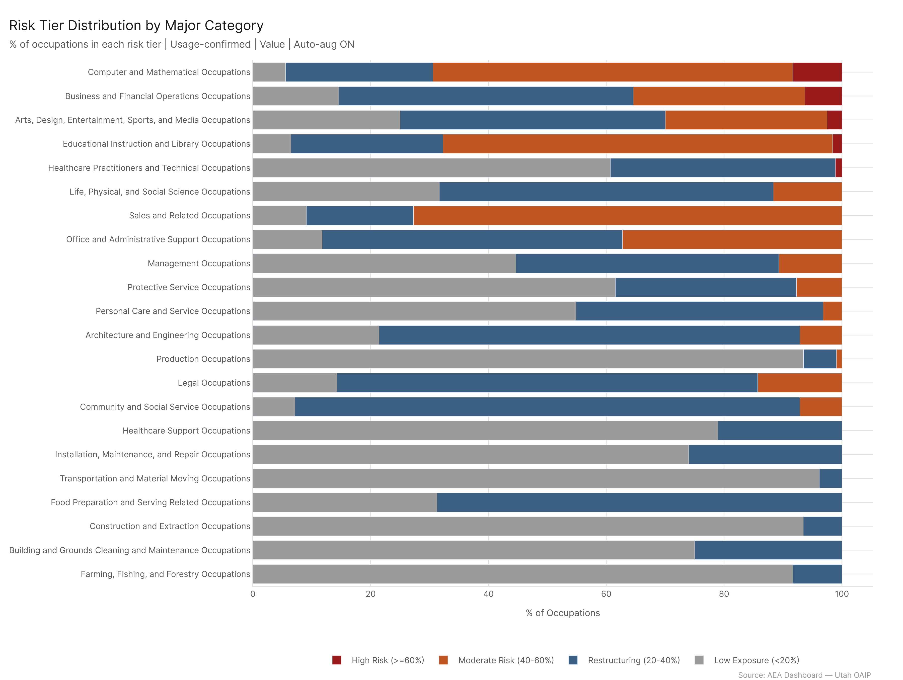

### Usage-confirmed vs capability ceiling: the emerging threat

The capability ceiling (all three sources, Max) puts **124 occupations** at >=60% task exposure — vs just 9 with usage-confirmed averages. The gap of **115 "emerging risk" occupations** represents jobs where at least one AI source demonstrates it can handle the majority of the work, but the average doesn't yet cross the threshold. The largest:

| Occupation | Ceiling % | Usage % | Gap | Employment |
|---|---:|---:|---:|---:|
| Cashiers | 63.8% | 36.6% | 27.3pp | 3.1M |
| Customer Service Reps | 65.7% | 54.6% | 11.1pp | 2.7M |
| Office Clerks, General | 72.5% | 53.4% | 19.1pp | 2.5M |
| Secretaries/Admin Assistants | 78.3% | 50.5% | 27.9pp | 1.7M |
| Bookkeeping/Auditing Clerks | 67.9% | 43.4% | 24.4pp | 1.5M |
| Sales Reps, Wholesale/Mfg | 72.2% | 59.2% | 13.0pp | 1.3M |
| Software QA Analysts/Testers | 72.9% | 33.6% | 39.3pp | 726K |
| Software Developers | 60.9% | 35.0% | 25.9pp | 726K |

The technology already exists to put these occupations above 60%. The question is how fast deployment follows.

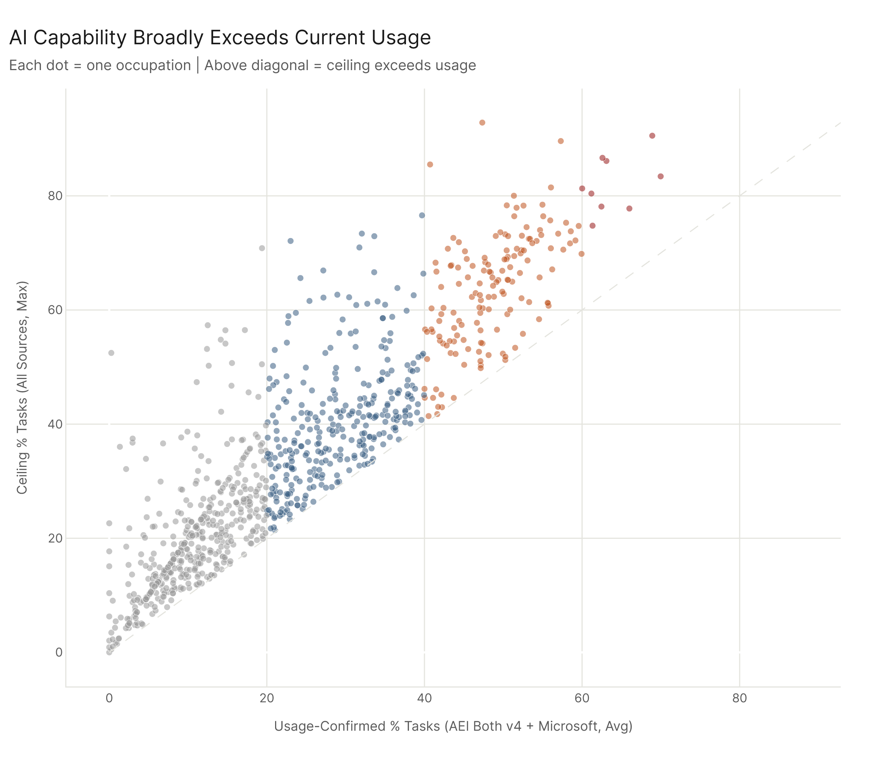

### Important framing

High task exposure does **not** equal job loss. It means the occupation's task bundle heavily overlaps with demonstrated AI capability and usage. Whether this leads to elimination, restructuring, fewer new hires, or productivity gains depends on deployment economics, regulation, and organizational inertia — none of which this data measures. The data identifies *where the pressure exists*, not what happens next.

*Config: AEI Cumul. (Both) v4 + Microsoft | Average | Value | Auto-aug ON | National | Occupation level. Ceiling: all three sources | Max. Sensitivity: Time method. Full data in [questions/job_elimination_risk/](../questions/job_elimination_risk/job_elimination_risk.md).*

---

## Utah vs National

**Question:** Do Utah's AI exposure results meaningfully differ from the national picture, and what are the policy implications for Utah specifically?

**Method:** Re-ran all three prior analyses (Economic Footprint, Transformative Potential, Job Elimination Risk) with Utah geography and compared against national results. Since % tasks affected is computed from O*NET task scores and AI auto-aug scores (which don't vary by state), only workers affected and wages affected change — driven entirely by Utah's occupational mix being different from the national average.

### Same headline, different composition

| Geography | % of Workforce AI-Exposed | Workers Affected |
|---|---:|---:|
| National | 27.2% | 41.7M |
| Utah | 27.4% | 620K |

The 0.2pp aggregate difference is negligible. But Utah's sector composition tells a different story:

| Major Category | National Share | Utah Share | Difference |
|---|---:|---:|---:|
| Computer and Mathematical | 6.4% | 10.4% | **+4.1pp** |
| Business and Financial Operations | 9.6% | 12.4% | **+2.8pp** |
| Sales and Related | 13.7% | 9.8% | **-3.9pp** |
| Office and Administrative Support | 20.6% | 17.6% | **-3.0pp** |

Utah's AI exposure is more concentrated in tech and business/financial occupations — reflecting Silicon Slopes — and less in traditional retail and office work.

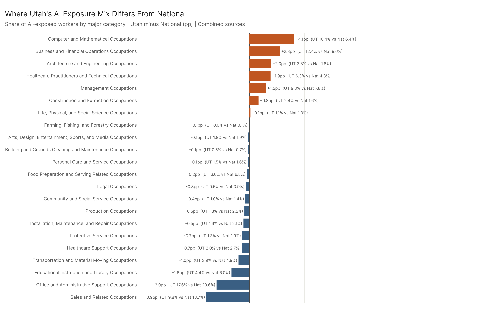

### Utah has double the high-risk workforce share

| Tier | National | Utah |
|---|---:|---:|
| High Risk (>=60%) | 1.0% | **2.0%** |
| Moderate (40–60%) | 23.4% | 21.7% |
| Restructuring (20–40%) | 34.7% | 36.6% |
| Low Exposure (<20%) | 40.9% | 39.7% |

This is driven by tech occupations like Search Marketing Strategists and Market Research Analysts being overrepresented in Utah's workforce — these are among the 9 high-risk occupations nationally, and Utah has proportionally more of them.

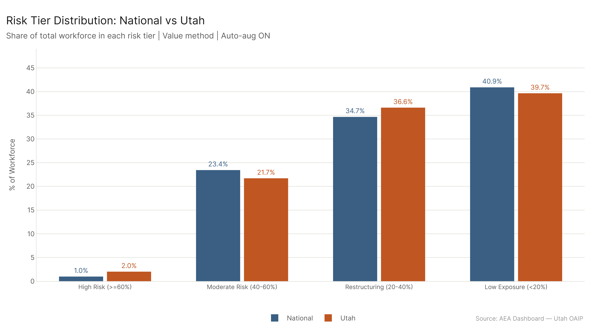

### Utah's top at-risk occupations

Six occupations appear in Utah's top 20 at-risk but not the national top 20:

| Occupation | Utah Emp | % Tasks | Tier |
|---|---:|---:|---|
| Search Marketing Strategists | 15,075 | 66.0% | High |
| Computer Systems Engineers/Architects | 13,276 | 43.8% | Moderate |
| Web Administrators | 12,577 | 51.4% | Moderate |
| Market Research Analysts | 12,300 | 63.1% | High |
| Online Merchants | 10,431 | 57.0% | Moderate |
| Document Management Specialists | 8,396 | 45.9% | Moderate |

These are all tech and digital marketing roles — occupations proportionally larger in Utah than nationally.

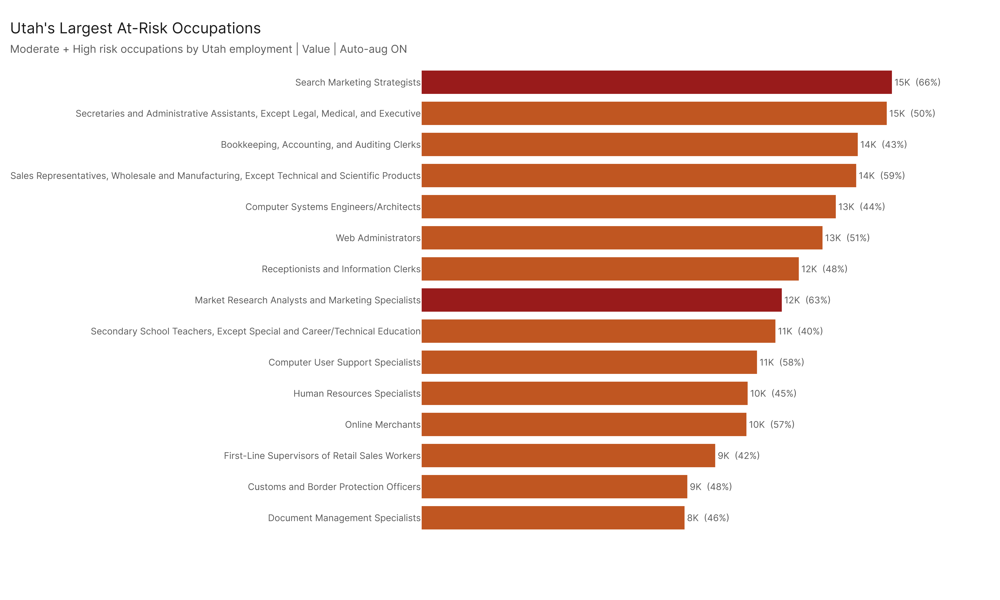

### Transformative potential: more concentrated in tech

Utah's unrealized AI potential is much more concentrated in Computer/Math (+13.3pp share vs national) and Management (+4.9pp). The Healthcare Practitioners negative gap (where usage exceeds capability) is proportionally larger in Utah, likely reflecting Utah's healthcare industry concentration.

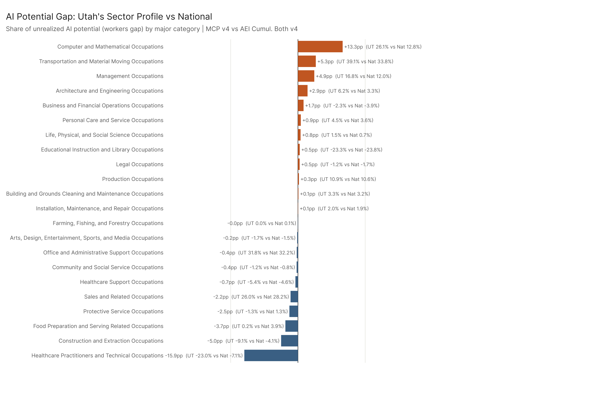

### Sector-level risk concentration differences

| Major Category | National | Utah | Diff |
|---|---:|---:|---:|
| Protective Service | 16.6% | 29.2% | **+12.6pp** |
| Arts/Design/Entertainment | 43.3% | 34.2% | **-9.1pp** |
| Business and Financial | 49.3% | 42.3% | **-7.0pp** |
| Computer and Mathematical | 65.9% | 69.6% | +3.7pp |

The Protective Service divergence (+12.6pp more at-risk in Utah) is the largest, likely driven by Utah's specific mix of protective service occupations. Under the capability ceiling (all sources, Max), the tier distribution is much more similar — no tier differs by more than 1pp.

### For Utah OAIP

The national findings are broadly applicable to Utah, but Utah's tech concentration means the state may feel the impact of AI on knowledge-worker occupations more acutely than the national average suggests. The agentic-vs-conversational split and methodology sensitivity are unchanged by geography. The 6 tech/digital occupations uniquely prominent in Utah's at-risk list are worth monitoring specifically.

*Config: Same as original analyses with geo="ut". Full data in [questions/utah_vs_national/](../questions/utah_vs_national/utah_vs_national.md).*

---

## Notes

All results generated by the same compute pipeline as the [AEA Dashboard](../ARCHITECTURE.md). Default config: AEI Cumul. (Both) v4, MCP Cumul. v4, Microsoft; Average; freq; auto-aug on; national. Full methodology in the research paper.
