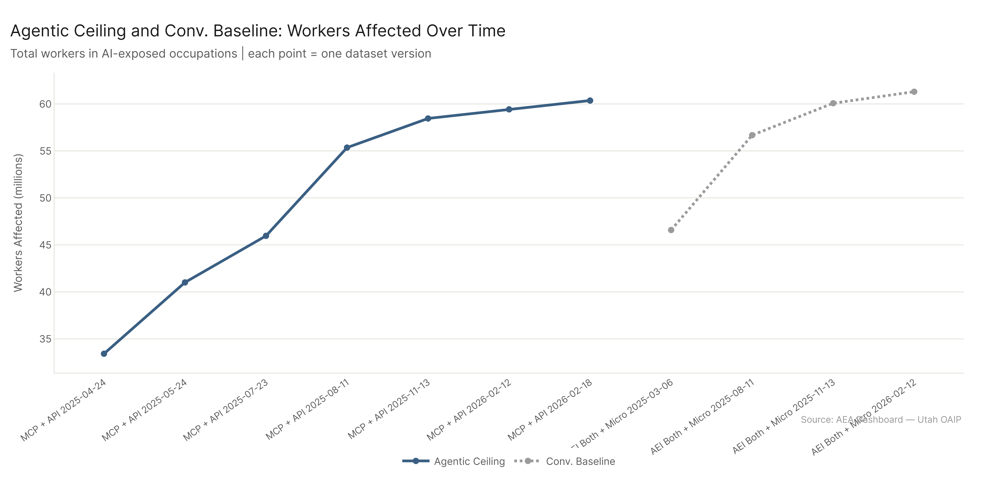

# Eight Things Worth Knowing About AI and Work

*AEA Dashboard Analysis — Selected findings from the full report. Primary config: All Confirmed (AEI Both + Micro 2026-02-12) | National | Method: freq | Auto-aug ON.*

*Full analysis: [report.md](report.md)*

---

61.3 million workers. $3.99 trillion in wages. 40% of U.S. employment. That's how much of the economy confirmed AI usage currently reaches — and confirmed means something specific here: tasks where multiple independent data sources agree that AI is actively handling the work, not just theoretically capable of it. The ceiling, where we relax the confirmation requirement to include all demonstrated capability, reaches 77.1 million workers and $4.97 trillion.

These numbers have roughly doubled since September 2024. What's changed isn't the economy — the occupational mix is stable. What's changed is how much of existing work AI can demonstrably do.

Below are eight findings from the analysis that we think are most worth understanding. They're not all good news, not all bad news, and in a few cases they're outright counterintuitive.

*Full data and methodology: [report.md](report.md)*

---

## 1. Zero to 145: The High-Exposure Tier Was Created During the Study Window

In September 2024, zero occupations had 60% or more of their tasks covered by confirmed AI usage. By February 2026, 145 did. The entire high-exposure tier — the set of occupations where AI demonstrably handles the majority of the task load — didn't exist at the start of the measurement window. It was created during it.

That's the starkest version of the finding, but the details matter too. Growth wasn't uniform. 44% of occupations — 406 of 923 — gained less than 5 percentage points total over 16 months. These are largely physical and operational jobs, and the AI transition has barely touched them. The expansion was concentrated in a smaller cohort of information-intensive and professional-service roles.

The identity of the big movers is the real surprise. Human Resources Specialists gained 53.5 percentage points (+22.4% → 75.8%). Market Research Analysts gained 49.7 points. Customer Service Representatives gained 39 points. Meanwhile, Software Developers, Data Scientists, and Accountants — the occupations that dominate AI disruption narratives — show identical confirmed values at every single one of the six dataset dates. Zero growth. Their exposure profile was fully established by September 2024 and hasn't moved since.

The obvious AI disruption targets plateaued early. The roles nobody was watching are where the actual expansion happened.

Two dates drove most of the change: March 2025 and August 2025. Confirmed exposure doesn't grow on a smooth curve — it advances in discrete jumps as new capabilities get confirmed across clusters of related activities in the same AEI dataset update. Single updates can shift large batches of occupations simultaneously.

*Full analysis: [time_trends/time_trends_report.md](../questions/time_trends/time_trends_report.md)*

---

## 2. The Preparation Paradox: Credential-Level Workers Are the Most AI-Exposed

The standard automation narrative says AI threatens low-skill workers most. The data says otherwise.

Average AI task exposure by O*NET job zone:

| Zone | Description | Avg % Tasks Affected |
|------|-------------|---------------------|
| Zone 1 | Little preparation required | ~26.9% |
| Zone 2 | Some preparation | ~30.6% |
| Zone 3 | Medium preparation | ~35.0% |
| **Zone 4** | **Considerable prep (bachelor's + experience)** | **~50.9%** |
| Zone 5 | Extensive prep (advanced degree) | ~45.9% |

Zone 4 — managers, accountants, engineers, analysts, healthcare practitioners — carries the highest average task exposure. Not Zone 1. Not Zone 2. The professional workforce with a bachelor's degree and work experience.

The intuition behind this isn't complicated once you see it. Zone 4 jobs are information-intensive, tool-mediated, and built around exactly the skills AI is best at: knowledge recall, written communication, data analysis, synthesis. Zone 1 jobs involve a lot of physical activity in unpredictable environments. The AI advantage is largest where the work is most cognitive and most structured.

Zone 5 dips back from Zone 4's peak because the most elite professional work — original research, clinical judgment, legal strategy — still has meaningful AI-resistant components. The Zone 4 peak is where structured knowledge work at scale creates the greatest overlap with current AI capability.

This complicates any policy frame that focuses exclusively on supporting low-education workers. By task exposure, the most exposed workers are the ones most often assumed to be safe.

*Full analysis: [economic_footprint/economic_footprint_report.md](../questions/economic_footprint/economic_footprint_report.md)*

---

## 3. Exposure Doesn't Equal Risk — A Seven-Factor Model Changes the Picture

Most AI-labor analyses sort occupations by task exposure percentage and call that risk. The problem is that 90% task exposure means something very different depending on the rest of the occupation's context.

Market Research Analysts: 89.5% confirmed task exposure. Risk score: moderate (7 out of 11).

Customer Service Representatives: 84.1% task exposure. Risk score: high (11 out of 11).

The difference is structural context. Market Research Analysts are Zone 4, with a good labor market outlook and high tech-skill density — all of which buffer against displacement. Customer Service Reps are lower job zone, with a below-average outlook, a weak software footprint, and a task exposure trend that has been rising sharply. When every flag converges, the risk reading is different from when exposure is the only signal firing.

The seven-factor model assigns weights based on whether the signal is a direct exposure indicator (weight 2) or a structural vulnerability factor (weight 1):

- Direct signals: task exposure above median, AI skill-capability gap above median, rising exposure trend, rising capability-gap trend
- Structural: job zone 1-3, poor labor market outlook, above-median software tool density

An exposure gate at 33% prevents structurally vulnerable occupations from being flagged as high-risk without meaningful AI task penetration. Some jobs are vulnerable and low-exposed — that's a different problem.

The result: **195 occupations, 50.7 million workers, score as genuinely high-risk** — where both the task evidence and the structural context converge. 224 occupations (20.1M workers) are low risk. The 195 high-risk occupations are a meaningfully different set than what you'd get by just sorting by exposure.

*Full analysis: [job_exposure/job_exposure_report.md](../questions/job_exposure/job_exposure_report.md)*

---

## 4. $980 Billion Sitting in Tools That Already Work

The gap between confirmed AI usage (61.3M workers, $3.99T wages) and the capability ceiling (77.1M workers, $4.97T wages) is 15.8 million workers and $980 billion in annual wages. That $980 billion isn't locked up in future AI capabilities that don't exist yet — it's associated with tools that have already been demonstrated to work, just not broadly deployed.

The distribution of the gap is specific and informative. Office and Administrative Support leads by raw worker gap (2.6M workers), Transportation leads by percentage-point gap (12.3pp), and Management carries the largest wage gap because the occupations are high-paying. At the occupation level, **General and Operations Managers alone accounts for $90.2 billion** in the adoption gap — a single occupation category.

The single clearest example: documentation and record-keeping. "Documenting/Recording Information" (a General Work Activity) has a 30pp gap between confirmed usage (37%) and ceiling capability (67%), representing 4.4M workers. These tools are mature. They work. They're widely used in large organizations and high-end professional settings. They're just not deployed at the bulk of jobs where the task exists.

**248 occupations fall in the "automation opportunity" quadrant** — where AI capability already exceeds occupational skill need AND the adoption gap is large. 102 of those also carry high structural risk signals, making them transformation candidates: the gap is closing whether or not workers are ready. The list is dominated by Office/Admin and Sales occupations — Cashiers, Bookkeeping Clerks, Office Clerks, Executive Secretaries, Billing Clerks.

*Full analysis: [potential_growth/potential_growth_report.md](../questions/potential_growth/potential_growth_report.md)*

---

## 5. Our 20.3% Matches Their 20%: External Cross-Validation

We run four independent AI data sources through the same pipeline and combine them. That produces our headline estimate of 40% confirmed exposure. The natural question is whether that's a reasonable number or an artifact of our specific methodology.

The external cross-validation is unusually clean.

Seampoint LLC, in a separate study of AI's impact on Utah's labor market, calculated that AI can fully take over approximately 20% of work hours under current governance constraints — meaning tasks where AI handles the entire workload without a human in the loop. Our **agentic_confirmed** config, which measures tasks covered by confirmed agentic (tool-use) AI without requiring human collaboration, comes in at **20.3%** of national employment.

Those two numbers were produced by entirely different methodologies, from different data sources, asking slightly different versions of the same question. They converge on the same number.

The ceiling comparison is similarly clean: Seampoint's "augment" estimate — the upper bound for near-term AI task coverage — is 51%. Our all-sources ceiling estimate is **50.3%**.

This isn't the only cross-validation signal in the field. Project Iceberg (Chopra et al., 2025) measures skill-wage substitutability and arrives at 11.7% as a "Full Index." At first glance, that seems to contradict our 40%. It doesn't — Iceberg is measuring how much of the wage value of work can be substituted, not how many tasks AI is touching. Those are different questions. Iceberg's 11.7% and our 40% are both defensible; they're just answering different things. The three-layer framework makes this visible: confirmed usage (~20-40%), deployment-constrained readiness (~20-51%), and technical capability ceiling (~2-12%) are measuring different positions in the same measurement spectrum.

*Full analysis: [field_benchmarks/field_benchmarks_report.md](../questions/field_benchmarks/field_benchmarks_report.md)*

---

## 6. The Agentic Gap Is Organizational, Not Technological

There are two ways to interact with an AI system: conversationally (asking questions, generating text, working through problems in dialogue) and agentically (giving the AI tools to act on systems, retrieve information autonomously, take multi-step actions). Both are real. They cover different work.

The current numbers:

| Mode | Workers | % Employment |
|---|---|---|
| Conversational (confirmed) | 54.1M | 35.3% |
| Agentic confirmed (AEI API only) | 31.1M | 20.3% |
| Agentic ceiling (MCP + AEI API) | 60.4M | 39.4% |

The agentic ceiling (60.4M) already exceeds conversational confirmed (54.1M). The potential of agentic AI, by demonstrated capability, is already larger than current conversational AI usage. The gap between agentic confirmed (31.1M) and agentic ceiling (60.4M) — 29.3 million workers — is not a technology gap. The tools that would close it already exist. It's an organizational deployment gap: enterprises haven't built the infrastructure to run agentic workflows at scale for most of the jobs where the capability applies.

What does agentic AI's marginal contribution look like when it does get deployed? The work activity analysis is revealing. The biggest IWA gains when moving from conversational to agentic ceiling aren't in creative or analytical work — they're operational: "Record information about environmental conditions" (+57.8pp), "Maintain operational records" (+51.1pp), "Prepare schedules for services or facilities" (+50.7pp). Agentic AI's distinctive contribution is automating the organizational backbone — the scheduling, documentation, and record management that nobody talks about but every organization runs on.

The growth trajectory is flattening: 81% growth from April to late 2025, but the last two dataset updates added a combined 1 million workers. This isn't because AI stopped advancing — it's because the current measurement framework is approaching saturation. The actual frontier may already exceed what the task taxonomy can currently capture.

*Full analysis: [agentic_usage/agentic_usage_report.md](../questions/agentic_usage/agentic_usage_report.md)*

---

## 7. Where Humans Still Lead — and What to Do About It

The Skills, Knowledge, and Abilities (SKA) analysis is the most granular answer to "what's AI-proof?" It compares AI capability on each of 120 O*NET elements to the actual demand for those elements across occupations.

AI leads on 23 of the 120 elements. All 23 are in knowledge or skills domains — none in physical or sensorimotor abilities. The top AI advantages: Sales and Marketing knowledge (+4.6), History and Archeology (+4.4), Philosophy and Theology (+3.3), Foreign Language (+3.3). The pattern is information that can be encoded, retrieved, and synthesized from text, especially in domains with large structured bodies of accumulated knowledge.

Human advantages are concentrated in abilities — specifically physical and perceptual abilities. Sound Localization (-7.9), Reaction Time (-7.8), Peripheral Vision (-7.7), Extent Flexibility (-6.7). These aren't gaps that will close through better prompting or larger training runs. They're embodied capabilities that AI doesn't have. Most cognitive skills — written comprehension, reading comprehension, mathematical reasoning — are now near parity or slight AI advantage.

The practical implication for workers: the durable competitive moat is physical and relational, not informational. If your job's value comes primarily from knowing things, AI now matches the average occupational need for most knowledge domains. If it comes from physical judgment, clinical intuition, or interpersonal coordination, AI's reach is still limited.

For reskilling, the finding is more hopeful than it might sound. Across all job zones, the majority of the skill gap between high-risk and low-risk occupations is in elements where AI capability already exceeds the at-risk worker's current level. In Zone 2, 99.5% of the reskilling cost is in AI-advantaged elements. AI is effectively the best available reskilling accelerator for the very workers it's displacing — if we're willing to use it that way.

*Full analysis: [job_exposure/job_exposure_report.md](../questions/job_exposure/job_exposure_report.md)*

---

## 8. Sources Agree on Sectors, Disagree on Occupations — Both Facts Matter for Policy

The four data sources in this analysis — Human Conversational (AEI Conv + Microsoft), Agentic (AEI API), Microsoft Copilot, and MCP tool-use — are measuring related but genuinely different things. The question is how much that matters.

At the sector level, it barely matters. The Spearman rank correlation between any two sources on major-category exposure is 0.875 on average. Six sectors are universally high-confidence — all four sources agree: Computer/Mathematical, Office/Administrative Support, Sales, Business/Financial Operations, Arts/Design/Entertainment, and Life/Physical/Social Science. Policy targeting sector-level retraining, workforce investment, or industry-specific support can proceed with high confidence regardless of which source you trust.

At the occupation level, it matters a lot. Correlation drops to 0.676. More telling: 91% of occupations have zero cross-source consensus in the top-30 most exposed. The sources identify almost entirely different occupations as the most affected, even within the sectors they agree on.

The disagreements aren't random — they reflect genuine methodological differences. Human Conversational sees education, psychology, and knowledge-worker roles most distinctively. MCP sees system-interaction and infrastructure roles. Microsoft rates broadly but never high (zero occupations above 60% in any tier). AEI API sees confirmed agentic deployments, which are concentrated in tech-adjacent analytical roles.

Adding MCP to the confirmed baseline upgrades 104 occupations to the High exposure tier. Adding AEI API upgrades 64. Neither addition causes any occupation to lose exposure — the signals are additive, not competing.

The policy translation: sector-level decisions are robust to source choice; occupation-specific targeting is not. Any policy or workforce program that focuses on specific occupations based on a single source is probably wrong about which occupations to target by a factor of 2-3x.

*Full analysis: [source_agreement/source_agreement_report.md](../questions/source_agreement/source_agreement_report.md)*

---

## Where to Go Next

These eight findings are a selection — the ones we think are most useful for understanding what's happening and what it implies. The full analysis is organized by research question, each with its own detailed report.

- **[Full Report](report.md)** — All findings, organized by chapter. Each chapter covers one analytical bucket with subsections for key sub-questions.
- **[Job Exposure](../questions/job_exposure/job_exposure_report.md)** — Which workers are most at risk, how to measure that, and what workers can do.
- **[Economic Footprint](../questions/economic_footprint/economic_footprint_report.md)** — The total scale of AI exposure: workers, wages, sectors, geography, trends.
- **[Potential Growth](../questions/potential_growth/potential_growth_report.md)** — The $980B adoption gap and where it lives.
- **[Agentic Usage](../questions/agentic_usage/agentic_usage_report.md)** — The full agentic AI footprint, growth trajectory, and what it's exposing.
- **[Source Agreement](../questions/source_agreement/source_agreement_report.md)** — How the four data sources compare and what each uniquely contributes.
- **[Time Trends](../questions/time_trends/time_trends_report.md)** — How AI exposure has evolved over 16 months.
- **[State Clusters](../questions/state_clusters/state_clusters_report.md)** — State-level variation across five analytical dimensions.
- **[Field Benchmarks](../questions/field_benchmarks/field_benchmarks_report.md)** — How our numbers compare to every other major AI-and-work study.

---

*Config reference: Primary = All Confirmed (AEI Both + Micro 2026-02-12). Ceiling = All Sources (All 2026-02-18). Agentic Confirmed = AEI API 2026-02-12. Agentic Ceiling = MCP + API 2026-02-18. All analyses: freq method, auto-aug ON, national geography unless noted.*
